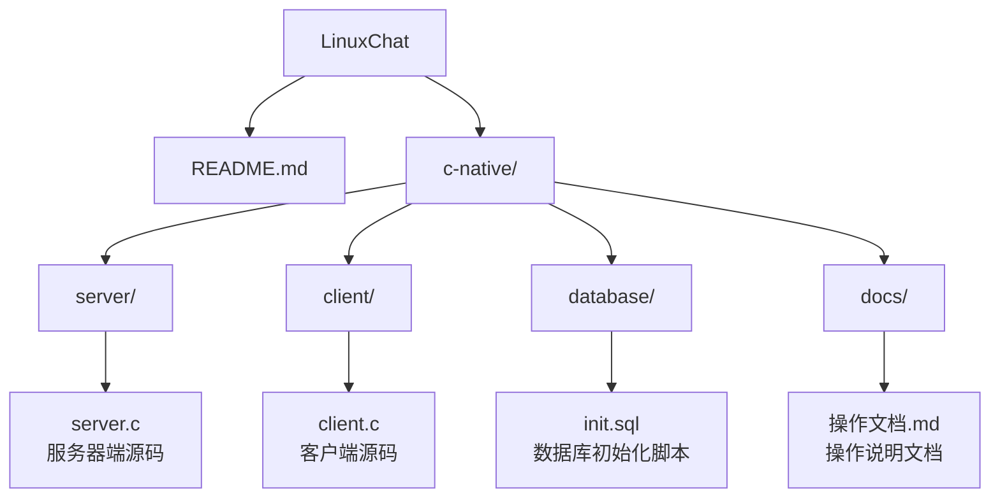
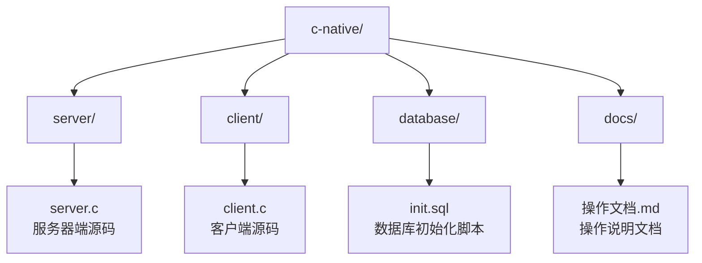
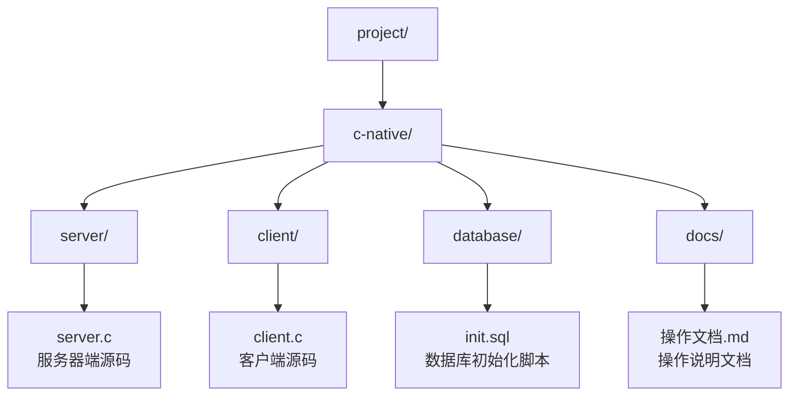

# Linux网络即时通信工具 - 操作文档

## 一、项目概述

本项目是一个基于Linux平台的网络即时通信工具，采用C语言开发。服务器端使用Socket网络编程和MySQL数据库，客户端使用GTK图形界面库。系统支持用户注册、登录、好友管理和实时消息通信等功能。

## 二、环境要求

### 2.1 服务器环境
- Linux操作系统（推荐 Ubuntu 18.04+）或 macOS
- GCC编译器（版本4.8+）
- MySQL数据库（版本5.7+）
- MySQL C API开发库

### 2.2 客户端环境
- Linux操作系统（推荐 Ubuntu 18.04+）或 macOS
- GCC编译器（版本4.8+）
- GTK3开发库
- 网络环境（能访问服务器）

## 三、安装步骤

### 3.1 安装依赖（Ubuntu/Debian）

```bash
sudo apt update
sudo apt install gcc make mysql-server libmysqlclient-dev libgtk-3-dev
```

### 3.2 安装依赖（macOS）

```bash
brew install mysql gtk+3 pkg-config
brew services start mysql
```

如果尚未安装 Homebrew，可先参考 Homebrew 官网安装。安装完成后，`mysql_config` 和 `pkg-config` 会用于后续编译参数探测。

### 3.3 下载项目文件

将项目文件放置在指定目录下：



进入 C 语言源码目录后，后续命令均以 `c-native/` 为项目根目录：

```bash
cd c-native
```

目录结构如下：



## 四、数据库配置

### 4.1 创建数据库和用户

```bash
mysql -u root -p
```

```sql
CREATE DATABASE chat_db;
CREATE USER 'chat_user'@'localhost' IDENTIFIED BY 'chat_password';
GRANT ALL PRIVILEGES ON chat_db.* TO 'chat_user'@'localhost';
FLUSH PRIVILEGES;
```

macOS 使用 Homebrew 安装 MySQL 后，如果 root 用户没有设置密码，可以先直接执行：

```bash
mysql -u root
```

### 4.2 初始化数据库表

```bash
mysql -u chat_user -p chat_db < database/init.sql
```

### 4.3 修改服务器连接配置

编辑 `server/server.c` 文件，修改数据库连接参数：

```c
if (!mysql_real_connect(db_conn, "localhost", "chat_user", "chat_password", "chat_db", 0, NULL, 0)) {
```

## 五、编译代码

### 5.1 编译服务器

```bash
cd server
gcc server.c -o server -lmysqlclient -lpthread
```

macOS 如果提示找不到 MySQL 头文件或链接库，使用 `mysql_config` 自动补齐编译参数：

```bash
cd server
gcc server.c -o server $(mysql_config --cflags --libs) -lpthread
```

如果使用 MySQL 官网安装包且 `mysql_config` 不在 `PATH` 中，可以使用完整路径：

```bash
cd server
gcc server.c -o server $(/usr/local/mysql/bin/mysql_config --cflags --libs) -lpthread
```

如果运行时提示找不到 `libssl.3.dylib` 或 `libcrypto.3.dylib`，需要为本地生成的 `server` 修正动态库路径：

```bash
install_name_tool -add_rpath /usr/local/mysql/lib server
install_name_tool -change libssl.3.dylib /opt/homebrew/lib/libssl.3.dylib server
install_name_tool -change libcrypto.3.dylib /opt/homebrew/lib/libcrypto.3.dylib server
```

### 5.2 编译客户端

```bash
cd client
gcc client.c -o client `pkg-config --cflags --libs gtk+-3.0` -lpthread
```

### 5.3 完整测试套件

项目根目录提供了 `tests/run_all_tests.sh` 作为主要测试入口。默认测试不需要运行 MySQL 服务，会完成客户端/服务端编译检查、服务端状态测试、协议边界测试和源码检查。

如果当前目录在 `c-native/`，先返回项目根目录：

```bash
cd ..
./tests/run_all_tests.sh
```

如果 `mysql_config` 不在默认路径中，可以显式指定：

```bash
MYSQL_CONFIG=/path/to/mysql_config ./tests/run_all_tests.sh
```

测试通过时会输出：

```text
All non-database tests passed.
```

默认测试重点覆盖：

1. 客户端和服务端能在当前依赖下通过编译检查。
2. 服务端在线会话状态同步和定向发送逻辑。
3. 协议记录拼接的边界和截断行为。
4. 客户端 GTK idle 回调、页面切换和限长解析检查。
5. 服务端数据库互斥、事务、级联外键、唯一约束、预处理语句和响应构造检查。
6. 安全加固检查，包括协议分隔符拒绝、会话授权、密码哈希和客户端 `snprintf` 构造。
7. `init.sql` 的关键约束、密码哈希和可重复导入特性。

### 5.4 数据库集成测试

如果需要验证真实 MySQL 数据库行为，需要准备一个专门用于测试的数据库。测试会删除并重建该数据库中的 `users`、`messages`、`friends`、`friend_blocks`、`chat_groups`、`group_members`、`group_messages` 和 `group_message_deliveries` 等表，因此数据库名必须包含 `test`。

需要的环境变量：

| 变量 | 必填 | 说明 |
| --- | --- | --- |
| `LINUXCHAT_TEST_DB_USER` | 是 | 测试数据库用户 |
| `LINUXCHAT_TEST_DB_NAME` | 是 | 测试数据库名，必须包含 `test` |
| `LINUXCHAT_TEST_DB_PASSWORD` | 否 | 测试数据库密码，空密码可省略 |
| `LINUXCHAT_TEST_DB_HOST` | 否 | 默认 `localhost` |
| `LINUXCHAT_TEST_DB_PORT` | 否 | 默认使用 MySQL 客户端默认端口 |

运行方式：

```bash
LINUXCHAT_RUN_DB_TESTS=1 \
LINUXCHAT_TEST_DB_HOST=localhost \
LINUXCHAT_TEST_DB_USER=chat_test_user \
LINUXCHAT_TEST_DB_PASSWORD=chat_test_password \
LINUXCHAT_TEST_DB_NAME=linuxchat_test \
./tests/run_all_tests.sh --with-db
```

数据库测试重点覆盖：

1. 重复用户名被拒绝。
2. 密码以 SHA-256 哈希形式落库，登录使用同样哈希校验。
3. 注入型登录输入不能绕过认证，带单引号的合法字段由预处理语句安全处理。
4. 无效外键不会写入好友或消息。
5. 好友关系双向插入具备事务一致性。
6. 半边好友关系不会在失败重试时变成不一致的双边状态。
7. 历史消息按时间排序，且时间戳不会破坏协议分隔。
8. 含协议分隔符的消息会被拒绝，不会写入数据库。
9. 删除用户会级联清理相关好友和消息。
10. 群聊创建、重复群成员、非成员访问拒绝、群消息持久化和离线统计。
11. 屏蔽关系会阻止私聊发送判定，解除屏蔽后恢复。

### 5.5 旧专项测试入口

下面两个旧专项脚本仍保留，用于快速复测登录后聊天链路和聊天稳定性相关修复。

## 六、启动服务

### 6.1 启动服务器

```bash
cd server
./server
```

服务器将在端口8888监听连接。

### 6.2 启动客户端

```bash
cd client
./client
```

客户端将打开GTK图形界面。

## 七、使用说明

### 7.1 用户注册

1. 在客户端登录界面点击"注册"按钮
2. 填写用户名、密码和昵称
3. 点击"注册"按钮完成注册
4. 注册成功后可以进行登录

### 7.2 用户登录

1. 在客户端登录界面填写用户名和密码
2. 点击"登录"按钮
3. 登录成功后进入聊天界面

### 7.3 添加好友

1. 在聊天界面点击"添加好友"按钮
2. 输入好友ID
3. 点击"确定"按钮
4. 添加成功后好友列表将显示新好友

### 7.4 发送消息

1. 在好友列表中选择要聊天的好友
2. 在消息输入框中输入消息内容
3. 点击"发送"按钮或按回车键发送消息
4. 消息将实时显示在聊天窗口中

### 7.5 接收消息

1. 当有新消息时，消息将自动显示在聊天窗口中
2. 如果当前没有打开与发送者的聊天窗口，消息将在打开窗口时自动加载

### 7.6 群聊和屏蔽

1. 点击"创建群聊"，输入群名称和初始成员ID，成员ID用英文逗号分隔。
2. 在群聊列表中选择群聊后，可以查看群历史和成员列表。
3. 选择群聊后输入文本并发送，即可向在线群成员实时推送消息，离线成员重新登录后会看到未读提示，也可以通过群历史确认消息。
4. 选择好友后点击"屏蔽好友"，双方私聊发送会被服务端拒绝；需要恢复时点击"解除屏蔽"并输入用户ID。
5. 好友登录和退出时，在线好友会收到上线或离线提示。

### 7.7 退出程序

点击窗口右上角的关闭按钮即可退出程序。

## 八、功能特性

### 8.1 基本功能
- 用户注册和登录
- 好友管理
- 实时消息发送和接收
- 群聊创建、群成员管理和群消息
- 好友上线/离线通知
- 用户屏蔽和解除屏蔽
- 离线消息未读提示
- 消息历史记录

### 8.2 技术特性
- 基于Socket的TCP网络通信
- 多线程服务器设计
- MySQL数据库持久化存储
- GTK图形界面

## 九、通信协议

### 9.1 协议格式

客户端和服务器之间使用文本协议，格式如下：

```
COMMAND:param1,param2,param3
```

### 9.2 命令列表

| 命令 | 参数 | 说明 |
|------|------|------|
| REGISTER | username,password,nickname | 用户注册 |
| LOGIN | username,password | 用户登录 |
| ADDFRIEND | user_id,friend_id | 添加好友 |
| FRIENDS | user_id | 获取好友列表 |
| MESSAGES | user_id,friend_id | 获取消息记录 |
| SEND | sender_id,receiver_id,content | 发送消息 |
| CREATE_GROUP | group_name,member_id... | 创建群聊 |
| GROUPS | user_id | 获取当前用户加入的群聊 |
| GROUP_MEMBERS | group_id | 获取群成员 |
| ADD_GROUP_MEMBER | group_id,user_id | 添加群成员 |
| GROUP_MESSAGES | group_id | 获取群聊历史 |
| SEND_GROUP | sender_id,group_id,content | 发送群消息 |
| BLOCK_USER | user_id,blocked_id | 屏蔽用户 |
| UNBLOCK_USER | user_id,blocked_id | 解除屏蔽 |
| OFFLINE_MESSAGES | user_id | 获取未读消息摘要 |
| QUIT | 无 | 断开连接 |

为兼容现有客户端，部分请求仍携带 user_id/sender_id；服务端实际执行时只信任登录会话中的用户 ID。用户名、密码、昵称和群名称不能包含 `,`、`:`、`;` 或换行，消息内容不能包含 `:`、`;` 或换行。

### 9.3 响应格式

服务器响应格式如下：

| 响应 | 说明 |
|------|------|
| REGISTER_SUCCESS:user_id | 注册成功 |
| REGISTER_FAILED | 注册失败 |
| LOGIN_SUCCESS:user_id:username:nickname | 登录成功 |
| LOGIN_FAILED | 登录失败 |
| ADDFRIEND_SUCCESS | 添加好友成功 |
| ADDFRIEND_FAILED | 添加好友失败 |
| FRIENDS_LIST:id:username:nickname;... | 好友列表 |
| MESSAGES_LIST:content:timestamp:nickname;... | 消息列表 |
| NEW_MESSAGE:sender_id:nickname:content | 新消息通知 |
| GROUPS_LIST:id:name:owner_nickname;... | 群聊列表 |
| GROUP_MEMBERS_LIST:id:username:nickname;... | 群成员列表 |
| GROUP_MESSAGES_LIST:content:timestamp:nickname;... | 群消息列表 |
| NEW_GROUP_MESSAGE:group_id:sender_id:nickname:content | 新群消息通知 |
| CREATE_GROUP_SUCCESS:group_id / CREATE_GROUP_FAILED | 创建群聊结果 |
| ADD_GROUP_MEMBER_SUCCESS / ADD_GROUP_MEMBER_FAILED | 添加群成员结果 |
| BLOCK_USER_SUCCESS / BLOCK_USER_FAILED | 屏蔽结果 |
| UNBLOCK_USER_SUCCESS / UNBLOCK_USER_FAILED | 解除屏蔽结果 |
| OFFLINE_MESSAGES_LIST:type:id:count;... | 未读消息摘要 |
| FRIEND_ONLINE:user_id:nickname | 好友上线通知 |
| FRIEND_OFFLINE:user_id:nickname | 好友离线通知 |

## 十、数据库结构

### 10.1 users表

| 字段名 | 类型 | 约束 | 说明 |
|--------|------|------|------|
| id | INT | PRIMARY KEY AUTO_INCREMENT | 用户ID |
| username | VARCHAR(50) | UNIQUE NOT NULL | 用户名 |
| password | VARCHAR(100) | NOT NULL | SHA-256 密码哈希 |
| nickname | VARCHAR(50) | NOT NULL | 昵称 |
| created_at | TIMESTAMP | DEFAULT CURRENT_TIMESTAMP | 创建时间 |

### 10.2 messages表

| 字段名 | 类型 | 约束 | 说明 |
|--------|------|------|------|
| id | INT | PRIMARY KEY AUTO_INCREMENT | 消息ID |
| sender_id | INT | NOT NULL, FOREIGN KEY | 发送者ID |
| receiver_id | INT | NOT NULL, FOREIGN KEY | 接收者ID |
| content | TEXT | NOT NULL | 消息内容 |
| delivered | TINYINT(1) | DEFAULT 0 | 接收者是否已收到或查看 |
| timestamp | TIMESTAMP | DEFAULT CURRENT_TIMESTAMP | 发送时间 |

### 10.3 friends表

| 字段名 | 类型 | 约束 | 说明 |
|--------|------|------|------|
| id | INT | PRIMARY KEY AUTO_INCREMENT | 记录ID |
| user_id | INT | NOT NULL, FOREIGN KEY | 用户ID |
| friend_id | INT | NOT NULL, FOREIGN KEY | 好友ID |
| status | INT | DEFAULT 0 | 状态（0:待确认, 1:已确认） |
| created_at | TIMESTAMP | DEFAULT CURRENT_TIMESTAMP | 创建时间 |

### 10.4 扩展表

| 表名 | 说明 |
|------|------|
| friend_blocks | 保存屏蔽关系，`blocker_id` 和 `blocked_id` 唯一 |
| chat_groups | 保存群聊名称、创建者和创建时间 |
| group_members | 保存群成员关系，`group_id` 和 `user_id` 唯一 |
| group_messages | 保存群聊消息内容、发送者和时间 |
| group_message_deliveries | 按用户记录群消息是否已收到或查看 |

## 十一、常见问题

### 11.1 编译错误：找不到mysql.h

**原因**：MySQL开发库未安装

**解决方案**：
```bash
# Ubuntu/Debian
sudo apt install libmysqlclient-dev

# macOS
brew install mysql
```

### 11.2 编译错误：找不到gtk/gtk.h

**原因**：GTK开发库未安装

**解决方案**：
```bash
# Ubuntu/Debian
sudo apt install libgtk-3-dev

# macOS
brew install gtk+3 pkg-config
```

### 11.3 macOS编译服务端时找不到mysql.h

**原因**：MySQL 头文件和库路径不一定在 GCC 默认搜索路径中；使用官网安装包时，`mysql_config` 默认位于 `/usr/local/mysql/bin/`，可能没有加入 `PATH`。

**解决方案**：使用 `mysql_config` 输出编译参数：

```bash
cd server
gcc server.c -o server $(mysql_config --cflags --libs) -lpthread
```

如果 `mysql_config` 命令不存在，使用官网安装包的完整路径：

```bash
cd server
gcc server.c -o server $(/usr/local/mysql/bin/mysql_config --cflags --libs) -lpthread
```

如果编译后运行时报 `Library not loaded: libssl.3.dylib`，说明 OpenSSL 动态库没有被记录为完整路径。可以用下面的命令修复当前目录下的 `server`：

```bash
install_name_tool -add_rpath /usr/local/mysql/lib server
install_name_tool -change libssl.3.dylib /opt/homebrew/lib/libssl.3.dylib server
install_name_tool -change libcrypto.3.dylib /opt/homebrew/lib/libcrypto.3.dylib server
```

### 11.4 数据库连接失败

**原因**：数据库用户名、密码或数据库名配置错误

**解决方案**：检查 `server.c` 中的数据库连接参数是否正确

### 11.5 无法连接服务器

**原因**：服务器未启动或网络不通

**解决方案**：
- 确保服务器已启动
- 检查服务器防火墙设置，允许端口8888
- 确保客户端和服务器在同一网络

### 11.6 注册失败

**原因**：用户名已存在或参数不完整

**解决方案**：
- 检查用户名是否已被注册
- 确保填写完整的注册信息

### 11.7 登录失败

**原因**：用户名或密码错误

**解决方案**：
- 检查用户名和密码是否正确
- 确认用户已注册

## 十二、开发说明

### 12.1 项目结构



### 12.2 代码结构

**服务器端（server.c）**：

| 函数 | 功能 |
|------|------|
| init_database() | 初始化数据库连接 |
| create_tables() | 创建数据库表 |
| register_user() | 用户注册 |
| login_user() | 用户登录验证 |
| add_friend() | 添加好友 |
| are_friends() | 校验好友关系 |
| get_friends() | 获取好友列表 |
| get_messages() | 获取消息记录 |
| save_message() | 保存消息 |
| block_user() / unblock_user() | 屏蔽或解除屏蔽用户 |
| create_group() | 创建群聊并写入初始成员 |
| get_groups() / get_group_members() | 查询群聊和成员 |
| save_group_message() / get_group_messages() | 保存和查询群消息 |
| get_offline_messages() | 查询未读消息摘要 |
| notify_friends_status() | 推送好友上线/离线状态 |
| handle_client() | 处理客户端连接（线程函数） |
| main() | 主函数，启动服务器 |

**客户端（client.c）**：

| 函数 | 功能 |
|------|------|
| connect_to_server() | 连接服务器 |
| send_message_to_server() | 发送消息到服务器 |
| on_register_clicked() | 注册按钮点击事件 |
| on_login_clicked() | 登录按钮点击事件 |
| on_send_clicked() | 发送按钮点击事件 |
| on_friend_selected() | 好友选择事件 |
| on_group_selected() | 群聊选择事件 |
| on_add_friend_clicked() | 添加好友按钮点击事件 |
| on_create_group_clicked() | 创建群聊按钮点击事件 |
| on_add_group_member_clicked() | 添加群成员按钮点击事件 |
| on_block_user_clicked() / on_unblock_user_clicked() | 屏蔽或解除屏蔽操作 |
| parse_friends_list() | 解析好友列表 |
| parse_groups_list() | 解析群聊列表 |
| parse_group_members_list() | 解析群成员列表 |
| parse_messages_list() | 解析消息列表 |
| parse_group_messages_list() | 解析群消息列表 |
| parse_new_message() | 解析新消息 |
| parse_new_group_message() | 解析新群消息 |
| parse_offline_messages() | 解析未读消息摘要 |
| receive_messages() | 接收消息线程 |
| build_login_window() | 构建登录窗口 |
| build_chat_window() | 构建聊天窗口 |
| main() | 主函数，启动客户端 |

### 12.3 修改服务器IP

如果服务器和客户端不在同一台机器上，需要修改客户端代码中的服务器IP：

```c
#define SERVER_IP "服务器IP地址"
```

## 十三、部署说明

### 13.1 服务器部署

1. 在Linux服务器或macOS开发机上安装依赖
2. 编译服务器代码
3. 修改数据库连接配置
4. 初始化数据库
5. 启动服务器

### 13.2 客户端部署

1. 在Linux客户端或macOS开发机上安装依赖
2. 编译客户端代码
3. 修改服务器IP配置
4. 启动客户端

### 13.3 防火墙配置

```bash
# Ubuntu/Debian
sudo ufw allow 8888
```

macOS 本地开发通常不需要手动放行端口。如果系统弹出网络访问确认，允许服务端程序接收本机或局域网连接即可。

## 十四、已知问题

当前 C 语言版本已具备课程设计演示所需的主要模块。登录后聊天链路中的关键问题已经修复：

1. 客户端接收线程改为登录成功后启动，避免 `sockfd = -1` 时提前退出。
2. GTK 主窗口通过 `GtkStack` 管理登录页和聊天页，登录成功后可以正常切换页面。
3. 服务端登录成功后会同步在线用户数组，实时转发可以找到在线接收方。
4. 服务端 `SEND` 分支使用登录会话中的昵称，不再通过空密码重新调用登录函数。

聊天链路中的稳定性和数据正确性问题也已经修复：

1. 历史消息时间戳改为不含 `:` 的格式，避免客户端解析错位。
2. 好友列表和历史消息拼接增加容量保护，结果过长时截断并记录日志。
3. 历史消息响应不再把 10KB 消息缓冲区写入 1KB `response`。
4. 服务端 socket 创建失败判断改为 `< 0`。
5. 全局 MySQL 连接增加 `db_mutex`，降低多客户端并发访问时的状态竞争风险。
6. 服务端响应构造和命令解析改为更安全的有界写入/限长读取。

安全加固部分已完成以下内容：

1. 注册、登录和消息写入改为 MySQL 预处理语句，避免用户输入直接拼接进 SQL。
2. 密码使用 `SHA2(..., 256)` 哈希后存储，初始化脚本中的演示用户也改为哈希写入。
3. 客户端和服务端都会拒绝破坏当前文本协议的分隔符输入。
4. 客户端命令构造统一改为 `snprintf`，登录响应解析增加宽度限制。
5. 好友、好友列表、历史消息和发送消息操作改为基于登录会话授权，并在发送/查询历史前校验好友关系。
6. 群聊发送、群历史和群成员查询都会校验群成员身份。
7. 私聊发送会检查屏蔽关系，群聊和私聊都会记录离线未读状态。

仍需后续修复和增强的问题：

1. 文本协议仍依赖 `:`, `,`, `;` 分隔，目前通过拒绝分隔符规避解析错位，后续可升级为转义或长度前缀协议。
2. 密码哈希目前使用 MySQL `SHA2(..., 256)`，后续可升级为带盐的慢哈希方案。
3. TCP 文本协议尚未处理拆包/粘包，后续可增加明确的消息边界。

## 十五、版本信息

- 版本号：1.0.0
- 创建日期：2024年
- 开发团队：LinuxChat 项目小组
