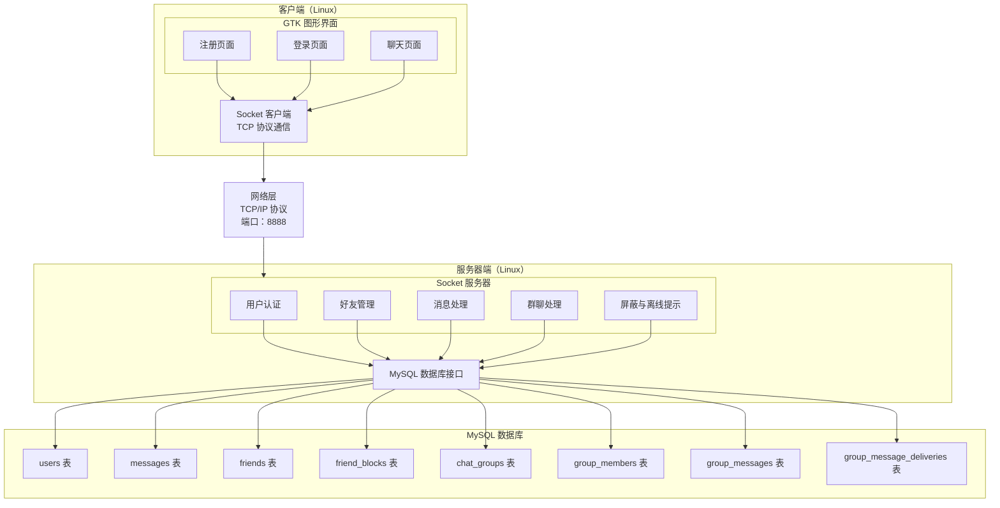
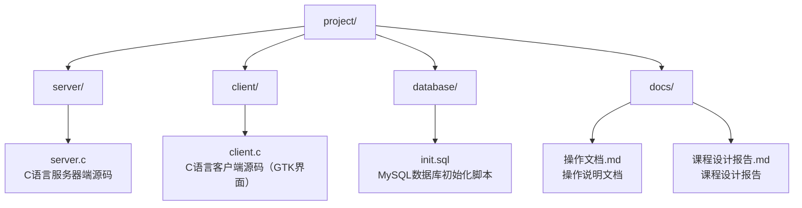

# Linux操作系统与程序设计课程设计报告

---

## 目录

1. [项目目标](#1-项目目标)
2. [项目功能及模块划分](#2-项目功能及模块划分)
3. [人员组成及职责划分](#3-人员组成及职责划分)
4. [设计与实现](#4-设计与实现)
   - [4.1 系统结构](#41-系统结构)
   - [4.2 客户端界面](#42-客户端界面)
   - [4.3 服务器的实现](#43-服务器的实现)
   - [4.4 数据库访问](#44-数据库访问)
   - [4.5 通信模块的实现](#45-通信模块的实现)
5. [测试与调试](#5-测试与调试)
6. [总结](#6-总结)
7. [附录：程序代码](#7-附录程序代码)

---

## 1、项目目标

这次课程设计我们选择做一个 Linux 平台下的即时通信工具。项目规模不算特别大，但它把 Socket 通信、多线程、MySQL 数据库和 GTK 图形界面都串在了一起，作为一次完整的Linux程序设计实践。

我们给这个项目定下的目标主要有以下几项：

1. **完成 Socket 网络通信实现**：用 TCP Socket 打通客户端和服务端之间的连接、消息收发和断开处理。

2. **完成 MySQL 数据持久化设计**：把用户信息、消息记录和好友关系保存到 MySQL 中，并用 MySQL C API 完成查询和写入。

3. **完成 GTK3 图形客户端开发**：用 GTK3 做出登录、注册、好友列表和聊天窗口，并处理按钮点击、好友选择和消息刷新。

4. **完成多线程服务端设计**：服务端为每个客户端连接创建处理线程，并用互斥锁保护在线用户列表和数据库连接。

5. **完成团队协作与任务分工**：把代码实现、文档整理、测试验证和问题修复拆开推进，减少重复工作。

6. **形成问题定位和复测验证流程**：遇到问题后先记录现象，再分析原因、修复代码，并用测试脚本确认问题没有反复出现。

---

## 2、项目功能及模块划分

### 2.1 项目概述

我们实现的是一个基于 Linux 平台的网络即时通信工具。服务端使用 C 语言、Socket 和 MySQL，客户端使用 GTK3 做图形界面。用户启动客户端后，可以完成注册、登录、添加好友、一对一聊天、群聊、拉黑用户和查看离线消息提示等操作。

### 2.2 功能模块划分

从实现上看，我们把功能拆成了下面几个模块：

| 模块名称 | 功能描述 | 所属层次 |
|---------|---------|---------|
| 用户注册模块 | 用户通过用户名、密码和昵称进行注册 | 客户端+服务器 |
| 用户登录模块 | 用户通过用户名和密码进行登录，验证身份 | 客户端+服务器 |
| 好友管理模块 | 添加好友、查看好友列表 | 客户端+服务器 |
| 消息发送模块 | 向好友发送文本消息 | 客户端+服务器 |
| 消息接收模块 | 实时接收好友发送的消息 | 客户端+服务器 |
| 消息存储模块 | 将消息记录存储到数据库 | 服务器 |
| 用户状态管理 | 管理用户在线状态 | 服务器 |
| 群聊管理模块 | 创建群聊、查看群列表和群成员、添加群成员 | 客户端+服务器 |
| 群消息模块 | 发送群消息、保存群历史、向在线群成员实时推送 | 客户端+服务器 |
| 拉黑模块 | 拉黑或解除拉黑用户，私聊发送前检查拉黑关系 | 客户端+服务器 |
| 离线消息模块 | 记录私聊和群聊未读状态，登录后提示未读摘要 | 客户端+服务器 |

### 2.3 核心功能描述

**用户注册与登录**

- 用户可以通过客户端注册页面创建新账号，需要填写用户名、密码和昵称
- 用户可以通过登录页面验证身份并进入系统
- 用户名具有唯一性约束，避免重复注册
- 登录状态通过用户ID进行管理

**好友管理**

- 用户可以添加其他用户为好友
- 用户可以查看自己的好友列表
- 好友关系建立后，双方可以互相发送消息

**实时消息通信**

- 用户可以选择好友进行一对一聊天
- 消息采用TCP Socket技术实现实时传输
- 消息发送后立即显示在聊天窗口中
- 历史消息可以随时查看

**群聊通信**

- 用户可以创建群聊，创建者会自动成为群成员
- 群成员可以查看自己加入的群聊和群成员列表
- 群成员可以向群聊发送文本消息，在线成员会实时收到
- 服务端会校验发送者是否属于该群，非成员不能发送群消息，也不能查看群历史

**状态通知和拉黑**

- 好友登录和断开连接时，在线好友会收到上线或离线提示
- 用户可以拉黑其他用户，也可以解除拉黑
- 私聊发送前会检查双方是否存在拉黑关系，存在拉黑关系时消息不会写入数据库
- 用户离线期间收到的私聊和群聊消息会留下未读记录，重新登录后可以看到未读摘要

---

## 3、人员组成及职责划分

### 3.1 团队成员

| 姓名 | 学号 | 职责 |
|------|------|------|
| 卞宇宁 | 239054412 | 组长，系统分析、整体设计和模块划分 |
| 杨国龙 | 229024392 | 核心代码初步构建，完成客户端、服务端、数据库和通信链路的主体实现 |
| 孙正辉 | 待补充 | 文档编写与资料整理，负责操作文档、课程报告和测试结果记录 |
| 杨智强 | 239044484 | 测试验证、数据库集成检查和问题修复协助，负责复测验证、数据一致性验证和缺陷整理 |

### 3.2 职责详细说明

**卞宇宁（组长）**

- 负责整个项目的需求分析和架构设计
- 制定开发计划和模块划分方案
- 协调各成员之间的工作
- 审核和整合各模块代码
- 负责项目整体进度控制

**杨国龙（核心代码初步构建）**

- 负责项目代码主体的初步构建
- 完成 C 语言服务端 Socket 通信、多线程连接处理和消息路由的基础实现
- 完成 GTK3 客户端登录、注册、聊天窗口和好友列表的基础实现
- 完成 MySQL 表结构、初始化脚本和数据库访问函数的初步实现
- 打通注册、登录、添加好友、历史消息和实时聊天的主要功能链路

**孙正辉（文档编写）**

- 负责项目操作文档和课程设计报告的编写
- 整理环境配置、数据库初始化、编译运行和使用说明
- 根据代码实现同步更新模块说明、协议说明和测试说明
- 记录测试结果、已修复问题和仍需改进的内容
- 维护文档结构、图表和最终提交材料

**杨智强（测试验证与问题整理）**

- 负责客户端和服务端主要功能的测试验证
- 设计并执行注册、登录、好友管理、消息收发和历史消息查询的测试用例
- 配合完成真实 MySQL 环境下的数据一致性检查
- 整理问题清单和复测结果
- 协助定位缺陷原因，并跟进修复后的测试闭环

---

## 4、设计与实现

### 4.1 系统结构

#### 4.1.1 系统架构

我们采用 C/S 架构。客户端只负责界面交互、协议消息发送和结果展示，服务端集中处理登录校验、好友关系、消息转发和数据库读写。客户端和服务端之间通过 TCP Socket 通信，默认端口为 8888。

**系统架构图：**



#### 4.1.2 技术选型

| 层次 | 技术 | 版本 | 说明 |
|------|------|------|------|
| 编程语言 | C语言 | C99 | 核心开发语言 |
| 服务器 | Socket编程 | POSIX标准 | TCP网络通信 |
| 线程 | POSIX线程 | pthread | 多线程支持 |
| 数据库 | MySQL | 5.7+ | 数据存储 |
| 数据库驱动 | MySQL C API | libmysqlclient | C语言访问MySQL |
| 图形界面 | GTK | 3.0+ | Linux下gnome图形环境 |

#### 4.1.3 项目结构



### 4.2 客户端界面

客户端界面主要包含注册、登录和聊天三个部分。注册页用于创建新账号，界面上包括：

- **用户名输入框**：用于输入用户名，要求唯一
- **密码输入框**：用于输入密码，采用密码框形式隐藏输入
- **昵称输入框**：用于输入用户昵称，在聊天时显示
- **注册按钮**：提交注册信息
- **状态提示标签**：显示操作结果

注册流程：

1. 用户填写用户名、密码和昵称
2. 点击注册按钮
3. 客户端通过Socket连接服务器，发送注册请求
4. 服务器验证用户名是否已存在
5. 验证通过后，将用户信息存储到数据库
6. 返回注册成功消息，用户可以进行登录

登录页用于校验账号密码，界面上包括：

- **用户名输入框**：用于输入用户名
- **密码输入框**：用于输入密码
- **登录按钮**：提交登录信息
- **状态提示标签**：显示操作结果

登录流程：

1. 用户填写用户名和密码
2. 点击登录按钮
3. 客户端通过Socket连接服务器，发送登录请求
4. 服务器验证用户名和密码是否匹配
5. 验证通过后，返回用户信息
6. 客户端保存用户信息，跳转到聊天页面

聊天页采用左侧列表、右侧聊天窗口的布局。左侧同时放好友列表、群聊列表和群成员列表，右侧复用同一个消息区域显示私聊或群聊内容。这个布局比较直观，测试时也方便观察好友切换、群聊切换和消息刷新是否正常。

**左侧侧边栏：**

- **用户信息区域**：显示当前登录用户信息，提供添加好友、创建群聊、添加群成员、拉黑好友和解除拉黑按钮
- **好友列表**：显示所有好友，点击好友可以切换聊天对象
- **群聊列表**：显示当前用户加入的群聊，点击群聊可以查看群历史
- **群成员列表**：选择群聊后显示该群成员

**右侧聊天区域：**

- **聊天标题栏**：显示当前聊天好友的昵称
- **消息列表**：显示与当前好友的所有聊天消息，支持滚动查看历史消息
- **消息输入区域**：包含输入框和发送按钮，支持回车键发送

界面实现上主要有几个特点：

- 主要使用 GTK 原生控件，整体风格比较接近 Linux 桌面应用
- 使用 Frame 控件划分用户信息、好友列表、群聊列表、群成员列表和聊天区域
- 消息列表使用 TextView 控件，便于滚动查看历史内容
- 窗口尺寸变化时，主要区域可以随布局自动调整

### 4.3 服务器的实现

#### 4.3.1 用户登录

登录请求由服务端线程处理，大致流程如下：

1. **接收请求**：服务器接收客户端发送的登录请求，格式为 `LOGIN:username,password`
2. **解析参数**：从请求中解析用户名和密码
3. **数据库查询**：在users表中查询用户名和密码匹配的记录
4. **验证结果**：
   - 如果匹配成功，返回登录成功消息，包含用户ID、用户名和昵称
   - 如果匹配失败，返回登录失败消息

**关键代码逻辑：**

```c
else if (strncmp(buffer, "LOGIN:", 6) == 0) {
    char username[50], password[50], nickname[50];
    int user_id;

    if (sscanf(buffer + 6, "%49[^,],%49[^\n]", username, password) == 2 &&
        login_user(username, password, nickname, &user_id) == 0) {
        client->user_id = user_id;
        strncpy(client->username, username, sizeof(client->username) - 1);
        client->username[sizeof(client->username) - 1] = '\0';
        snprintf(response, sizeof(response),
                 "LOGIN_SUCCESS:%d:%s:%s", user_id, username, nickname);
    } else {
        snprintf(response, sizeof(response), "LOGIN_FAILED");
    }
    send(client->sockfd, response, strlen(response), 0);
}
```

#### 4.3.2 转发聊天消息

消息发送也是在服务端线程里处理。这里我们没有直接相信客户端传来的 sender_id，而是使用登录会话里的用户 ID，避免客户端伪造发送者：

1. **接收消息**：服务器接收客户端发送的消息，格式为 `SEND:sender_id,receiver_id,content`
2. **解析参数**：从消息中解析发送者ID、接收者ID和消息内容
3. **消息存储**：服务器将消息存储到messages表中
4. **消息转发**：服务器通过Socket将消息发送到接收者客户端

**关键代码逻辑：**

```c
else if (strncmp(buffer, "SEND:", 5) == 0) {
    int sender_id, requested_sender_id, receiver_id;
    char content[BUFFER_SIZE];

    if (client->user_id <= 0 ||
        sscanf(buffer + 5, "%d,%d,%1023[^\n]", &requested_sender_id, &receiver_id, content) != 3) {
        snprintf(response, sizeof(response), "SEND_FAILED");
        send(client->sockfd, response, strlen(response), 0);
        continue;
    }

    sender_id = client->user_id;
    if (!can_send_private_message(sender_id, receiver_id) ||
        save_message(sender_id, receiver_id, content) != 0) {
        snprintf(response, sizeof(response), "SEND_FAILED");
        send(client->sockfd, response, strlen(response), 0);
        continue;
    }

    snprintf(response, sizeof(response),
             "NEW_MESSAGE:%d:%s:%s", sender_id, client->nickname, content);
    send_to_user(receiver_id, response);
    send(client->sockfd, response, strlen(response), 0);
}
```

#### 4.3.3 群聊消息处理

群聊部分仍然由服务端统一校验。客户端发送 `SEND_GROUP:sender_id,group_id,content`，其中 sender_id 只是为了兼容协议格式，真正使用的是当前连接登录后的用户 ID。服务端会先检查发送者是不是群成员，再写入 `group_messages` 表，并为每个群成员写入一条投递记录。在线群成员会立即收到 `NEW_GROUP_MESSAGE` 通知，离线成员重新登录后可以通过未读摘要或群历史看到消息。

创建群聊时，服务端会先写入 `chat_groups`，再把创建者和初始成员写入 `group_members`。成员表上有 `group_id + user_id` 唯一约束，所以重复成员不会变成多条记录。查看群成员和群历史时也会校验当前用户是否属于该群。

### 4.4 数据库访问

#### 4.4.1 数据库设计

数据库部分我们使用 MySQL。为了支撑账号、好友、私聊、群聊、屏蔽关系和离线提示，主要设计了下面几类表：

**users表**：存储用户账号信息。

| 字段名 | 类型 | 约束 | 说明 |
|--------|------|------|------|
| id | INT | PRIMARY KEY AUTO_INCREMENT | 用户ID，自增主键 |
| username | VARCHAR(50) | UNIQUE NOT NULL | 用户名，唯一约束 |
| password | VARCHAR(100) | NOT NULL | SHA-256 密码哈希 |
| nickname | VARCHAR(50) | NOT NULL | 用户昵称 |
| created_at | TIMESTAMP | DEFAULT CURRENT_TIMESTAMP | 创建时间 |

**messages表**：存储聊天消息记录。

| 字段名 | 类型 | 约束 | 说明 |
|--------|------|------|------|
| id | INT | PRIMARY KEY AUTO_INCREMENT | 消息ID，自增主键 |
| sender_id | INT | NOT NULL, FOREIGN KEY | 发送者ID，外键关联users表 |
| receiver_id | INT | NOT NULL, FOREIGN KEY | 接收者ID，外键关联users表 |
| content | TEXT | NOT NULL | 消息内容 |
| delivered | TINYINT(1) | DEFAULT 0 | 接收者是否已经在线收到或查看 |
| timestamp | TIMESTAMP | DEFAULT CURRENT_TIMESTAMP | 发送时间 |

**friends表**：存储用户之间的好友关系。

| 字段名 | 类型 | 约束 | 说明 |
|--------|------|------|------|
| id | INT | PRIMARY KEY AUTO_INCREMENT | 记录ID，自增主键 |
| user_id | INT | NOT NULL, FOREIGN KEY | 用户ID，外键关联users表 |
| friend_id | INT | NOT NULL, FOREIGN KEY | 好友ID，外键关联users表 |
| status | INT | DEFAULT 0 | 状态，0表示待确认，1表示已确认 |
| created_at | TIMESTAMP | DEFAULT CURRENT_TIMESTAMP | 创建时间 |

**friend_blocks表**：存储用户之间的屏蔽关系，`blocker_id` 和 `blocked_id` 组合唯一。

**chat_groups表**：存储群聊名称、创建者和创建时间。

**group_members表**：存储群成员关系，`group_id` 和 `user_id` 组合唯一，用来防止重复成员。

**group_messages表**：存储群聊消息，包含群ID、发送者ID、消息内容和发送时间。

**group_message_deliveries表**：按用户记录每条群消息是否已经收到或查看，用来实现离线未读提示。

#### 4.4.2 数据库操作

**数据库连接函数：**

```c
void init_database() {
    db_conn = mysql_init(NULL);
    if (!mysql_real_connect(db_conn, "localhost", "root", "password", "chat_db", 0, NULL, 0)) {
        fprintf(stderr, "数据库连接失败: %s\n", mysql_error(db_conn));
        exit(1);
    }
    printf("数据库连接成功\n");
}
```

**初始化数据库表函数：**

```c
void create_tables() {
    char *create_users = "CREATE TABLE IF NOT EXISTS users ("
                         "id INT AUTO_INCREMENT PRIMARY KEY,"
                         "username VARCHAR(50) UNIQUE NOT NULL,"
                         "password VARCHAR(100) NOT NULL,"
                         "nickname VARCHAR(50) NOT NULL,"
                         "created_at TIMESTAMP DEFAULT CURRENT_TIMESTAMP)";
    // 创建其他表...
}
```

**用户注册函数：**

```c
int register_user(const char *username, const char *password, const char *nickname) {
    const char *statement =
        "INSERT INTO users (username, password, nickname) VALUES (?, SHA2(?, 256), ?)";
    MYSQL_STMT *stmt = NULL;
    MYSQL_BIND params[3];
    unsigned long lengths[3];

    if (!is_protocol_safe_text(username, 0) ||
        !is_protocol_safe_text(password, 0) ||
        !is_protocol_safe_text(nickname, 0)) {
        return -1;
    }

    memset(params, 0, sizeof(params));
    bind_string_param(&params[0], username, &lengths[0]);
    bind_string_param(&params[1], password, &lengths[1]);
    bind_string_param(&params[2], nickname, &lengths[2]);

    stmt = mysql_stmt_init(db_conn);
    if (stmt == NULL ||
        mysql_stmt_prepare(stmt, statement, strlen(statement)) != 0 ||
        mysql_stmt_bind_param(stmt, params) != 0 ||
        mysql_stmt_execute(stmt) != 0) {
        if (stmt != NULL) {
            mysql_stmt_close(stmt);
        }
        return -1;
    }

    int user_id = (int)mysql_insert_id(db_conn);
    mysql_stmt_close(stmt);
    return user_id;
}
```

#### 4.4.3 数据安全

- 使用参数化查询防止SQL注入攻击
- 使用 `SHA2(..., 256)` 存储密码哈希，避免明文密码落库
- 对用户输入进行验证和过滤
- 好友、历史消息、群聊和发送消息操作只信任登录会话中的用户 ID
- 群聊发送和群历史查询会校验成员身份
- 私聊发送会检查屏蔽关系
- 数据库用户权限最小化配置

### 4.5 通信模块的实现

通信方式上我们选择 TCP Socket。聊天消息虽然不像文件传输那样大，但需要保证顺序和可靠送达，所以 TCP 比 UDP 更合适：

| 特性 | UDP | TCP |
|------|-----|-----|
| 可靠性 | 不可靠（可能丢失） | 可靠（保证送达） |
| 顺序 | 无序 | 有序 |
| 连接 | 无连接 | 面向连接 |
| 数据量 | 有限制 | 无限制 |
| 适用场景 | 实时音视频 | 可靠数据传输 |

实现时主要用到下面几个点：

- 使用POSIX Socket API实现TCP通信
- 服务器使用多线程模型，每个客户端一个线程
- 使用pthread_mutex保证多线程安全
- 使用自定义文本协议进行通信

**Socket编程流程：**

**服务器端：**

1. 创建Socket：`socket(AF_INET, SOCK_STREAM, 0)`
2. 设置Socket选项：`setsockopt()`
3. 绑定地址：`bind()`
4. 监听连接：`listen()`
5. 接受连接：`accept()`
6. 创建线程处理客户端：`pthread_create()`
7. 接收消息：`recv()`
8. 发送消息：`send()`

**客户端：**

1. 创建Socket：`socket(AF_INET, SOCK_STREAM, 0)`
2. 设置服务器地址：`struct sockaddr_in`
3. 连接服务器：`connect()`
4. 发送消息：`send()`
5. 接收消息：`recv()`

**通信协议格式：**

```
COMMAND:param1,param2,param3
```

| 命令 | 参数 | 说明 |
|------|------|------|
| REGISTER | username,password,nickname | 用户注册 |
| LOGIN | username,password | 用户登录 |
| ADDFRIEND | user_id,friend_id | 添加好友 |
| FRIENDS | user_id | 获取好友列表 |
| MESSAGES | user_id,friend_id | 获取消息记录 |
| SEND | sender_id,receiver_id,content | 发送消息 |
| CREATE_GROUP | group_name,member_id... | 创建群聊 |
| GROUPS | user_id | 获取当前用户加入的群聊 |
| GROUP_MEMBERS | group_id | 获取群成员 |
| ADD_GROUP_MEMBER | group_id,user_id | 添加群成员 |
| GROUP_MESSAGES | group_id | 获取群聊历史 |
| SEND_GROUP | sender_id,group_id,content | 发送群消息 |
| BLOCK_USER | user_id,blocked_id | 拉黑用户 |
| UNBLOCK_USER | user_id,blocked_id | 解除拉黑 |
| OFFLINE_MESSAGES | user_id | 获取未读消息摘要 |

---

## 5、测试与调试

### 5.1 测试环境

- **操作系统**：Ubuntu 20.04 LTS
- **编译器**：GCC 9.3.0
- **MySQL版本**：5.7.33
- **GTK版本**：3.24.20
- **测试工具**：gcc编译工具、MySQL命令行、终端调试、完整测试脚本和专项测试脚本

### 5.2 功能测试

**用户注册测试**

| 测试用例 | 输入 | 预期结果 | 实际结果 |
|---------|------|---------|---------|
| 正常注册 | 用户名：test1，密码：123456，昵称：测试用户 | 注册成功，返回user_id | 成功 |
| 用户名重复 | 用户名：test1，密码：123456，昵称：测试用户2 | 返回"REGISTER_FAILED" | 成功 |
| 缺少参数 | 用户名：test2，密码：123456 | 客户端提示"请填写完整信息" | 成功 |

**用户登录测试**

| 测试用例 | 输入 | 预期结果 | 实际结果 |
|---------|------|---------|---------|
| 正常登录 | 用户名：test1，密码：123456 | 登录成功，进入聊天界面 | 成功 |
| 密码错误 | 用户名：test1，密码：654321 | 返回"LOGIN_FAILED" | 成功 |
| 用户不存在 | 用户名：nonexist，密码：123456 | 返回"LOGIN_FAILED" | 成功 |

**添加好友测试**

| 测试用例 | 输入 | 预期结果 | 实际结果 |
|---------|------|---------|---------|
| 添加有效好友 | user_id：1，friend_id：2 | 添加成功 | 成功 |
| 添加自己 | user_id：1，friend_id：1 | 客户端提示无效 | 成功 |
| 重复添加 | user_id：1，friend_id：2（已添加） | 返回"ADDFRIEND_FAILED" | 成功 |

**消息发送测试**

| 测试用例 | 操作 | 预期结果 | 实际结果 |
|---------|------|---------|---------|
| 正常发送消息 | 用户1向用户2发送消息 | 用户2收到消息，消息显示在聊天窗口 | 成功 |
| 发送空消息 | 输入空内容发送 | 消息不发送 | 成功 |
| 未选择好友发送 | 未选择好友直接发送 | 消息不发送 | 成功 |

**群聊功能测试**

| 测试用例 | 操作 | 预期结果 | 实际结果 |
|---------|------|---------|---------|
| 创建群聊 | 用户1创建群聊并添加用户2、用户3 | 群聊创建成功，成员写入数据库 | 成功 |
| 重复成员 | 创建群聊时重复填写同一成员ID | 成员表只保留一条成员记录 | 成功 |
| 非成员查看群历史 | 未加入群聊的用户请求群历史 | 服务端返回空列表，不泄露群消息 | 成功 |
| 群消息发送 | 群成员发送文本消息 | 群消息落库，在线群成员实时收到 | 成功 |
| 群消息非法内容 | 消息包含冒号、分号或换行 | 服务端拒绝保存 | 成功 |

**拉黑和离线提示测试**

| 测试用例 | 操作 | 预期结果 | 实际结果 |
|---------|------|---------|---------|
| 拉黑用户 | 用户2拉黑用户1后，用户1尝试私聊用户2 | 服务端拒绝发送 | 成功 |
| 解除拉黑 | 用户2解除对用户1的拉黑 | 私聊发送资格恢复 | 成功 |
| 好友上线/离线 | 好友登录或断开连接 | 在线好友收到状态通知 | 成功 |
| 私聊离线消息 | 接收者离线时收到私聊 | 登录后可以看到未读提示，打开历史后清除 | 成功 |
| 群聊离线消息 | 群成员离线时收到群消息 | 登录后可以看到未读提示，打开群历史后清除 | 成功 |

#### 5.2.1 登录后聊天链路专项测试

针对登录成功后无法正常进入聊天流程、实时消息无法正确显示等问题，我们保留了一个登录链路专项测试脚本，用于快速验证相关修复点。

测试内容包括：

| 测试项 | 预期结果 | 实际结果 |
|-------|---------|---------|
| 客户端编译检查 | `client.c` 通过 `-Wall -Wextra -Wpedantic` 编译 | 成功 |
| 服务端编译检查 | `server.c` 通过 `-Wall -Wextra -Wpedantic` 编译 | 成功 |
| 在线会话同步 | 登录后 `clients` 数组同步用户ID、用户名和昵称 | 成功 |
| 页面切换检查 | 客户端通过 `GtkStack` 管理登录页和聊天页 | 成功 |
| 接收线程检查 | 接收线程使用 GTK idle 回调，并复制消息缓冲区 | 成功 |
| 昵称来源检查 | 实时消息使用登录会话昵称，不再空密码调用登录函数 | 成功 |

#### 5.2.2 聊天稳定性专项测试

针对历史消息解析、响应缓冲区、socket 判断和数据库并发访问等问题，我们保留了聊天稳定性专项测试脚本。

该脚本会先复测登录后聊天链路，再检查稳定性相关修复。测试内容包括：

| 测试项 | 预期结果 | 实际结果 |
|-------|---------|---------|
| 登录链路复测 | 登录后聊天链路相关检查继续通过 | 成功 |
| 数据库互斥检查 | 服务端全局 MySQL 连接通过 `db_mutex` 串行访问 | 成功 |
| 时间戳格式检查 | 历史消息时间戳不包含 `:`，避免客户端解析错位 | 成功 |
| 协议记录拼接检查 | 好友和历史消息记录拼接使用容量保护，结果过长时返回失败 | 成功 |
| 历史响应缓冲区检查 | `MESSAGES_LIST` 不再把大缓冲区写入 1KB `response` | 成功 |
| socket失败判断检查 | `socket()` 失败判断使用 `< 0` | 成功 |
| 无界写入检查 | 服务端不再使用 `sprintf`、`strcat`、`strcpy` 构造响应 | 成功 |

#### 5.2.3 完整测试套件

为避免测试只围绕单次问题修复编写，项目新增 `tests/run_all_tests.sh` 作为主要测试入口：

```bash
./tests/run_all_tests.sh
```

默认测试不依赖正在运行的 MySQL 服务，覆盖内容包括：

| 测试项 | 预期结果 | 实际结果 |
|-------|---------|---------|
| 编译检查 | 客户端和服务端通过 `-Wall -Wextra -Wpedantic` 编译 | 成功 |
| 服务端会话状态 | 登录状态能同步到在线用户数组，错误 socket 不会误更新 | 成功 |
| 定向发送 | `send_to_user()` 只向匹配用户发送消息 | 成功 |
| 协议边界 | 协议记录拼接在缓冲区不足时返回失败并保持字符串结束符 | 成功 |
| 客户端检查 | GTK idle 回调复制缓冲区，解析格式包含长度限制 | 成功 |
| 服务端检查 | 数据库互斥、事务、唯一约束、级联外键、预处理语句和有界响应构造存在 | 成功 |
| 群聊扩展检查 | 群聊协议、群成员唯一约束、群消息表和离线投递表存在 | 成功 |
| 安全加固检查 | 协议分隔符拒绝、会话授权、成员校验、密码哈希和客户端 `snprintf` 构造存在 | 成功 |
| 初始化脚本检查 | `init.sql` 包含唯一约束、级联外键、密码哈希、群聊表和 `INSERT IGNORE` | 成功 |

#### 5.2.4 数据库集成测试

完整测试套件支持真实 MySQL 集成测试。运行前需要提供一个专门用于测试的数据库，数据库名必须包含 `test`，因为测试会删除并重建其中的 `users`、`messages`、`friends`、`friend_blocks`、`chat_groups`、`group_members`、`group_messages` 和 `group_message_deliveries` 等表。

```bash
LINUXCHAT_RUN_DB_TESTS=1 \
LINUXCHAT_TEST_DB_HOST=localhost \
LINUXCHAT_TEST_DB_USER=chat_test_user \
LINUXCHAT_TEST_DB_PASSWORD=chat_test_password \
LINUXCHAT_TEST_DB_NAME=linuxchat_test \
./tests/run_all_tests.sh --with-db
```

数据库集成测试覆盖内容包括：

| 测试项 | 预期结果 | 实际结果 |
|-------|---------|---------|
| 重复用户 | 重复用户名插入失败，数据库只保留一条记录 | 需真实数据库环境 |
| 密码哈希 | 用户密码以 64 位 SHA-256 哈希保存，不保存明文 | 需真实数据库环境 |
| 注入防护 | 注入型登录输入不能绕过认证，带单引号字段可安全注册和登录 | 需真实数据库环境 |
| 无效外键 | 不存在的好友或消息用户 ID 不会写入数据库 | 需真实数据库环境 |
| 双向好友 | 添加好友时同时写入两条互为好友记录 | 需真实数据库环境 |
| 事务回滚 | 半边好友关系存在时，失败重试不会写入另一半脏数据 | 需真实数据库环境 |
| 屏蔽关系 | 屏蔽后私聊发送资格被拒绝，解除后恢复 | 需真实数据库环境 |
| 群聊创建 | 创建群聊后写入创建者和初始成员 | 需真实数据库环境 |
| 重复群成员 | 重复添加成员不会产生多条成员记录 | 需真实数据库环境 |
| 非成员越权 | 非成员不能查看群成员、群历史或发送群消息 | 需真实数据库环境 |
| 群消息持久化 | 群消息写入数据库，并产生按成员记录的投递状态 | 需真实数据库环境 |
| 离线提示 | 私聊和群聊未读摘要在查看历史后清除 | 需真实数据库环境 |
| 历史消息 | 消息按时间排序，时间戳不破坏协议分隔 | 需真实数据库环境 |
| 协议分隔符 | 含 `:`、`;` 或换行的消息内容不会持久化 | 需真实数据库环境 |
| 级联删除 | 删除用户后相关好友、私聊、群聊、群消息和投递记录自动清理 | 需真实数据库环境 |

### 5.3 调试过程

**问题1：编译错误找不到 mysql.h**

**现象**：编译服务器时提示找不到mysql.h头文件

**原因**：MySQL开发库未安装

**解决方案**：
```bash
sudo apt install libmysqlclient-dev
```

**问题2：编译错误找不到 gtk/gtk.h**

**现象**：编译客户端时提示找不到gtk/gtk.h头文件

**原因**：GTK开发库未安装

**解决方案**：
```bash
sudo apt install libgtk-3-dev
```

**问题3：数据库连接失败**

**现象**：服务器启动时无法连接MySQL数据库

**原因**：数据库用户名、密码或数据库名配置错误

**解决方案**：检查server.c中的数据库连接参数是否正确

**问题4：客户端无法连接服务器**

**现象**：客户端启动后无法连接到服务器

**原因**：服务器未启动或防火墙阻止连接

**解决方案**：
- 确保服务器已启动
- 配置防火墙允许端口8888

**问题5：多线程同步问题**

**现象**：多个客户端同时操作时出现数据不一致

**原因**：多个线程同时访问共享数据结构

**解决方案**：使用pthread_mutex互斥锁保护共享数据

**问题6：GTK线程安全问题**

**现象**：在接收线程中更新界面导致程序崩溃

**原因**：GTK不是线程安全的，不能在非主线程中更新界面

**解决方案**：使用`gdk_threads_add_idle()`函数在主线程中更新界面

---

## 6、总结

### 6.1 项目完成情况

到目前为止，项目已经能够跑通主要聊天流程。客户端和服务端可以正常启动，用户可以注册、登录、添加好友，进行一对一消息收发，也可以创建群聊、查看群成员、发送群消息、拉黑用户和查看离线消息提示。我们实际完成的内容包括：

1. **服务器端实现**：基于 Socket 的 TCP 服务端，支持多个客户端连接
2. **客户端实现**：基于 GTK3 的图形界面，支持登录、注册和聊天操作
3. **数据库操作**：使用 MySQL C API 保存用户、好友关系和消息记录
4. **用户管理功能**：实现了用户注册、登录和身份验证
5. **好友管理功能**：实现了添加好友和查看好友列表
6. **消息通信功能**：实现了私聊和群聊的实时消息发送、接收和历史查询
7. **扩展通信功能**：实现了群聊管理、屏蔽关系、好友上线/离线通知和离线消息摘要
8. **文档编写**：整理了操作文档、课程设计报告和测试说明

### 6.2 实现中比较关键的部分

1. **Socket网络编程**：客户端和服务端通过 TCP Socket 交换文本协议消息
2. **多线程设计**：服务端使用 pthread 处理多个客户端连接，并对共享数据加锁
3. **MySQL数据库访问**：服务端通过 MySQL C API 读写用户、好友和消息数据
4. **GTK图形界面**：客户端使用 GTK3 完成窗口、列表、输入框和按钮事件
5. **自定义协议**：使用简单文本协议连接 UI 操作和服务端业务逻辑

### 6.3 目前还不完善的地方

1. **功能范围仍以文本为主**：目前已经支持私聊和群聊文本消息，但没有图片、文件、语音和视频等富媒体内容
2. **界面比较朴素**：GTK 原生控件能满足使用，但界面美观度还有提升空间
3. **安全机制还可以继续加强**：当前已经补了密码哈希、预处理语句和会话授权，但消息传输还没有加密
4. **协议处理还比较基础**：现在通过限制分隔符规避解析错位，后续更适合改成长度前缀或转义协议

### 6.4 后续改进方向

1. **增加功能**：后续可以继续补充图片、文件传输、表情发送等功能
2. **界面优化**：调整 GTK 布局和样式，让聊天窗口更接近日常软件的使用习惯
3. **安全增强**：增加消息传输加密，并把密码哈希升级为带盐慢哈希方案
4. **性能优化**：后续可以考虑线程池，减少大量客户端连接时的线程创建开销

### 6.5 实践收获

做这个项目时，我们不是一次就把所有功能写完的。前期先把客户端、服务端和数据库主链路跑通，后面又陆续补充了登录后聊天、历史消息、并发访问、数据库一致性、安全加固、群聊、屏蔽和离线提示等内容。这个过程里比较有收获的地方包括：

1. **Socket网络编程**：真正走了一遍连接建立、消息收发、断开连接和实时转发流程
2. **多线程编程**：理解了在线用户数组、数据库连接这类共享状态为什么需要互斥保护
3. **MySQL数据库访问**：从普通查询写入，逐步补到事务、外键、唯一约束和预处理语句
4. **GTK图形界面开发**：体会到 UI 线程和后台接收线程之间不能随意互相操作，需要通过 GTK 的 idle 回调更新界面
5. **测试复查**：后期补充测试脚本之后，修复问题时更容易确认有没有破坏已有功能
6. **团队协作**：代码、文档、测试和问题整理分开推进后，项目整体节奏更清楚

---

## 7、附录：程序代码

### 7.1 服务器代码（server.c）

```c
#include <stdio.h>
#include <stdlib.h>
#include <string.h>
#include <unistd.h>
#include <sys/socket.h>
#include <netinet/in.h>
#include <arpa/inet.h>
#include <pthread.h>
#include <mysql.h>

#define PORT 8888
#define MAX_CLIENTS 100
#define BUFFER_SIZE 1024

MYSQL *db_conn;
pthread_mutex_t db_mutex;

typedef struct {
    int sockfd;
    struct sockaddr_in addr;
    int user_id;
    char username[50];
    char nickname[50];
} Client;

Client clients[MAX_CLIENTS];
pthread_mutex_t clients_mutex;

int client_count = 0;

int is_user_online(int user_id) {
    int online = 0;

    if (user_id <= 0) {
        return 0;
    }

    pthread_mutex_lock(&clients_mutex);
    for (int i = 0; i < client_count; i++) {
        if (clients[i].user_id == user_id) {
            online = 1;
            break;
        }
    }
    pthread_mutex_unlock(&clients_mutex);

    return online;
}

int is_protocol_safe_text(const char *text, int allow_comma) {
    if (text == NULL || text[0] == '\0') {
        return 0;
    }

    for (const unsigned char *ptr = (const unsigned char *)text; *ptr != '\0'; ptr++) {
        if (*ptr < 32 || *ptr == ':' || *ptr == ';' || (!allow_comma && *ptr == ',')) {
            return 0;
        }
    }

    return 1;
}

static void bind_string_param(MYSQL_BIND *bind, const char *value, unsigned long *length) {
    *length = (unsigned long)strlen(value);
    bind->buffer_type = MYSQL_TYPE_STRING;
    bind->buffer = (char *)value;
    bind->buffer_length = *length;
    bind->length = length;
}

static void bind_int_param(MYSQL_BIND *bind, int *value) {
    bind->buffer_type = MYSQL_TYPE_LONG;
    bind->buffer = value;
}

int append_protocol_record(char *result, size_t result_size,
                           const char *field1, const char *field2, const char *field3) {
    if (result_size == 0) {
        return -1;
    }

    size_t used = strlen(result);

    if (used >= result_size) {
        return -1;
    }

    int written = snprintf(result + used, result_size - used, "%s:%s:%s;",
                           field1 ? field1 : "", field2 ? field2 : "", field3 ? field3 : "");
    if (written < 0 || (size_t)written >= result_size - used) {
        result[result_size - 1] = '\0';
        return -1;
    }

    return 0;
}

void update_client_session(int sockfd, int user_id, const char *username, const char *nickname) {
    pthread_mutex_lock(&clients_mutex);
    for (int i = 0; i < client_count; i++) {
        if (clients[i].sockfd == sockfd) {
            clients[i].user_id = user_id;
            strncpy(clients[i].username, username, sizeof(clients[i].username) - 1);
            clients[i].username[sizeof(clients[i].username) - 1] = '\0';
            strncpy(clients[i].nickname, nickname, sizeof(clients[i].nickname) - 1);
            clients[i].nickname[sizeof(clients[i].nickname) - 1] = '\0';
            break;
        }
    }
    pthread_mutex_unlock(&clients_mutex);
}

void init_database(void) {
    db_conn = mysql_init(NULL);
    if (!mysql_real_connect(db_conn, "localhost", "chat_user", "chat_password", "chat_db", 0, NULL, 0)) {
        fprintf(stderr, "数据库连接失败: %s\n", mysql_error(db_conn));
        exit(1);
    }
    printf("数据库连接成功\n");
}

void create_tables(void) {
    char *create_users = "CREATE TABLE IF NOT EXISTS users ("
                         "id INT AUTO_INCREMENT PRIMARY KEY,"
                         "username VARCHAR(50) UNIQUE NOT NULL,"
                         "password VARCHAR(100) NOT NULL,"
                         "nickname VARCHAR(50) NOT NULL,"
                         "created_at TIMESTAMP DEFAULT CURRENT_TIMESTAMP)";

    char *create_messages = "CREATE TABLE IF NOT EXISTS messages ("
                            "id INT AUTO_INCREMENT PRIMARY KEY,"
                            "sender_id INT NOT NULL,"
                            "receiver_id INT NOT NULL,"
                            "content TEXT NOT NULL,"
                            "delivered TINYINT(1) DEFAULT 0,"
                            "timestamp TIMESTAMP DEFAULT CURRENT_TIMESTAMP,"
                            "FOREIGN KEY(sender_id) REFERENCES users(id) ON DELETE CASCADE,"
                            "FOREIGN KEY(receiver_id) REFERENCES users(id) ON DELETE CASCADE)";

    char *create_friends = "CREATE TABLE IF NOT EXISTS friends ("
                           "id INT AUTO_INCREMENT PRIMARY KEY,"
                           "user_id INT NOT NULL,"
                           "friend_id INT NOT NULL,"
                           "status INT DEFAULT 0,"
                           "created_at TIMESTAMP DEFAULT CURRENT_TIMESTAMP,"
                           "FOREIGN KEY(user_id) REFERENCES users(id) ON DELETE CASCADE,"
                           "FOREIGN KEY(friend_id) REFERENCES users(id) ON DELETE CASCADE,"
                           "UNIQUE KEY unique_friend (user_id, friend_id))";

    char *create_friend_blocks = "CREATE TABLE IF NOT EXISTS friend_blocks ("
                                 "id INT AUTO_INCREMENT PRIMARY KEY,"
                                 "blocker_id INT NOT NULL,"
                                 "blocked_id INT NOT NULL,"
                                 "created_at TIMESTAMP DEFAULT CURRENT_TIMESTAMP,"
                                 "FOREIGN KEY(blocker_id) REFERENCES users(id) ON DELETE CASCADE,"
                                 "FOREIGN KEY(blocked_id) REFERENCES users(id) ON DELETE CASCADE,"
                                 "UNIQUE KEY unique_block (blocker_id, blocked_id))";

    char *create_groups = "CREATE TABLE IF NOT EXISTS chat_groups ("
                          "id INT AUTO_INCREMENT PRIMARY KEY,"
                          "name VARCHAR(80) NOT NULL,"
                          "owner_id INT NOT NULL,"
                          "created_at TIMESTAMP DEFAULT CURRENT_TIMESTAMP,"
                          "FOREIGN KEY(owner_id) REFERENCES users(id) ON DELETE CASCADE)";

    char *create_group_members = "CREATE TABLE IF NOT EXISTS group_members ("
                                 "id INT AUTO_INCREMENT PRIMARY KEY,"
                                 "group_id INT NOT NULL,"
                                 "user_id INT NOT NULL,"
                                 "created_at TIMESTAMP DEFAULT CURRENT_TIMESTAMP,"
                                 "FOREIGN KEY(group_id) REFERENCES chat_groups(id) ON DELETE CASCADE,"
                                 "FOREIGN KEY(user_id) REFERENCES users(id) ON DELETE CASCADE,"
                                 "UNIQUE KEY unique_group_member (group_id, user_id))";

    char *create_group_messages = "CREATE TABLE IF NOT EXISTS group_messages ("
                                  "id INT AUTO_INCREMENT PRIMARY KEY,"
                                  "group_id INT NOT NULL,"
                                  "sender_id INT NOT NULL,"
                                  "content TEXT NOT NULL,"
                                  "timestamp TIMESTAMP DEFAULT CURRENT_TIMESTAMP,"
                                  "FOREIGN KEY(group_id) REFERENCES chat_groups(id) ON DELETE CASCADE,"
                                  "FOREIGN KEY(sender_id) REFERENCES users(id) ON DELETE CASCADE)";

    char *create_group_message_deliveries = "CREATE TABLE IF NOT EXISTS group_message_deliveries ("
                                            "id INT AUTO_INCREMENT PRIMARY KEY,"
                                            "message_id INT NOT NULL,"
                                            "user_id INT NOT NULL,"
                                            "delivered TINYINT(1) DEFAULT 0,"
                                            "created_at TIMESTAMP DEFAULT CURRENT_TIMESTAMP,"
                                            "FOREIGN KEY(message_id) REFERENCES group_messages(id) ON DELETE CASCADE,"
                                            "FOREIGN KEY(user_id) REFERENCES users(id) ON DELETE CASCADE,"
                                            "UNIQUE KEY unique_group_delivery (message_id, user_id))";

    pthread_mutex_lock(&db_mutex);
    if (mysql_query(db_conn, create_users) != 0) {
        fprintf(stderr, "创建users表失败: %s\n", mysql_error(db_conn));
    }
    if (mysql_query(db_conn, create_messages) != 0) {
        fprintf(stderr, "创建messages表失败: %s\n", mysql_error(db_conn));
    }
    if (mysql_query(db_conn, create_friends) != 0) {
        fprintf(stderr, "创建friends表失败: %s\n", mysql_error(db_conn));
    }
    if (mysql_query(db_conn, "ALTER TABLE messages ADD COLUMN delivered TINYINT(1) DEFAULT 0") != 0 &&
        mysql_errno(db_conn) != 1060) {
        fprintf(stderr, "扩展messages表失败: %s\n", mysql_error(db_conn));
    }
    if (mysql_query(db_conn, create_friend_blocks) != 0) {
        fprintf(stderr, "创建friend_blocks表失败: %s\n", mysql_error(db_conn));
    }
    if (mysql_query(db_conn, create_groups) != 0) {
        fprintf(stderr, "创建chat_groups表失败: %s\n", mysql_error(db_conn));
    }
    if (mysql_query(db_conn, create_group_members) != 0) {
        fprintf(stderr, "创建group_members表失败: %s\n", mysql_error(db_conn));
    }
    if (mysql_query(db_conn, create_group_messages) != 0) {
        fprintf(stderr, "创建group_messages表失败: %s\n", mysql_error(db_conn));
    }
    if (mysql_query(db_conn, create_group_message_deliveries) != 0) {
        fprintf(stderr, "创建group_message_deliveries表失败: %s\n", mysql_error(db_conn));
    }
    pthread_mutex_unlock(&db_mutex);
    printf("数据库表初始化完成\n");
}

int register_user(const char *username, const char *password, const char *nickname) {
    const char *statement =
        "INSERT INTO users (username, password, nickname) VALUES (?, SHA2(?, 256), ?)";
    MYSQL_STMT *stmt = NULL;
    MYSQL_BIND params[3];
    unsigned long lengths[3];
    int user_id = -1;

    if (!is_protocol_safe_text(username, 0) ||
        !is_protocol_safe_text(password, 0) ||
        !is_protocol_safe_text(nickname, 0)) {
        return -1;
    }

    memset(params, 0, sizeof(params));
    bind_string_param(&params[0], username, &lengths[0]);
    bind_string_param(&params[1], password, &lengths[1]);
    bind_string_param(&params[2], nickname, &lengths[2]);

    pthread_mutex_lock(&db_mutex);
    stmt = mysql_stmt_init(db_conn);
    if (stmt == NULL) {
        fprintf(stderr, "初始化注册语句失败: %s\n", mysql_error(db_conn));
        goto cleanup;
    }

    if (mysql_stmt_prepare(stmt, statement, strlen(statement)) != 0 ||
        mysql_stmt_bind_param(stmt, params) != 0 ||
        mysql_stmt_execute(stmt) != 0) {
        fprintf(stderr, "注册失败: %s\n", mysql_stmt_error(stmt));
        goto cleanup;
    }

    user_id = (int)mysql_insert_id(db_conn);

cleanup:
    if (stmt != NULL) {
        mysql_stmt_close(stmt);
    }
    pthread_mutex_unlock(&db_mutex);
    return user_id;
}

int login_user(const char *username, const char *password, char *nickname, int *user_id) {
    const char *statement =
        "SELECT id, nickname FROM users WHERE username = ? AND password = SHA2(?, 256)";
    MYSQL_STMT *stmt = NULL;
    MYSQL_BIND params[2];
    MYSQL_BIND results[2];
    unsigned long param_lengths[2];
    unsigned long nickname_length = 0;
    char nickname_buffer[50] = "";
    int found_user_id = 0;
    int status = -1;

    if (!is_protocol_safe_text(username, 0) ||
        !is_protocol_safe_text(password, 0) ||
        nickname == NULL ||
        user_id == NULL) {
        return -1;
    }

    memset(params, 0, sizeof(params));
    bind_string_param(&params[0], username, &param_lengths[0]);
    bind_string_param(&params[1], password, &param_lengths[1]);

    memset(results, 0, sizeof(results));
    results[0].buffer_type = MYSQL_TYPE_LONG;
    results[0].buffer = &found_user_id;
    results[1].buffer_type = MYSQL_TYPE_STRING;
    results[1].buffer = nickname_buffer;
    results[1].buffer_length = sizeof(nickname_buffer) - 1;
    results[1].length = &nickname_length;

    pthread_mutex_lock(&db_mutex);
    stmt = mysql_stmt_init(db_conn);
    if (stmt == NULL) {
        fprintf(stderr, "初始化登录语句失败: %s\n", mysql_error(db_conn));
        goto cleanup;
    }

    if (mysql_stmt_prepare(stmt, statement, strlen(statement)) != 0 ||
        mysql_stmt_bind_param(stmt, params) != 0 ||
        mysql_stmt_execute(stmt) != 0 ||
        mysql_stmt_bind_result(stmt, results) != 0) {
        fprintf(stderr, "登录查询失败: %s\n", mysql_stmt_error(stmt));
        goto cleanup;
    }

    int fetch_status = mysql_stmt_fetch(stmt);
    if (fetch_status == 0 || fetch_status == MYSQL_DATA_TRUNCATED) {
        size_t copy_length = nickname_length < 49 ? nickname_length : 49;
        nickname_buffer[copy_length] = '\0';
        if (!is_protocol_safe_text(nickname_buffer, 0)) {
            goto cleanup;
        }

        *user_id = found_user_id;
        strncpy(nickname, nickname_buffer, 49);
        nickname[49] = '\0';
        status = 0;
    }

cleanup:
    if (stmt != NULL) {
        mysql_stmt_close(stmt);
    }
    pthread_mutex_unlock(&db_mutex);
    return status;
}

int add_friend(int user_id, int friend_id) {
    char query[500];

    if (user_id <= 0 || friend_id <= 0 || user_id == friend_id) {
        return -1;
    }

    snprintf(query, sizeof(query), "INSERT INTO friends (user_id, friend_id, status) VALUES (%d, %d, 1)",
             user_id, friend_id);

    pthread_mutex_lock(&db_mutex);
    if (mysql_query(db_conn, "START TRANSACTION") != 0) {
        fprintf(stderr, "开始好友事务失败: %s\n", mysql_error(db_conn));
        pthread_mutex_unlock(&db_mutex);
        return -1;
    }

    if (mysql_query(db_conn, query) != 0) {
        fprintf(stderr, "添加好友失败: %s\n", mysql_error(db_conn));
        mysql_query(db_conn, "ROLLBACK");
        pthread_mutex_unlock(&db_mutex);
        return -1;
    }

    snprintf(query, sizeof(query), "INSERT INTO friends (user_id, friend_id, status) VALUES (%d, %d, 1)",
             friend_id, user_id);

    if (mysql_query(db_conn, query) != 0) {
        fprintf(stderr, "添加好友失败: %s\n", mysql_error(db_conn));
        mysql_query(db_conn, "ROLLBACK");
        pthread_mutex_unlock(&db_mutex);
        return -1;
    }

    if (mysql_query(db_conn, "COMMIT") != 0) {
        fprintf(stderr, "提交好友事务失败: %s\n", mysql_error(db_conn));
        mysql_query(db_conn, "ROLLBACK");
        pthread_mutex_unlock(&db_mutex);
        return -1;
    }

    pthread_mutex_unlock(&db_mutex);
    return 0;
}

void get_friends(int user_id, char *result, size_t result_size) {
    char query[500];
    snprintf(query, sizeof(query), "SELECT u.id, u.username, u.nickname FROM friends f "
                                   "JOIN users u ON f.friend_id = u.id WHERE f.user_id = %d", user_id);

    if (result_size == 0) {
        return;
    }
    result[0] = '\0';
    if (user_id <= 0) {
        return;
    }

    pthread_mutex_lock(&db_mutex);
    if (mysql_query(db_conn, query) != 0) {
        fprintf(stderr, "获取好友列表失败: %s\n", mysql_error(db_conn));
        pthread_mutex_unlock(&db_mutex);
        return;
    }

    MYSQL_RES *res = mysql_store_result(db_conn);
    if (res == NULL) {
        pthread_mutex_unlock(&db_mutex);
        return;
    }

    MYSQL_ROW row;
    while ((row = mysql_fetch_row(res)) != NULL) {
        if (append_protocol_record(result, result_size, row[0], row[1], row[2]) != 0) {
            fprintf(stderr, "好友列表结果过长，已截断\n");
            break;
        }
    }
    mysql_free_result(res);
    pthread_mutex_unlock(&db_mutex);
}

int are_friends(int user_id, int friend_id) {
    char query[300];
    int result = 0;

    if (user_id <= 0 || friend_id <= 0 || user_id == friend_id) {
        return 0;
    }

    snprintf(query, sizeof(query),
             "SELECT COUNT(*) FROM friends WHERE user_id = %d AND friend_id = %d AND status = 1",
             user_id, friend_id);

    pthread_mutex_lock(&db_mutex);
    if (mysql_query(db_conn, query) != 0) {
        fprintf(stderr, "好友关系查询失败: %s\n", mysql_error(db_conn));
        pthread_mutex_unlock(&db_mutex);
        return 0;
    }

    MYSQL_RES *res = mysql_store_result(db_conn);
    if (res != NULL) {
        MYSQL_ROW row = mysql_fetch_row(res);
        if (row != NULL && row[0] != NULL) {
            result = atoi(row[0]) > 0;
        }
        mysql_free_result(res);
    }

    pthread_mutex_unlock(&db_mutex);
    return result;
}

int has_block_between(int user_id, int other_id) {
    const char *statement =
        "SELECT COUNT(*) FROM friend_blocks "
        "WHERE (blocker_id = ? AND blocked_id = ?) OR (blocker_id = ? AND blocked_id = ?)";
    MYSQL_STMT *stmt = NULL;
    MYSQL_BIND params[4];
    MYSQL_BIND result_bind[1];
    int bound_user_id = user_id;
    int bound_other_id = other_id;
    long long count = 0;
    int blocked = 0;

    if (user_id <= 0 || other_id <= 0 || user_id == other_id) {
        return 0;
    }

    memset(params, 0, sizeof(params));
    bind_int_param(&params[0], &bound_user_id);
    bind_int_param(&params[1], &bound_other_id);
    bind_int_param(&params[2], &bound_other_id);
    bind_int_param(&params[3], &bound_user_id);

    memset(result_bind, 0, sizeof(result_bind));
    result_bind[0].buffer_type = MYSQL_TYPE_LONGLONG;
    result_bind[0].buffer = &count;

    pthread_mutex_lock(&db_mutex);
    stmt = mysql_stmt_init(db_conn);
    if (stmt == NULL) {
        fprintf(stderr, "初始化屏蔽查询失败: %s\n", mysql_error(db_conn));
        goto cleanup;
    }

    if (mysql_stmt_prepare(stmt, statement, strlen(statement)) != 0 ||
        mysql_stmt_bind_param(stmt, params) != 0 ||
        mysql_stmt_execute(stmt) != 0 ||
        mysql_stmt_bind_result(stmt, result_bind) != 0) {
        fprintf(stderr, "屏蔽关系查询失败: %s\n", mysql_stmt_error(stmt));
        goto cleanup;
    }

    if (mysql_stmt_fetch(stmt) == 0 && count > 0) {
        blocked = 1;
    }

cleanup:
    if (stmt != NULL) {
        mysql_stmt_close(stmt);
    }
    pthread_mutex_unlock(&db_mutex);
    return blocked;
}

int can_send_private_message(int sender_id, int receiver_id) {
    return are_friends(sender_id, receiver_id) && !has_block_between(sender_id, receiver_id);
}

int block_user(int blocker_id, int blocked_id) {
    const char *statement =
        "INSERT INTO friend_blocks (blocker_id, blocked_id) VALUES (?, ?)";
    MYSQL_STMT *stmt = NULL;
    MYSQL_BIND params[2];
    int bound_blocker_id = blocker_id;
    int bound_blocked_id = blocked_id;
    int status = -1;

    if (blocker_id <= 0 || blocked_id <= 0 || blocker_id == blocked_id) {
        return -1;
    }

    memset(params, 0, sizeof(params));
    bind_int_param(&params[0], &bound_blocker_id);
    bind_int_param(&params[1], &bound_blocked_id);

    pthread_mutex_lock(&db_mutex);
    stmt = mysql_stmt_init(db_conn);
    if (stmt == NULL) {
        fprintf(stderr, "初始化屏蔽语句失败: %s\n", mysql_error(db_conn));
        goto cleanup;
    }

    if (mysql_stmt_prepare(stmt, statement, strlen(statement)) != 0 ||
        mysql_stmt_bind_param(stmt, params) != 0 ||
        mysql_stmt_execute(stmt) != 0) {
        fprintf(stderr, "屏蔽用户失败: %s\n", mysql_stmt_error(stmt));
        goto cleanup;
    }

    status = 0;

cleanup:
    if (stmt != NULL) {
        mysql_stmt_close(stmt);
    }
    pthread_mutex_unlock(&db_mutex);
    return status;
}

int unblock_user(int blocker_id, int blocked_id) {
    const char *statement =
        "DELETE FROM friend_blocks WHERE blocker_id = ? AND blocked_id = ?";
    MYSQL_STMT *stmt = NULL;
    MYSQL_BIND params[2];
    int bound_blocker_id = blocker_id;
    int bound_blocked_id = blocked_id;
    int status = -1;

    if (blocker_id <= 0 || blocked_id <= 0 || blocker_id == blocked_id) {
        return -1;
    }

    memset(params, 0, sizeof(params));
    bind_int_param(&params[0], &bound_blocker_id);
    bind_int_param(&params[1], &bound_blocked_id);

    pthread_mutex_lock(&db_mutex);
    stmt = mysql_stmt_init(db_conn);
    if (stmt == NULL) {
        fprintf(stderr, "初始化解除屏蔽语句失败: %s\n", mysql_error(db_conn));
        goto cleanup;
    }

    if (mysql_stmt_prepare(stmt, statement, strlen(statement)) != 0 ||
        mysql_stmt_bind_param(stmt, params) != 0 ||
        mysql_stmt_execute(stmt) != 0) {
        fprintf(stderr, "解除屏蔽失败: %s\n", mysql_stmt_error(stmt));
        goto cleanup;
    }

    status = mysql_stmt_affected_rows(stmt) > 0 ? 0 : -1;

cleanup:
    if (stmt != NULL) {
        mysql_stmt_close(stmt);
    }
    pthread_mutex_unlock(&db_mutex);
    return status;
}

int is_group_member(int user_id, int group_id) {
    const char *statement =
        "SELECT COUNT(*) FROM group_members WHERE user_id = ? AND group_id = ?";
    MYSQL_STMT *stmt = NULL;
    MYSQL_BIND params[2];
    MYSQL_BIND result_bind[1];
    int bound_user_id = user_id;
    int bound_group_id = group_id;
    long long count = 0;
    int member = 0;

    if (user_id <= 0 || group_id <= 0) {
        return 0;
    }

    memset(params, 0, sizeof(params));
    bind_int_param(&params[0], &bound_user_id);
    bind_int_param(&params[1], &bound_group_id);

    memset(result_bind, 0, sizeof(result_bind));
    result_bind[0].buffer_type = MYSQL_TYPE_LONGLONG;
    result_bind[0].buffer = &count;

    pthread_mutex_lock(&db_mutex);
    stmt = mysql_stmt_init(db_conn);
    if (stmt == NULL) {
        fprintf(stderr, "初始化群成员查询失败: %s\n", mysql_error(db_conn));
        goto cleanup;
    }

    if (mysql_stmt_prepare(stmt, statement, strlen(statement)) != 0 ||
        mysql_stmt_bind_param(stmt, params) != 0 ||
        mysql_stmt_execute(stmt) != 0 ||
        mysql_stmt_bind_result(stmt, result_bind) != 0) {
        fprintf(stderr, "群成员查询失败: %s\n", mysql_stmt_error(stmt));
        goto cleanup;
    }

    if (mysql_stmt_fetch(stmt) == 0 && count > 0) {
        member = 1;
    }

cleanup:
    if (stmt != NULL) {
        mysql_stmt_close(stmt);
    }
    pthread_mutex_unlock(&db_mutex);
    return member;
}

static int insert_group_member_locked(int group_id, int user_id, int ignore_duplicate) {
    const char *insert_statement =
        "INSERT INTO group_members (group_id, user_id) VALUES (?, ?)";
    const char *insert_ignore_statement =
        "INSERT IGNORE INTO group_members (group_id, user_id) VALUES (?, ?)";
    MYSQL_STMT *stmt = NULL;
    MYSQL_BIND params[2];
    int bound_group_id = group_id;
    int bound_user_id = user_id;
    int status = -1;

    if (group_id <= 0 || user_id <= 0) {
        return -1;
    }

    memset(params, 0, sizeof(params));
    bind_int_param(&params[0], &bound_group_id);
    bind_int_param(&params[1], &bound_user_id);

    stmt = mysql_stmt_init(db_conn);
    if (stmt == NULL) {
        fprintf(stderr, "初始化群成员写入失败: %s\n", mysql_error(db_conn));
        return -1;
    }

    if (mysql_stmt_prepare(stmt,
                           ignore_duplicate ? insert_ignore_statement : insert_statement,
                           strlen(ignore_duplicate ? insert_ignore_statement : insert_statement)) != 0 ||
        mysql_stmt_bind_param(stmt, params) != 0 ||
        mysql_stmt_execute(stmt) != 0) {
        fprintf(stderr, "写入群成员失败: %s\n", mysql_stmt_error(stmt));
        goto cleanup;
    }

    status = (ignore_duplicate || mysql_stmt_affected_rows(stmt) > 0) ? 0 : -1;

cleanup:
    mysql_stmt_close(stmt);
    return status;
}

static int user_exists_locked(int user_id) {
    const char *statement = "SELECT COUNT(*) FROM users WHERE id = ?";
    MYSQL_STMT *stmt = NULL;
    MYSQL_BIND params[1];
    MYSQL_BIND results[1];
    int bound_user_id = user_id;
    long long count = 0;
    int exists = 0;

    if (user_id <= 0) {
        return 0;
    }

    memset(params, 0, sizeof(params));
    bind_int_param(&params[0], &bound_user_id);

    memset(results, 0, sizeof(results));
    results[0].buffer_type = MYSQL_TYPE_LONGLONG;
    results[0].buffer = &count;

    stmt = mysql_stmt_init(db_conn);
    if (stmt == NULL) {
        fprintf(stderr, "初始化用户存在性查询失败: %s\n", mysql_error(db_conn));
        return 0;
    }

    if (mysql_stmt_prepare(stmt, statement, strlen(statement)) != 0 ||
        mysql_stmt_bind_param(stmt, params) != 0 ||
        mysql_stmt_execute(stmt) != 0 ||
        mysql_stmt_bind_result(stmt, results) != 0) {
        fprintf(stderr, "用户存在性查询失败: %s\n", mysql_stmt_error(stmt));
        mysql_stmt_close(stmt);
        return 0;
    }

    if (mysql_stmt_fetch(stmt) == 0 && count > 0) {
        exists = 1;
    }

    mysql_stmt_close(stmt);
    return exists;
}

int add_group_member(int requester_id, int group_id, int new_member_id) {
    int status = -1;

    if (requester_id <= 0 || group_id <= 0 || new_member_id <= 0 ||
        !is_group_member(requester_id, group_id)) {
        return -1;
    }

    pthread_mutex_lock(&db_mutex);
    if (user_exists_locked(new_member_id)) {
        status = insert_group_member_locked(group_id, new_member_id, 0);
    }
    pthread_mutex_unlock(&db_mutex);
    return status;
}

int create_group(int owner_id, const char *group_name, const char *member_csv) {
    const char *statement =
        "INSERT INTO chat_groups (name, owner_id) VALUES (?, ?)";
    MYSQL_STMT *stmt = NULL;
    MYSQL_BIND params[2];
    unsigned long name_length;
    int bound_owner_id = owner_id;
    int group_id = -1;
    char members[BUFFER_SIZE];

    if (owner_id <= 0 ||
        !is_protocol_safe_text(group_name, 0) ||
        strlen(group_name) >= 80) {
        return -1;
    }

    if (member_csv != NULL && member_csv[0] != '\0' && !is_protocol_safe_text(member_csv, 1)) {
        return -1;
    }

    memset(params, 0, sizeof(params));
    bind_string_param(&params[0], group_name, &name_length);
    bind_int_param(&params[1], &bound_owner_id);

    pthread_mutex_lock(&db_mutex);
    if (mysql_query(db_conn, "START TRANSACTION") != 0) {
        fprintf(stderr, "开始创建群聊事务失败: %s\n", mysql_error(db_conn));
        goto cleanup;
    }

    stmt = mysql_stmt_init(db_conn);
    if (stmt == NULL) {
        fprintf(stderr, "初始化创建群聊语句失败: %s\n", mysql_error(db_conn));
        mysql_query(db_conn, "ROLLBACK");
        goto cleanup;
    }

    if (mysql_stmt_prepare(stmt, statement, strlen(statement)) != 0 ||
        mysql_stmt_bind_param(stmt, params) != 0 ||
        mysql_stmt_execute(stmt) != 0) {
        fprintf(stderr, "创建群聊失败: %s\n", mysql_stmt_error(stmt));
        mysql_query(db_conn, "ROLLBACK");
        goto cleanup;
    }

    group_id = (int)mysql_insert_id(db_conn);
    if (insert_group_member_locked(group_id, owner_id, 1) != 0) {
        mysql_query(db_conn, "ROLLBACK");
        group_id = -1;
        goto cleanup;
    }

    if (member_csv != NULL && member_csv[0] != '\0') {
        snprintf(members, sizeof(members), "%s", member_csv);
        char *saveptr = NULL;
        char *token = strtok_r(members, ",", &saveptr);
        while (token != NULL) {
            char *endptr = NULL;
            long parsed_id = strtol(token, &endptr, 10);
            if (token[0] == '\0' || *endptr != '\0' || parsed_id <= 0 || parsed_id > 2147483647L ||
                !user_exists_locked((int)parsed_id) ||
                insert_group_member_locked(group_id, (int)parsed_id, 1) != 0) {
                mysql_query(db_conn, "ROLLBACK");
                group_id = -1;
                goto cleanup;
            }
            token = strtok_r(NULL, ",", &saveptr);
        }
    }

    if (mysql_query(db_conn, "COMMIT") != 0) {
        fprintf(stderr, "提交创建群聊事务失败: %s\n", mysql_error(db_conn));
        mysql_query(db_conn, "ROLLBACK");
        group_id = -1;
    }

cleanup:
    if (stmt != NULL) {
        mysql_stmt_close(stmt);
    }
    pthread_mutex_unlock(&db_mutex);
    return group_id;
}

void get_groups(int user_id, char *result, size_t result_size) {
    const char *statement =
        "SELECT g.id, g.name, u.nickname FROM chat_groups g "
        "JOIN group_members gm ON g.id = gm.group_id "
        "JOIN users u ON g.owner_id = u.id "
        "WHERE gm.user_id = ? ORDER BY g.created_at, g.id";
    MYSQL_STMT *stmt = NULL;
    MYSQL_BIND params[1];
    MYSQL_BIND results[3];
    int bound_user_id = user_id;
    int group_id = 0;
    char group_name[80] = "";
    char owner_nickname[50] = "";
    unsigned long group_name_length = 0;
    unsigned long owner_nickname_length = 0;
    char id_text[16];

    if (result_size == 0) {
        return;
    }
    result[0] = '\0';
    if (user_id <= 0) {
        return;
    }

    memset(params, 0, sizeof(params));
    bind_int_param(&params[0], &bound_user_id);

    memset(results, 0, sizeof(results));
    results[0].buffer_type = MYSQL_TYPE_LONG;
    results[0].buffer = &group_id;
    results[1].buffer_type = MYSQL_TYPE_STRING;
    results[1].buffer = group_name;
    results[1].buffer_length = sizeof(group_name) - 1;
    results[1].length = &group_name_length;
    results[2].buffer_type = MYSQL_TYPE_STRING;
    results[2].buffer = owner_nickname;
    results[2].buffer_length = sizeof(owner_nickname) - 1;
    results[2].length = &owner_nickname_length;

    pthread_mutex_lock(&db_mutex);
    stmt = mysql_stmt_init(db_conn);
    if (stmt == NULL) {
        fprintf(stderr, "初始化群列表查询失败: %s\n", mysql_error(db_conn));
        goto cleanup;
    }

    if (mysql_stmt_prepare(stmt, statement, strlen(statement)) != 0 ||
        mysql_stmt_bind_param(stmt, params) != 0 ||
        mysql_stmt_execute(stmt) != 0 ||
        mysql_stmt_bind_result(stmt, results) != 0) {
        fprintf(stderr, "群列表查询失败: %s\n", mysql_stmt_error(stmt));
        goto cleanup;
    }

    while (mysql_stmt_fetch(stmt) == 0) {
        group_name[group_name_length < sizeof(group_name) ? group_name_length : sizeof(group_name) - 1] = '\0';
        owner_nickname[owner_nickname_length < sizeof(owner_nickname) ? owner_nickname_length : sizeof(owner_nickname) - 1] = '\0';
        snprintf(id_text, sizeof(id_text), "%d", group_id);
        if (append_protocol_record(result, result_size, id_text, group_name, owner_nickname) != 0) {
            fprintf(stderr, "群列表结果过长，已截断\n");
            break;
        }
    }

cleanup:
    if (stmt != NULL) {
        mysql_stmt_close(stmt);
    }
    pthread_mutex_unlock(&db_mutex);
}

int get_group_members(int requester_id, int group_id, char *result, size_t result_size) {
    const char *statement =
        "SELECT u.id, u.username, u.nickname FROM group_members gm "
        "JOIN users u ON gm.user_id = u.id "
        "WHERE gm.group_id = ? ORDER BY gm.created_at, gm.id";
    MYSQL_STMT *stmt = NULL;
    MYSQL_BIND params[1];
    MYSQL_BIND results[3];
    int bound_group_id = group_id;
    int member_id = 0;
    char username[50] = "";
    char nickname[50] = "";
    unsigned long username_length = 0;
    unsigned long nickname_length = 0;
    char id_text[16];
    int status = -1;

    if (result_size == 0) {
        return -1;
    }
    result[0] = '\0';
    if (!is_group_member(requester_id, group_id)) {
        return -1;
    }

    memset(params, 0, sizeof(params));
    bind_int_param(&params[0], &bound_group_id);

    memset(results, 0, sizeof(results));
    results[0].buffer_type = MYSQL_TYPE_LONG;
    results[0].buffer = &member_id;
    results[1].buffer_type = MYSQL_TYPE_STRING;
    results[1].buffer = username;
    results[1].buffer_length = sizeof(username) - 1;
    results[1].length = &username_length;
    results[2].buffer_type = MYSQL_TYPE_STRING;
    results[2].buffer = nickname;
    results[2].buffer_length = sizeof(nickname) - 1;
    results[2].length = &nickname_length;

    pthread_mutex_lock(&db_mutex);
    stmt = mysql_stmt_init(db_conn);
    if (stmt == NULL) {
        fprintf(stderr, "初始化群成员列表查询失败: %s\n", mysql_error(db_conn));
        goto cleanup;
    }

    if (mysql_stmt_prepare(stmt, statement, strlen(statement)) != 0 ||
        mysql_stmt_bind_param(stmt, params) != 0 ||
        mysql_stmt_execute(stmt) != 0 ||
        mysql_stmt_bind_result(stmt, results) != 0) {
        fprintf(stderr, "群成员列表查询失败: %s\n", mysql_stmt_error(stmt));
        goto cleanup;
    }

    while (mysql_stmt_fetch(stmt) == 0) {
        username[username_length < sizeof(username) ? username_length : sizeof(username) - 1] = '\0';
        nickname[nickname_length < sizeof(nickname) ? nickname_length : sizeof(nickname) - 1] = '\0';
        snprintf(id_text, sizeof(id_text), "%d", member_id);
        if (append_protocol_record(result, result_size, id_text, username, nickname) != 0) {
            fprintf(stderr, "群成员列表结果过长，已截断\n");
            break;
        }
    }
    status = 0;

cleanup:
    if (stmt != NULL) {
        mysql_stmt_close(stmt);
    }
    pthread_mutex_unlock(&db_mutex);
    return status;
}

void get_messages(int user_id, int friend_id, char *result, size_t result_size) {
    char query[500];
    snprintf(query, sizeof(query), "SELECT m.content, DATE_FORMAT(m.timestamp, '%%Y-%%m-%%d %%H-%%i-%%s'), u.nickname FROM messages m "
                                   "JOIN users u ON m.sender_id = u.id WHERE "
                                   "(m.sender_id = %d AND m.receiver_id = %d) OR "
                                   "(m.sender_id = %d AND m.receiver_id = %d) ORDER BY m.timestamp",
             user_id, friend_id, friend_id, user_id);

    if (result_size == 0) {
        return;
    }
    result[0] = '\0';
    if (user_id <= 0 || friend_id <= 0) {
        return;
    }

    pthread_mutex_lock(&db_mutex);
    if (mysql_query(db_conn, query) != 0) {
        fprintf(stderr, "获取消息失败: %s\n", mysql_error(db_conn));
        pthread_mutex_unlock(&db_mutex);
        return;
    }

    MYSQL_RES *res = mysql_store_result(db_conn);
    if (res == NULL) {
        pthread_mutex_unlock(&db_mutex);
        return;
    }

    MYSQL_ROW row;
    while ((row = mysql_fetch_row(res)) != NULL) {
        if (append_protocol_record(result, result_size, row[0], row[1], row[2]) != 0) {
            fprintf(stderr, "消息列表结果过长，已截断\n");
            break;
        }
    }
    mysql_free_result(res);

    MYSQL_STMT *stmt = mysql_stmt_init(db_conn);
    if (stmt != NULL) {
        const char *mark_statement =
            "UPDATE messages SET delivered = 1 WHERE receiver_id = ? AND sender_id = ?";
        MYSQL_BIND params[2];
        int bound_user_id = user_id;
        int bound_friend_id = friend_id;

        memset(params, 0, sizeof(params));
        bind_int_param(&params[0], &bound_user_id);
        bind_int_param(&params[1], &bound_friend_id);

        if (mysql_stmt_prepare(stmt, mark_statement, strlen(mark_statement)) == 0 &&
            mysql_stmt_bind_param(stmt, params) == 0) {
            mysql_stmt_execute(stmt);
        }
        mysql_stmt_close(stmt);
    }
    pthread_mutex_unlock(&db_mutex);
}

int save_message(int sender_id, int receiver_id, const char *content) {
    const char *statement =
        "INSERT INTO messages (sender_id, receiver_id, content, delivered) VALUES (?, ?, ?, ?)";
    MYSQL_STMT *stmt = NULL;
    MYSQL_BIND params[4];
    unsigned long content_length;
    int status = -1;
    int bound_sender_id = sender_id;
    int bound_receiver_id = receiver_id;
    int delivered = is_user_online(receiver_id) ? 1 : 0;

    if (sender_id <= 0 ||
        receiver_id <= 0 ||
        !is_protocol_safe_text(content, 1)) {
        return -1;
    }

    memset(params, 0, sizeof(params));
    bind_int_param(&params[0], &bound_sender_id);
    bind_int_param(&params[1], &bound_receiver_id);
    bind_string_param(&params[2], content, &content_length);
    bind_int_param(&params[3], &delivered);

    pthread_mutex_lock(&db_mutex);
    stmt = mysql_stmt_init(db_conn);
    if (stmt == NULL) {
        fprintf(stderr, "初始化消息语句失败: %s\n", mysql_error(db_conn));
        goto cleanup;
    }

    if (mysql_stmt_prepare(stmt, statement, strlen(statement)) != 0 ||
        mysql_stmt_bind_param(stmt, params) != 0 ||
        mysql_stmt_execute(stmt) != 0) {
        fprintf(stderr, "保存消息失败: %s\n", mysql_stmt_error(stmt));
        goto cleanup;
    }

    status = 0;

cleanup:
    if (stmt != NULL) {
        mysql_stmt_close(stmt);
    }
    pthread_mutex_unlock(&db_mutex);
    return status;
}

static int fetch_group_member_ids_locked(int group_id, int *member_ids, int max_members) {
    const char *statement =
        "SELECT user_id FROM group_members WHERE group_id = ? ORDER BY id";
    MYSQL_STMT *stmt = NULL;
    MYSQL_BIND params[1];
    MYSQL_BIND results[1];
    int bound_group_id = group_id;
    int member_id = 0;
    int count = 0;

    if (group_id <= 0 || member_ids == NULL || max_members <= 0) {
        return 0;
    }

    memset(params, 0, sizeof(params));
    bind_int_param(&params[0], &bound_group_id);

    memset(results, 0, sizeof(results));
    results[0].buffer_type = MYSQL_TYPE_LONG;
    results[0].buffer = &member_id;

    stmt = mysql_stmt_init(db_conn);
    if (stmt == NULL) {
        fprintf(stderr, "初始化群成员ID查询失败: %s\n", mysql_error(db_conn));
        return 0;
    }

    if (mysql_stmt_prepare(stmt, statement, strlen(statement)) != 0 ||
        mysql_stmt_bind_param(stmt, params) != 0 ||
        mysql_stmt_execute(stmt) != 0 ||
        mysql_stmt_bind_result(stmt, results) != 0) {
        fprintf(stderr, "群成员ID查询失败: %s\n", mysql_stmt_error(stmt));
        mysql_stmt_close(stmt);
        return 0;
    }

    while (count < max_members && mysql_stmt_fetch(stmt) == 0) {
        member_ids[count++] = member_id;
    }

    mysql_stmt_close(stmt);
    return count;
}

int save_group_message(int sender_id, int group_id, const char *content, int *message_id) {
    const char *insert_message =
        "INSERT INTO group_messages (group_id, sender_id, content) VALUES (?, ?, ?)";
    const char *insert_delivery =
        "INSERT INTO group_message_deliveries (message_id, user_id, delivered) VALUES (?, ?, ?)";
    MYSQL_STMT *stmt = NULL;
    MYSQL_BIND params[3];
    unsigned long content_length;
    int bound_sender_id = sender_id;
    int bound_group_id = group_id;
    int saved_message_id = -1;
    int member_ids[MAX_CLIENTS];
    int member_count;
    int status = -1;

    if (message_id != NULL) {
        *message_id = -1;
    }
    if (sender_id <= 0 ||
        group_id <= 0 ||
        !is_protocol_safe_text(content, 1) ||
        !is_group_member(sender_id, group_id)) {
        return -1;
    }

    memset(params, 0, sizeof(params));
    bind_int_param(&params[0], &bound_group_id);
    bind_int_param(&params[1], &bound_sender_id);
    bind_string_param(&params[2], content, &content_length);

    pthread_mutex_lock(&db_mutex);
    stmt = mysql_stmt_init(db_conn);
    if (stmt == NULL) {
        fprintf(stderr, "初始化群消息语句失败: %s\n", mysql_error(db_conn));
        goto cleanup;
    }

    if (mysql_stmt_prepare(stmt, insert_message, strlen(insert_message)) != 0 ||
        mysql_stmt_bind_param(stmt, params) != 0 ||
        mysql_stmt_execute(stmt) != 0) {
        fprintf(stderr, "保存群消息失败: %s\n", mysql_stmt_error(stmt));
        goto cleanup;
    }

    saved_message_id = (int)mysql_insert_id(db_conn);
    mysql_stmt_close(stmt);
    stmt = NULL;

    member_count = fetch_group_member_ids_locked(group_id, member_ids, MAX_CLIENTS);
    for (int i = 0; i < member_count; i++) {
        MYSQL_BIND delivery_params[3];
        int delivered = (member_ids[i] == sender_id || is_user_online(member_ids[i])) ? 1 : 0;
        int bound_message_id = saved_message_id;
        int bound_user_id = member_ids[i];

        memset(delivery_params, 0, sizeof(delivery_params));
        bind_int_param(&delivery_params[0], &bound_message_id);
        bind_int_param(&delivery_params[1], &bound_user_id);
        bind_int_param(&delivery_params[2], &delivered);

        stmt = mysql_stmt_init(db_conn);
        if (stmt == NULL ||
            mysql_stmt_prepare(stmt, insert_delivery, strlen(insert_delivery)) != 0 ||
            mysql_stmt_bind_param(stmt, delivery_params) != 0 ||
            mysql_stmt_execute(stmt) != 0) {
            fprintf(stderr, "保存群消息投递状态失败: %s\n",
                    stmt != NULL ? mysql_stmt_error(stmt) : mysql_error(db_conn));
            if (stmt != NULL) {
                mysql_stmt_close(stmt);
                stmt = NULL;
            }
            goto cleanup;
        }
        mysql_stmt_close(stmt);
        stmt = NULL;
    }

    if (message_id != NULL) {
        *message_id = saved_message_id;
    }
    status = 0;

cleanup:
    if (stmt != NULL) {
        mysql_stmt_close(stmt);
    }
    pthread_mutex_unlock(&db_mutex);
    return status;
}

int get_group_messages(int requester_id, int group_id, char *result, size_t result_size) {
    const char *statement =
        "SELECT gm.content, DATE_FORMAT(gm.timestamp, '%%Y-%%m-%%d %%H-%%i-%%s'), u.nickname "
        "FROM group_messages gm JOIN users u ON gm.sender_id = u.id "
        "WHERE gm.group_id = ? ORDER BY gm.timestamp, gm.id";
    MYSQL_STMT *stmt = NULL;
    MYSQL_BIND params[1];
    MYSQL_BIND results[3];
    int bound_group_id = group_id;
    char content[BUFFER_SIZE] = "";
    char timestamp[50] = "";
    char nickname[50] = "";
    unsigned long content_length = 0;
    unsigned long timestamp_length = 0;
    unsigned long nickname_length = 0;
    int status = -1;

    if (result_size == 0) {
        return -1;
    }
    result[0] = '\0';
    if (!is_group_member(requester_id, group_id)) {
        return -1;
    }

    memset(params, 0, sizeof(params));
    bind_int_param(&params[0], &bound_group_id);

    memset(results, 0, sizeof(results));
    results[0].buffer_type = MYSQL_TYPE_STRING;
    results[0].buffer = content;
    results[0].buffer_length = sizeof(content) - 1;
    results[0].length = &content_length;
    results[1].buffer_type = MYSQL_TYPE_STRING;
    results[1].buffer = timestamp;
    results[1].buffer_length = sizeof(timestamp) - 1;
    results[1].length = &timestamp_length;
    results[2].buffer_type = MYSQL_TYPE_STRING;
    results[2].buffer = nickname;
    results[2].buffer_length = sizeof(nickname) - 1;
    results[2].length = &nickname_length;

    pthread_mutex_lock(&db_mutex);
    stmt = mysql_stmt_init(db_conn);
    if (stmt == NULL) {
        fprintf(stderr, "初始化群消息查询失败: %s\n", mysql_error(db_conn));
        goto cleanup;
    }

    if (mysql_stmt_prepare(stmt, statement, strlen(statement)) != 0 ||
        mysql_stmt_bind_param(stmt, params) != 0 ||
        mysql_stmt_execute(stmt) != 0 ||
        mysql_stmt_bind_result(stmt, results) != 0) {
        fprintf(stderr, "群消息查询失败: %s\n", mysql_stmt_error(stmt));
        goto cleanup;
    }

    while (mysql_stmt_fetch(stmt) == 0) {
        content[content_length < sizeof(content) ? content_length : sizeof(content) - 1] = '\0';
        timestamp[timestamp_length < sizeof(timestamp) ? timestamp_length : sizeof(timestamp) - 1] = '\0';
        nickname[nickname_length < sizeof(nickname) ? nickname_length : sizeof(nickname) - 1] = '\0';
        if (append_protocol_record(result, result_size, content, timestamp, nickname) != 0) {
            fprintf(stderr, "群消息列表结果过长，已截断\n");
            break;
        }
    }

    mysql_stmt_close(stmt);
    stmt = NULL;

    const char *mark_statement =
        "UPDATE group_message_deliveries d "
        "JOIN group_messages gm ON d.message_id = gm.id "
        "SET d.delivered = 1 WHERE d.user_id = ? AND gm.group_id = ?";
    MYSQL_BIND mark_params[2];
    int bound_requester_id = requester_id;

    memset(mark_params, 0, sizeof(mark_params));
    bind_int_param(&mark_params[0], &bound_requester_id);
    bind_int_param(&mark_params[1], &bound_group_id);

    stmt = mysql_stmt_init(db_conn);
    if (stmt != NULL &&
        mysql_stmt_prepare(stmt, mark_statement, strlen(mark_statement)) == 0 &&
        mysql_stmt_bind_param(stmt, mark_params) == 0) {
        mysql_stmt_execute(stmt);
    }
    status = 0;

cleanup:
    if (stmt != NULL) {
        mysql_stmt_close(stmt);
    }
    pthread_mutex_unlock(&db_mutex);
    return status;
}

void get_offline_messages(int user_id, char *result, size_t result_size) {
    const char *private_statement =
        "SELECT sender_id, COUNT(*) FROM messages WHERE receiver_id = ? AND delivered = 0 GROUP BY sender_id";
    const char *group_statement =
        "SELECT gm.group_id, COUNT(*) FROM group_message_deliveries d "
        "JOIN group_messages gm ON d.message_id = gm.id "
        "WHERE d.user_id = ? AND d.delivered = 0 GROUP BY gm.group_id";
    MYSQL_STMT *stmt = NULL;
    MYSQL_BIND params[1];
    MYSQL_BIND results[2];
    int bound_user_id = user_id;
    int related_id = 0;
    long long count = 0;
    char id_text[16];
    char count_text[32];

    if (result_size == 0) {
        return;
    }
    result[0] = '\0';
    if (user_id <= 0) {
        return;
    }

    memset(params, 0, sizeof(params));
    bind_int_param(&params[0], &bound_user_id);

    pthread_mutex_lock(&db_mutex);
    for (int pass = 0; pass < 2; pass++) {
        const char *statement = pass == 0 ? private_statement : group_statement;
        const char *type = pass == 0 ? "PRIVATE" : "GROUP";

        stmt = mysql_stmt_init(db_conn);
        if (stmt == NULL) {
            fprintf(stderr, "初始化离线消息查询失败: %s\n", mysql_error(db_conn));
            break;
        }

        memset(results, 0, sizeof(results));
        results[0].buffer_type = MYSQL_TYPE_LONG;
        results[0].buffer = &related_id;
        results[1].buffer_type = MYSQL_TYPE_LONGLONG;
        results[1].buffer = &count;

        if (mysql_stmt_prepare(stmt, statement, strlen(statement)) != 0 ||
            mysql_stmt_bind_param(stmt, params) != 0 ||
            mysql_stmt_execute(stmt) != 0 ||
            mysql_stmt_bind_result(stmt, results) != 0) {
            fprintf(stderr, "离线消息查询失败: %s\n", mysql_stmt_error(stmt));
            mysql_stmt_close(stmt);
            stmt = NULL;
            break;
        }

        while (mysql_stmt_fetch(stmt) == 0) {
            snprintf(id_text, sizeof(id_text), "%d", related_id);
            snprintf(count_text, sizeof(count_text), "%lld", count);
            if (append_protocol_record(result, result_size, type, id_text, count_text) != 0) {
                fprintf(stderr, "离线消息结果过长，已截断\n");
                break;
            }
        }

        mysql_stmt_close(stmt);
        stmt = NULL;
    }
    pthread_mutex_unlock(&db_mutex);
}

void broadcast_message(int sender_id, const char *message) {
    pthread_mutex_lock(&clients_mutex);
    for (int i = 0; i < client_count; i++) {
        if (clients[i].user_id == sender_id) {
            continue;
        }
        send(clients[i].sockfd, message, strlen(message), 0);
    }
    pthread_mutex_unlock(&clients_mutex);
}

void send_to_user(int user_id, const char *message) {
    pthread_mutex_lock(&clients_mutex);
    for (int i = 0; i < client_count; i++) {
        if (clients[i].user_id == user_id) {
            send(clients[i].sockfd, message, strlen(message), 0);
            break;
        }
    }
    pthread_mutex_unlock(&clients_mutex);
}

int get_group_member_ids(int group_id, int *member_ids, int max_members) {
    int count;

    pthread_mutex_lock(&db_mutex);
    count = fetch_group_member_ids_locked(group_id, member_ids, max_members);
    pthread_mutex_unlock(&db_mutex);
    return count;
}

void send_to_group_members(int group_id, const char *message) {
    int member_ids[MAX_CLIENTS];
    int member_count = get_group_member_ids(group_id, member_ids, MAX_CLIENTS);

    pthread_mutex_lock(&clients_mutex);
    for (int i = 0; i < client_count; i++) {
        for (int j = 0; j < member_count; j++) {
            if (clients[i].user_id == member_ids[j]) {
                send(clients[i].sockfd, message, strlen(message), 0);
                break;
            }
        }
    }
    pthread_mutex_unlock(&clients_mutex);
}

int get_friend_ids(int user_id, int *friend_ids, int max_friends) {
    const char *statement =
        "SELECT friend_id FROM friends WHERE user_id = ? AND status = 1 ORDER BY id";
    MYSQL_STMT *stmt = NULL;
    MYSQL_BIND params[1];
    MYSQL_BIND results[1];
    int bound_user_id = user_id;
    int friend_id = 0;
    int count = 0;

    if (user_id <= 0 || friend_ids == NULL || max_friends <= 0) {
        return 0;
    }

    memset(params, 0, sizeof(params));
    bind_int_param(&params[0], &bound_user_id);

    memset(results, 0, sizeof(results));
    results[0].buffer_type = MYSQL_TYPE_LONG;
    results[0].buffer = &friend_id;

    pthread_mutex_lock(&db_mutex);
    stmt = mysql_stmt_init(db_conn);
    if (stmt == NULL) {
        fprintf(stderr, "初始化好友ID查询失败: %s\n", mysql_error(db_conn));
        goto cleanup;
    }

    if (mysql_stmt_prepare(stmt, statement, strlen(statement)) != 0 ||
        mysql_stmt_bind_param(stmt, params) != 0 ||
        mysql_stmt_execute(stmt) != 0 ||
        mysql_stmt_bind_result(stmt, results) != 0) {
        fprintf(stderr, "好友ID查询失败: %s\n", mysql_stmt_error(stmt));
        goto cleanup;
    }

    while (count < max_friends && mysql_stmt_fetch(stmt) == 0) {
        friend_ids[count++] = friend_id;
    }

cleanup:
    if (stmt != NULL) {
        mysql_stmt_close(stmt);
    }
    pthread_mutex_unlock(&db_mutex);
    return count;
}

void notify_friends_status(int user_id, const char *command, const char *nickname) {
    int friend_ids[MAX_CLIENTS];
    int friend_count;
    char message[BUFFER_SIZE];

    if (user_id <= 0 || command == NULL || nickname == NULL) {
        return;
    }

    friend_count = get_friend_ids(user_id, friend_ids, MAX_CLIENTS);
    snprintf(message, sizeof(message), "%s:%d:%s", command, user_id, nickname);
    for (int i = 0; i < friend_count; i++) {
        if (!has_block_between(user_id, friend_ids[i])) {
            send_to_user(friend_ids[i], message);
        }
    }
}

void *handle_client(void *arg) {
    Client *client = (Client *)arg;
    char buffer[BUFFER_SIZE];
    char response[BUFFER_SIZE];

    printf("新客户端连接: %s:%d\n", inet_ntoa(client->addr.sin_addr), ntohs(client->addr.sin_port));

    while (1) {
        memset(buffer, 0, BUFFER_SIZE);
        int bytes_read = recv(client->sockfd, buffer, BUFFER_SIZE - 1, 0);

        if (bytes_read <= 0) {
            printf("客户端断开连接: %s:%d\n", inet_ntoa(client->addr.sin_addr), ntohs(client->addr.sin_port));
            break;
        }

        printf("收到消息: %s\n", buffer);

        if (strncmp(buffer, "REGISTER:", 9) == 0) {
            char username[50], password[50], nickname[50];
            if (sscanf(buffer + 9, "%49[^,],%49[^,],%49[^\n]", username, password, nickname) == 3) {
                int user_id = register_user(username, password, nickname);
                if (user_id > 0) {
                    snprintf(response, sizeof(response), "REGISTER_SUCCESS:%d", user_id);
                } else {
                    snprintf(response, sizeof(response), "REGISTER_FAILED");
                }
            } else {
                snprintf(response, sizeof(response), "REGISTER_FAILED");
            }
            send(client->sockfd, response, strlen(response), 0);
        }
        else if (strncmp(buffer, "LOGIN:", 6) == 0) {
            char username[50], password[50], nickname[50];
            int user_id;
            int login_success = 0;

            if (sscanf(buffer + 6, "%49[^,],%49[^\n]", username, password) == 2 &&
                login_user(username, password, nickname, &user_id) == 0) {
                client->user_id = user_id;
                strncpy(client->username, username, sizeof(client->username) - 1);
                client->username[sizeof(client->username) - 1] = '\0';
                strncpy(client->nickname, nickname, sizeof(client->nickname) - 1);
                client->nickname[sizeof(client->nickname) - 1] = '\0';
                update_client_session(client->sockfd, user_id, username, nickname);
                snprintf(response, sizeof(response), "LOGIN_SUCCESS:%d:%s:%s", user_id, username, nickname);
                login_success = 1;
            } else {
                snprintf(response, sizeof(response), "LOGIN_FAILED");
            }
            send(client->sockfd, response, strlen(response), 0);
            if (login_success) {
                notify_friends_status(client->user_id, "FRIEND_ONLINE", client->nickname);
            }
        }
        else if (strncmp(buffer, "ADDFRIEND:", 10) == 0) {
            int requested_user_id, friend_id;
            if (client->user_id > 0 &&
                sscanf(buffer + 10, "%d,%d", &requested_user_id, &friend_id) == 2 &&
                add_friend(client->user_id, friend_id) == 0) {
                if (requested_user_id != client->user_id) {
                    printf("忽略客户端声明的好友操作用户ID: %d，使用登录会话ID: %d\n",
                           requested_user_id, client->user_id);
                }
                snprintf(response, sizeof(response), "ADDFRIEND_SUCCESS");
            } else {
                snprintf(response, sizeof(response), "ADDFRIEND_FAILED");
            }
            send(client->sockfd, response, strlen(response), 0);
        }
        else if (strncmp(buffer, "FRIENDS:", 8) == 0) {
            int requested_user_id;
            if (client->user_id > 0 && sscanf(buffer + 8, "%d", &requested_user_id) == 1) {
                char friends[BUFFER_SIZE];
                if (requested_user_id != client->user_id) {
                    printf("忽略客户端声明的好友列表用户ID: %d，使用登录会话ID: %d\n",
                           requested_user_id, client->user_id);
                }
                get_friends(client->user_id, friends, sizeof(friends));
                snprintf(response, sizeof(response), "FRIENDS_LIST:%s", friends);
            } else {
                snprintf(response, sizeof(response), "FRIENDS_LIST:");
            }
            send(client->sockfd, response, strlen(response), 0);
        }
        else if (strncmp(buffer, "MESSAGES:", 9) == 0) {
            int requested_user_id, friend_id;
            if (client->user_id > 0 &&
                sscanf(buffer + 9, "%d,%d", &requested_user_id, &friend_id) == 2 &&
                are_friends(client->user_id, friend_id)) {
                char messages[BUFFER_SIZE];
                if (requested_user_id != client->user_id) {
                    printf("忽略客户端声明的消息查询用户ID: %d，使用登录会话ID: %d\n",
                           requested_user_id, client->user_id);
                }
                get_messages(client->user_id, friend_id, messages, sizeof(messages) - strlen("MESSAGES_LIST:"));
                snprintf(response, sizeof(response), "MESSAGES_LIST:%s", messages);
            } else {
                snprintf(response, sizeof(response), "MESSAGES_LIST:");
            }
            send(client->sockfd, response, strlen(response), 0);
        }
        else if (strncmp(buffer, "SEND:", 5) == 0) {
            int sender_id, requested_sender_id, receiver_id;
            char content[BUFFER_SIZE];

            if (client->user_id <= 0) {
                snprintf(response, sizeof(response), "SEND_FAILED");
                send(client->sockfd, response, strlen(response), 0);
                continue;
            }

            if (sscanf(buffer + 5, "%d,%d,%1023[^\n]", &requested_sender_id, &receiver_id, content) != 3) {
                snprintf(response, sizeof(response), "SEND_FAILED");
                send(client->sockfd, response, strlen(response), 0);
                continue;
            }

            sender_id = client->user_id;
            if (requested_sender_id != sender_id) {
                printf("忽略客户端声明的发送者ID: %d，使用登录会话ID: %d\n",
                       requested_sender_id, sender_id);
            }
            if (!can_send_private_message(sender_id, receiver_id) ||
                save_message(sender_id, receiver_id, content) != 0) {
                snprintf(response, sizeof(response), "SEND_FAILED");
                send(client->sockfd, response, strlen(response), 0);
                continue;
            }

            snprintf(response, sizeof(response), "NEW_MESSAGE:%d:%s:%s", sender_id, client->nickname, content);
            send_to_user(receiver_id, response);
            send(client->sockfd, response, strlen(response), 0);
        }
        else if (strncmp(buffer, "CREATE_GROUP:", 13) == 0) {
            char payload[BUFFER_SIZE];
            char group_name[80];
            char member_csv[BUFFER_SIZE] = "";
            char *comma;
            int group_id = -1;

            if (client->user_id <= 0) {
                snprintf(response, sizeof(response), "CREATE_GROUP_FAILED");
                send(client->sockfd, response, strlen(response), 0);
                continue;
            }

            snprintf(payload, sizeof(payload), "%s", buffer + 13);
            comma = strchr(payload, ',');
            if (comma != NULL) {
                *comma = '\0';
                snprintf(member_csv, sizeof(member_csv), "%s", comma + 1);
            }
            snprintf(group_name, sizeof(group_name), "%s", payload);

            group_id = create_group(client->user_id, group_name, member_csv);
            if (group_id > 0) {
                snprintf(response, sizeof(response), "CREATE_GROUP_SUCCESS:%d", group_id);
            } else {
                snprintf(response, sizeof(response), "CREATE_GROUP_FAILED");
            }
            send(client->sockfd, response, strlen(response), 0);
        }
        else if (strncmp(buffer, "GROUPS:", 7) == 0) {
            int requested_user_id;
            if (client->user_id > 0 && sscanf(buffer + 7, "%d", &requested_user_id) == 1) {
                char groups[BUFFER_SIZE];
                if (requested_user_id != client->user_id) {
                    printf("忽略客户端声明的群列表用户ID: %d，使用登录会话ID: %d\n",
                           requested_user_id, client->user_id);
                }
                get_groups(client->user_id, groups, sizeof(groups));
                snprintf(response, sizeof(response), "GROUPS_LIST:%s", groups);
            } else {
                snprintf(response, sizeof(response), "GROUPS_LIST:");
            }
            send(client->sockfd, response, strlen(response), 0);
        }
        else if (strncmp(buffer, "GROUP_MEMBERS:", 14) == 0) {
            int group_id;
            char members[BUFFER_SIZE];
            if (client->user_id > 0 &&
                sscanf(buffer + 14, "%d", &group_id) == 1 &&
                get_group_members(client->user_id, group_id, members, sizeof(members)) == 0) {
                snprintf(response, sizeof(response), "GROUP_MEMBERS_LIST:%s", members);
            } else {
                snprintf(response, sizeof(response), "GROUP_MEMBERS_LIST:");
            }
            send(client->sockfd, response, strlen(response), 0);
        }
        else if (strncmp(buffer, "ADD_GROUP_MEMBER:", 17) == 0) {
            int group_id, new_member_id;
            if (client->user_id > 0 &&
                sscanf(buffer + 17, "%d,%d", &group_id, &new_member_id) == 2 &&
                add_group_member(client->user_id, group_id, new_member_id) == 0) {
                snprintf(response, sizeof(response), "ADD_GROUP_MEMBER_SUCCESS");
            } else {
                snprintf(response, sizeof(response), "ADD_GROUP_MEMBER_FAILED");
            }
            send(client->sockfd, response, strlen(response), 0);
        }
        else if (strncmp(buffer, "GROUP_MESSAGES:", 15) == 0) {
            int group_id;
            char messages[BUFFER_SIZE];
            if (client->user_id > 0 &&
                sscanf(buffer + 15, "%d", &group_id) == 1 &&
                get_group_messages(client->user_id, group_id, messages,
                                   sizeof(messages) - strlen("GROUP_MESSAGES_LIST:")) == 0) {
                snprintf(response, sizeof(response), "GROUP_MESSAGES_LIST:%s", messages);
            } else {
                snprintf(response, sizeof(response), "GROUP_MESSAGES_LIST:");
            }
            send(client->sockfd, response, strlen(response), 0);
        }
        else if (strncmp(buffer, "SEND_GROUP:", 11) == 0) {
            int requested_sender_id, sender_id, group_id, message_id;
            char content[BUFFER_SIZE];

            if (client->user_id <= 0 ||
                sscanf(buffer + 11, "%d,%d,%1023[^\n]", &requested_sender_id, &group_id, content) != 3) {
                snprintf(response, sizeof(response), "SEND_GROUP_FAILED");
                send(client->sockfd, response, strlen(response), 0);
                continue;
            }

            sender_id = client->user_id;
            if (requested_sender_id != sender_id) {
                printf("忽略客户端声明的群消息发送者ID: %d，使用登录会话ID: %d\n",
                       requested_sender_id, sender_id);
            }

            if (save_group_message(sender_id, group_id, content, &message_id) != 0) {
                snprintf(response, sizeof(response), "SEND_GROUP_FAILED");
                send(client->sockfd, response, strlen(response), 0);
                continue;
            }

            snprintf(response, sizeof(response), "NEW_GROUP_MESSAGE:%d:%d:%s:%s",
                     group_id, sender_id, client->nickname, content);
            send_to_group_members(group_id, response);
        }
        else if (strncmp(buffer, "BLOCK_USER:", 11) == 0) {
            int requested_user_id, blocked_id;
            if (client->user_id > 0 &&
                sscanf(buffer + 11, "%d,%d", &requested_user_id, &blocked_id) == 2 &&
                block_user(client->user_id, blocked_id) == 0) {
                if (requested_user_id != client->user_id) {
                    printf("忽略客户端声明的屏蔽操作用户ID: %d，使用登录会话ID: %d\n",
                           requested_user_id, client->user_id);
                }
                snprintf(response, sizeof(response), "BLOCK_USER_SUCCESS");
            } else {
                snprintf(response, sizeof(response), "BLOCK_USER_FAILED");
            }
            send(client->sockfd, response, strlen(response), 0);
        }
        else if (strncmp(buffer, "UNBLOCK_USER:", 13) == 0) {
            int requested_user_id, blocked_id;
            if (client->user_id > 0 &&
                sscanf(buffer + 13, "%d,%d", &requested_user_id, &blocked_id) == 2 &&
                unblock_user(client->user_id, blocked_id) == 0) {
                if (requested_user_id != client->user_id) {
                    printf("忽略客户端声明的解除屏蔽用户ID: %d，使用登录会话ID: %d\n",
                           requested_user_id, client->user_id);
                }
                snprintf(response, sizeof(response), "UNBLOCK_USER_SUCCESS");
            } else {
                snprintf(response, sizeof(response), "UNBLOCK_USER_FAILED");
            }
            send(client->sockfd, response, strlen(response), 0);
        }
        else if (strncmp(buffer, "OFFLINE_MESSAGES:", 17) == 0) {
            int requested_user_id;
            if (client->user_id > 0 && sscanf(buffer + 17, "%d", &requested_user_id) == 1) {
                char offline[BUFFER_SIZE];
                if (requested_user_id != client->user_id) {
                    printf("忽略客户端声明的离线消息用户ID: %d，使用登录会话ID: %d\n",
                           requested_user_id, client->user_id);
                }
                get_offline_messages(client->user_id, offline, sizeof(offline));
                snprintf(response, sizeof(response), "OFFLINE_MESSAGES_LIST:%s", offline);
            } else {
                snprintf(response, sizeof(response), "OFFLINE_MESSAGES_LIST:");
            }
            send(client->sockfd, response, strlen(response), 0);
        }
        else if (strcmp(buffer, "QUIT") == 0) {
            break;
        }
    }

    int disconnected_user_id = client->user_id;
    char disconnected_nickname[50];
    snprintf(disconnected_nickname, sizeof(disconnected_nickname), "%s", client->nickname);

    pthread_mutex_lock(&clients_mutex);
    for (int i = 0; i < client_count; i++) {
        if (clients[i].sockfd == client->sockfd) {
            for (int j = i; j < client_count - 1; j++) {
                clients[j] = clients[j + 1];
            }
            client_count--;
            break;
        }
    }
    pthread_mutex_unlock(&clients_mutex);

    if (disconnected_user_id > 0 && !is_user_online(disconnected_user_id)) {
        notify_friends_status(disconnected_user_id, "FRIEND_OFFLINE", disconnected_nickname);
    }

    close(client->sockfd);
    free(client);
    return NULL;
}

int main(void) {
    int server_fd, new_socket;
    struct sockaddr_in address;
    int opt = 1;
    int addrlen = sizeof(address);

    pthread_mutex_init(&clients_mutex, NULL);
    pthread_mutex_init(&db_mutex, NULL);

    init_database();
    create_tables();

    if ((server_fd = socket(AF_INET, SOCK_STREAM, 0)) < 0) {
        perror("socket failed");
        exit(EXIT_FAILURE);
    }

    if (setsockopt(server_fd, SOL_SOCKET, SO_REUSEADDR, &opt, sizeof(opt))) {
        perror("setsockopt SO_REUSEADDR");
        exit(EXIT_FAILURE);
    }

#ifdef SO_REUSEPORT
    if (setsockopt(server_fd, SOL_SOCKET, SO_REUSEPORT, &opt, sizeof(opt))) {
        perror("setsockopt SO_REUSEPORT");
        exit(EXIT_FAILURE);
    }
#endif

    address.sin_family = AF_INET;
    address.sin_addr.s_addr = INADDR_ANY;
    address.sin_port = htons(PORT);

    if (bind(server_fd, (struct sockaddr *)&address, sizeof(address)) < 0) {
        perror("bind failed");
        exit(EXIT_FAILURE);
    }

    if (listen(server_fd, 3) < 0) {
        perror("listen");
        exit(EXIT_FAILURE);
    }

    printf("服务器启动成功，监听端口 %d...\n", PORT);

    while (1) {
        if ((new_socket = accept(server_fd, (struct sockaddr *)&address, (socklen_t*)&addrlen)) < 0) {
            perror("accept");
            continue;
        }

        if (client_count >= MAX_CLIENTS) {
            printf("客户端数量已达上限\n");
            close(new_socket);
            continue;
        }

        Client *client = (Client *)malloc(sizeof(Client));
        client->sockfd = new_socket;
        client->addr = address;
        client->user_id = -1;
        client->username[0] = '\0';
        client->nickname[0] = '\0';

        pthread_mutex_lock(&clients_mutex);
        clients[client_count++] = *client;
        pthread_mutex_unlock(&clients_mutex);

        pthread_t thread;
        if (pthread_create(&thread, NULL, handle_client, client) != 0) {
            perror("pthread_create");
            free(client);
        }
        pthread_detach(thread);
    }

    mysql_close(db_conn);
    return 0;
}

```

### 7.2 客户端代码（client.c）

```c
#include <stdio.h>
#include <stdlib.h>
#include <string.h>
#include <unistd.h>
#include <sys/socket.h>
#include <netinet/in.h>
#include <arpa/inet.h>
#include <pthread.h>
#include <time.h>
#include <gtk/gtk.h>

#define SERVER_IP "127.0.0.1"
#define SERVER_PORT 8888
#define BUFFER_SIZE 1024

int sockfd = -1;
int current_user_id = -1;
char current_username[50];
char current_nickname[50];
int selected_friend_id = -1;
int selected_group_id = -1;
gboolean selected_is_group = FALSE;

GtkWidget *window;
GtkWidget *main_stack;
GtkWidget *login_window;
GtkWidget *chat_window;
GtkWidget *message_view;
GtkWidget *message_entry;
GtkWidget *friends_list;
GtkWidget *groups_list;
GtkWidget *members_list;
GtkWidget *status_label;

GList *friend_items = NULL;
pthread_t recv_thread;
int recv_thread_running = 0;

void send_message_to_server(const char *msg) {
    if (sockfd >= 0) {
        send(sockfd, msg, strlen(msg), 0);
    }
}

gboolean is_client_protocol_safe(const char *text, gboolean allow_comma) {
    if (text == NULL || text[0] == '\0') {
        return FALSE;
    }

    for (const unsigned char *ptr = (const unsigned char *)text; *ptr != '\0'; ptr++) {
        if (*ptr < 32 || *ptr == ':' || *ptr == ';' || (!allow_comma && *ptr == ',')) {
            return FALSE;
        }
    }

    return TRUE;
}

void connect_to_server(void) {
    struct sockaddr_in server_addr;

    if (sockfd >= 0) {
        close(sockfd);
        sockfd = -1;
    }

    sockfd = socket(AF_INET, SOCK_STREAM, 0);
    if (sockfd < 0) {
        perror("socket creation failed");
        return;
    }

    memset(&server_addr, 0, sizeof(server_addr));
    server_addr.sin_family = AF_INET;
    server_addr.sin_port = htons(SERVER_PORT);

    if (inet_pton(AF_INET, SERVER_IP, &server_addr.sin_addr) <= 0) {
        perror("invalid address");
        close(sockfd);
        sockfd = -1;
        return;
    }

    if (connect(sockfd, (struct sockaddr *)&server_addr, sizeof(server_addr)) < 0) {
        perror("connection failed");
        close(sockfd);
        sockfd = -1;
        return;
    }

    printf("Connected to server\n");
}

void on_register_clicked(GtkButton *button, gpointer user_data) {
    (void)button;

    GtkEntry *username_entry = GTK_ENTRY(g_object_get_data(G_OBJECT(user_data), "username_entry"));
    GtkEntry *password_entry = GTK_ENTRY(g_object_get_data(G_OBJECT(user_data), "password_entry"));
    GtkEntry *nickname_entry = GTK_ENTRY(g_object_get_data(G_OBJECT(user_data), "nickname_entry"));

    const char *username = gtk_entry_get_text(username_entry);
    const char *password = gtk_entry_get_text(password_entry);
    const char *nickname = gtk_entry_get_text(nickname_entry);

    if (strlen(username) == 0 || strlen(password) == 0 || strlen(nickname) == 0) {
        gtk_label_set_text(GTK_LABEL(status_label), "请填写完整信息");
        return;
    }
    if (strlen(username) >= 50 || strlen(password) >= 50 || strlen(nickname) >= 50) {
        gtk_label_set_text(GTK_LABEL(status_label), "用户名、密码和昵称不能超过49字节");
        return;
    }
    if (!is_client_protocol_safe(username, FALSE) ||
        !is_client_protocol_safe(password, FALSE) ||
        !is_client_protocol_safe(nickname, FALSE)) {
        gtk_label_set_text(GTK_LABEL(status_label), "输入不能包含逗号、冒号、分号或换行");
        return;
    }

    connect_to_server();
    if (sockfd < 0) {
        gtk_label_set_text(GTK_LABEL(status_label), "无法连接服务器");
        return;
    }

    char msg[BUFFER_SIZE];
    if (snprintf(msg, sizeof(msg), "REGISTER:%s,%s,%s", username, password, nickname) >= (int)sizeof(msg)) {
        gtk_label_set_text(GTK_LABEL(status_label), "注册信息过长");
        close(sockfd);
        sockfd = -1;
        return;
    }
    send_message_to_server(msg);

    char buffer[BUFFER_SIZE];
    memset(buffer, 0, BUFFER_SIZE);
    recv(sockfd, buffer, BUFFER_SIZE - 1, 0);

    if (strncmp(buffer, "REGISTER_SUCCESS:", 18) == 0) {
        gtk_label_set_text(GTK_LABEL(status_label), "注册成功，请登录");
        close(sockfd);
        sockfd = -1;
    } else {
        gtk_label_set_text(GTK_LABEL(status_label), "注册失败，用户名已存在");
        close(sockfd);
        sockfd = -1;
    }
}

void *receive_messages(void *arg);

int start_receive_thread(void) {
    if (recv_thread_running) {
        return 0;
    }

    recv_thread_running = 1;
    if (pthread_create(&recv_thread, NULL, receive_messages, NULL) != 0) {
        perror("pthread_create receive thread");
        recv_thread_running = 0;
        return -1;
    }

    pthread_detach(recv_thread);
    return 0;
}

void on_login_clicked(GtkButton *button, gpointer user_data) {
    (void)button;

    GtkEntry *username_entry = GTK_ENTRY(g_object_get_data(G_OBJECT(user_data), "username_entry"));
    GtkEntry *password_entry = GTK_ENTRY(g_object_get_data(G_OBJECT(user_data), "password_entry"));

    const char *username = gtk_entry_get_text(username_entry);
    const char *password = gtk_entry_get_text(password_entry);

    if (strlen(username) == 0 || strlen(password) == 0) {
        gtk_label_set_text(GTK_LABEL(status_label), "请填写用户名和密码");
        return;
    }
    if (strlen(username) >= 50 || strlen(password) >= 50) {
        gtk_label_set_text(GTK_LABEL(status_label), "用户名和密码不能超过49字节");
        return;
    }
    if (!is_client_protocol_safe(username, FALSE) ||
        !is_client_protocol_safe(password, FALSE)) {
        gtk_label_set_text(GTK_LABEL(status_label), "用户名和密码不能包含逗号、冒号、分号或换行");
        return;
    }

    connect_to_server();
    if (sockfd < 0) {
        gtk_label_set_text(GTK_LABEL(status_label), "无法连接服务器");
        return;
    }

    char msg[BUFFER_SIZE];
    if (snprintf(msg, sizeof(msg), "LOGIN:%s,%s", username, password) >= (int)sizeof(msg)) {
        gtk_label_set_text(GTK_LABEL(status_label), "登录信息过长");
        close(sockfd);
        sockfd = -1;
        return;
    }
    send_message_to_server(msg);

    char buffer[BUFFER_SIZE];
    memset(buffer, 0, BUFFER_SIZE);
    recv(sockfd, buffer, BUFFER_SIZE - 1, 0);

    if (strncmp(buffer, "LOGIN_SUCCESS:", 14) == 0 &&
        sscanf(buffer + 14, "%d:%49[^:]:%49[^\n]", &current_user_id, current_username, current_nickname) == 3) {
        gtk_label_set_text(GTK_LABEL(status_label), "登录成功");

        if (start_receive_thread() != 0) {
            gtk_label_set_text(GTK_LABEL(status_label), "接收线程启动失败");
            close(sockfd);
            sockfd = -1;
            return;
        }

        gtk_stack_set_visible_child(GTK_STACK(main_stack), chat_window);

        char title[100];
        snprintf(title, sizeof(title), "Linux聊天工具 - %s", current_nickname);
        gtk_window_set_title(GTK_WINDOW(window), title);

        snprintf(msg, sizeof(msg), "FRIENDS:%d", current_user_id);
        send_message_to_server(msg);
    } else {
        gtk_label_set_text(GTK_LABEL(status_label), "登录失败，用户名或密码错误");
        close(sockfd);
        sockfd = -1;
    }
}

void on_send_clicked(GtkButton *button, gpointer user_data) {
    (void)button;
    (void)user_data;

    const char *text = gtk_entry_get_text(GTK_ENTRY(message_entry));

    if (strlen(text) == 0 || (!selected_is_group && selected_friend_id < 0) ||
        (selected_is_group && selected_group_id < 0)) {
        return;
    }
    if (strlen(text) >= 900) {
        gtk_label_set_text(GTK_LABEL(status_label), "消息内容过长");
        return;
    }
    if (!is_client_protocol_safe(text, TRUE)) {
        gtk_label_set_text(GTK_LABEL(status_label), "消息不能包含冒号、分号或换行");
        return;
    }

    char msg[BUFFER_SIZE];
    int written;
    if (selected_is_group) {
        written = snprintf(msg, sizeof(msg), "SEND_GROUP:%d,%d,%s",
                           current_user_id, selected_group_id, text);
    } else {
        written = snprintf(msg, sizeof(msg), "SEND:%d,%d,%s",
                           current_user_id, selected_friend_id, text);
    }
    if (written >= (int)sizeof(msg)) {
        gtk_label_set_text(GTK_LABEL(status_label), "消息内容过长");
        return;
    }
    send_message_to_server(msg);

    gtk_entry_set_text(GTK_ENTRY(message_entry), "");
}

void on_friend_selected(GtkTreeView *tree_view, gpointer user_data) {
    GtkTreeSelection *selection = gtk_tree_view_get_selection(tree_view);
    GtkTreeModel *model;
    GtkTreeIter iter;

    if (gtk_tree_selection_get_selected(selection, &model, &iter)) {
        gint friend_id;
        gchar *nickname;

        gtk_tree_model_get(model, &iter, 0, &friend_id, 1, &nickname, -1);

        selected_friend_id = friend_id;
        selected_group_id = -1;
        selected_is_group = FALSE;

        char title[100];
        snprintf(title, sizeof(title), "与 %s 聊天", nickname);
        gtk_label_set_text(GTK_LABEL(g_object_get_data(G_OBJECT(user_data), "chat_title")), title);

        g_free(nickname);

        gtk_text_buffer_set_text(gtk_text_view_get_buffer(GTK_TEXT_VIEW(message_view)), "", -1);

        char msg[BUFFER_SIZE];
        snprintf(msg, sizeof(msg), "MESSAGES:%d,%d", current_user_id, selected_friend_id);
        send_message_to_server(msg);
    }
}

void on_group_selected(GtkTreeView *tree_view, gpointer user_data) {
    GtkTreeSelection *selection = gtk_tree_view_get_selection(tree_view);
    GtkTreeModel *model;
    GtkTreeIter iter;

    if (gtk_tree_selection_get_selected(selection, &model, &iter)) {
        gint group_id;
        gchar *group_name;

        gtk_tree_model_get(model, &iter, 0, &group_id, 1, &group_name, -1);

        selected_group_id = group_id;
        selected_friend_id = -1;
        selected_is_group = TRUE;

        char title[120];
        snprintf(title, sizeof(title), "群聊：%s", group_name);
        gtk_label_set_text(GTK_LABEL(g_object_get_data(G_OBJECT(user_data), "chat_title")), title);

        g_free(group_name);

        gtk_text_buffer_set_text(gtk_text_view_get_buffer(GTK_TEXT_VIEW(message_view)), "", -1);

        char msg[BUFFER_SIZE];
        snprintf(msg, sizeof(msg), "GROUP_MESSAGES:%d", selected_group_id);
        send_message_to_server(msg);
        snprintf(msg, sizeof(msg), "GROUP_MEMBERS:%d", selected_group_id);
        send_message_to_server(msg);
    }
}

void on_add_friend_clicked(GtkButton *button, gpointer user_data) {
    (void)button;
    (void)user_data;

    GtkWidget *dialog = gtk_dialog_new_with_buttons("添加好友", GTK_WINDOW(window),
                                                    GTK_DIALOG_MODAL, "确定", GTK_RESPONSE_OK,
                                                    "取消", GTK_RESPONSE_CANCEL, NULL);

    GtkWidget *content_area = gtk_dialog_get_content_area(GTK_DIALOG(dialog));
    GtkWidget *label = gtk_label_new("请输入好友ID:");
    GtkWidget *entry = gtk_entry_new();

    gtk_container_add(GTK_CONTAINER(content_area), label);
    gtk_container_add(GTK_CONTAINER(content_area), entry);

    gtk_widget_show_all(content_area);

    gint response = gtk_dialog_run(GTK_DIALOG(dialog));

    if (response == GTK_RESPONSE_OK) {
        const char *friend_id_str = gtk_entry_get_text(GTK_ENTRY(entry));
        int friend_id = atoi(friend_id_str);

        if (friend_id > 0 && friend_id != current_user_id) {
            char msg[BUFFER_SIZE];
            snprintf(msg, sizeof(msg), "ADDFRIEND:%d,%d", current_user_id, friend_id);
            send_message_to_server(msg);
        }
    }

    gtk_widget_destroy(dialog);
}

void on_create_group_clicked(GtkButton *button, gpointer user_data) {
    (void)button;
    (void)user_data;

    GtkWidget *dialog = gtk_dialog_new_with_buttons("创建群聊", GTK_WINDOW(window),
                                                    GTK_DIALOG_MODAL, "确定", GTK_RESPONSE_OK,
                                                    "取消", GTK_RESPONSE_CANCEL, NULL);
    GtkWidget *content_area = gtk_dialog_get_content_area(GTK_DIALOG(dialog));
    GtkWidget *name_label = gtk_label_new("群名称:");
    GtkWidget *name_entry = gtk_entry_new();
    GtkWidget *members_label = gtk_label_new("初始成员ID（逗号分隔，可留空）:");
    GtkWidget *members_entry = gtk_entry_new();

    gtk_container_add(GTK_CONTAINER(content_area), name_label);
    gtk_container_add(GTK_CONTAINER(content_area), name_entry);
    gtk_container_add(GTK_CONTAINER(content_area), members_label);
    gtk_container_add(GTK_CONTAINER(content_area), members_entry);
    gtk_widget_show_all(content_area);

    if (gtk_dialog_run(GTK_DIALOG(dialog)) == GTK_RESPONSE_OK) {
        const char *name = gtk_entry_get_text(GTK_ENTRY(name_entry));
        const char *members = gtk_entry_get_text(GTK_ENTRY(members_entry));

        if (strlen(name) > 0 && strlen(name) < 80 &&
            is_client_protocol_safe(name, FALSE) &&
            (strlen(members) == 0 || is_client_protocol_safe(members, TRUE))) {
            char msg[BUFFER_SIZE];
            int written;
            if (strlen(members) > 0) {
                written = snprintf(msg, sizeof(msg), "CREATE_GROUP:%s,%s", name, members);
            } else {
                written = snprintf(msg, sizeof(msg), "CREATE_GROUP:%s", name);
            }
            if (written < (int)sizeof(msg)) {
                send_message_to_server(msg);
            }
        } else {
            gtk_label_set_text(GTK_LABEL(status_label), "群名称或成员ID格式不正确");
        }
    }

    gtk_widget_destroy(dialog);
}

void on_add_group_member_clicked(GtkButton *button, gpointer user_data) {
    (void)button;
    (void)user_data;

    if (selected_group_id <= 0) {
        gtk_label_set_text(GTK_LABEL(status_label), "请先选择群聊");
        return;
    }

    GtkWidget *dialog = gtk_dialog_new_with_buttons("添加群成员", GTK_WINDOW(window),
                                                    GTK_DIALOG_MODAL, "确定", GTK_RESPONSE_OK,
                                                    "取消", GTK_RESPONSE_CANCEL, NULL);
    GtkWidget *content_area = gtk_dialog_get_content_area(GTK_DIALOG(dialog));
    GtkWidget *label = gtk_label_new("请输入成员ID:");
    GtkWidget *entry = gtk_entry_new();

    gtk_container_add(GTK_CONTAINER(content_area), label);
    gtk_container_add(GTK_CONTAINER(content_area), entry);
    gtk_widget_show_all(content_area);

    if (gtk_dialog_run(GTK_DIALOG(dialog)) == GTK_RESPONSE_OK) {
        int member_id = atoi(gtk_entry_get_text(GTK_ENTRY(entry)));
        if (member_id > 0) {
            char msg[BUFFER_SIZE];
            snprintf(msg, sizeof(msg), "ADD_GROUP_MEMBER:%d,%d", selected_group_id, member_id);
            send_message_to_server(msg);
        }
    }

    gtk_widget_destroy(dialog);
}

void send_user_relation_request(const char *dialog_title,
                                const char *entry_label,
                                gboolean block_user,
                                const char *invalid_message,
                                const char *pending_message) {
    GtkWidget *dialog = gtk_dialog_new_with_buttons(dialog_title, GTK_WINDOW(window),
                                                    GTK_DIALOG_MODAL, "确定", GTK_RESPONSE_OK,
                                                    "取消", GTK_RESPONSE_CANCEL, NULL);
    GtkWidget *content_area = gtk_dialog_get_content_area(GTK_DIALOG(dialog));
    GtkWidget *label = gtk_label_new(entry_label);
    GtkWidget *entry = gtk_entry_new();

    gtk_container_add(GTK_CONTAINER(content_area), label);
    gtk_container_add(GTK_CONTAINER(content_area), entry);
    gtk_widget_show_all(content_area);

    if (gtk_dialog_run(GTK_DIALOG(dialog)) == GTK_RESPONSE_OK) {
        const char *username = gtk_entry_get_text(GTK_ENTRY(entry));
        if (strlen(username) > 0 &&
            strlen(username) < 50 &&
            is_client_protocol_safe(username, FALSE)) {
            char msg[BUFFER_SIZE];
            int written;
            if (block_user) {
                written = snprintf(msg, sizeof(msg), "BLOCK_USER_USERNAME:%s", username);
            } else {
                written = snprintf(msg, sizeof(msg), "UNBLOCK_USER_USERNAME:%s", username);
            }
            if (written < (int)sizeof(msg)) {
                send_message_to_server(msg);
                gtk_label_set_text(GTK_LABEL(status_label), pending_message);
            }
        } else {
            gtk_label_set_text(GTK_LABEL(status_label), invalid_message);
        }
    }

    gtk_widget_destroy(dialog);
}

void on_block_user_clicked(GtkButton *button, gpointer user_data) {
    (void)button;
    (void)user_data;

    send_user_relation_request("拉黑好友",
                               "请输入用户名:",
                               TRUE,
                               "请输入有效的用户名",
                               "拉黑请求已发送");
}

void on_unblock_user_clicked(GtkButton *button, gpointer user_data) {
    (void)button;
    (void)user_data;

    send_user_relation_request("解除拉黑",
                               "请输入用户名:",
                               FALSE,
                               "请输入有效的用户名",
                               "解除拉黑请求已发送");
}

gboolean parse_friends_list(gpointer data) {
    char *buffer = (char *)data;
    GtkListStore *store = GTK_LIST_STORE(gtk_tree_view_get_model(GTK_TREE_VIEW(friends_list)));
    gtk_list_store_clear(store);

    const char *ptr = buffer + 14;
    char friend_id[10], username[50], nickname[50];

    while (sscanf(ptr, "%9[^:]:%49[^:]:%49[^;];", friend_id, username, nickname) == 3) {
        GtkTreeIter iter;
        gtk_list_store_append(store, &iter);
        gtk_list_store_set(store, &iter, 0, atoi(friend_id), 1, nickname, -1);

        ptr += strlen(friend_id) + strlen(username) + strlen(nickname) + 3;
    }

    g_free(buffer);
    return G_SOURCE_REMOVE;
}

gboolean parse_groups_list(gpointer data) {
    char *buffer = (char *)data;
    GtkListStore *store = GTK_LIST_STORE(gtk_tree_view_get_model(GTK_TREE_VIEW(groups_list)));
    gtk_list_store_clear(store);

    const char *ptr = buffer + 12;
    char group_id[10], group_name[80], owner_nickname[50];

    while (sscanf(ptr, "%9[^:]:%79[^:]:%49[^;];", group_id, group_name, owner_nickname) == 3) {
        GtkTreeIter iter;
        gtk_list_store_append(store, &iter);
        gtk_list_store_set(store, &iter, 0, atoi(group_id), 1, group_name, -1);

        ptr += strlen(group_id) + strlen(group_name) + strlen(owner_nickname) + 3;
    }

    g_free(buffer);
    return G_SOURCE_REMOVE;
}

gboolean parse_group_members_list(gpointer data) {
    char *buffer = (char *)data;
    GtkListStore *store = GTK_LIST_STORE(gtk_tree_view_get_model(GTK_TREE_VIEW(members_list)));
    gtk_list_store_clear(store);

    const char *ptr = buffer + 19;
    char member_id[10], username[50], nickname[50];

    while (sscanf(ptr, "%9[^:]:%49[^:]:%49[^;];", member_id, username, nickname) == 3) {
        GtkTreeIter iter;
        char display[120];
        snprintf(display, sizeof(display), "%s (%s)", nickname, member_id);
        gtk_list_store_append(store, &iter);
        gtk_list_store_set(store, &iter, 0, atoi(member_id), 1, display, -1);

        ptr += strlen(member_id) + strlen(username) + strlen(nickname) + 3;
    }

    g_free(buffer);
    return G_SOURCE_REMOVE;
}

gboolean parse_messages_list(gpointer data) {
    char *buffer = (char *)data;
    GtkTextBuffer *text_buffer = gtk_text_view_get_buffer(GTK_TEXT_VIEW(message_view));
    gtk_text_buffer_set_text(text_buffer, "", -1);

    GtkTextIter iter;
    gtk_text_buffer_get_end_iter(text_buffer, &iter);

    const char *ptr = buffer + 15;
    char content[BUFFER_SIZE], timestamp[50], nickname[50];

    while (sscanf(ptr, "%1023[^:]:%49[^:]:%49[^;];", content, timestamp, nickname) == 3) {
        char msg[BUFFER_SIZE];
        snprintf(msg, sizeof(msg), "%s [%s]: %s\n", nickname, timestamp, content);

        gtk_text_buffer_insert(text_buffer, &iter, msg, -1);

        ptr += strlen(content) + strlen(timestamp) + strlen(nickname) + 3;
    }

    gtk_text_view_scroll_to_mark(GTK_TEXT_VIEW(message_view),
                                  gtk_text_buffer_get_insert(text_buffer), 0.0, FALSE, 0.0, 0.0);

    g_free(buffer);
    return G_SOURCE_REMOVE;
}

gboolean parse_group_messages_list(gpointer data) {
    char *buffer = (char *)data;
    GtkTextBuffer *text_buffer = gtk_text_view_get_buffer(GTK_TEXT_VIEW(message_view));
    gtk_text_buffer_set_text(text_buffer, "", -1);

    GtkTextIter iter;
    gtk_text_buffer_get_end_iter(text_buffer, &iter);

    const char *ptr = buffer + 20;
    char content[BUFFER_SIZE], timestamp[50], nickname[50];

    while (sscanf(ptr, "%1023[^:]:%49[^:]:%49[^;];", content, timestamp, nickname) == 3) {
        char msg[BUFFER_SIZE];
        snprintf(msg, sizeof(msg), "%s [%s]: %s\n", nickname, timestamp, content);

        gtk_text_buffer_insert(text_buffer, &iter, msg, -1);

        ptr += strlen(content) + strlen(timestamp) + strlen(nickname) + 3;
    }

    gtk_text_view_scroll_to_mark(GTK_TEXT_VIEW(message_view),
                                  gtk_text_buffer_get_insert(text_buffer), 0.0, FALSE, 0.0, 0.0);

    g_free(buffer);
    return G_SOURCE_REMOVE;
}

gboolean parse_new_message(gpointer data) {
    char *buffer = (char *)data;
    int sender_id;
    char sender_nickname[50], content[BUFFER_SIZE];

    if (sscanf(buffer + 12, "%d:%49[^:]:%1023[^\n]", &sender_id, sender_nickname, content) == 3) {
        if (sender_id == selected_friend_id || sender_id == current_user_id) {
            GtkTextBuffer *text_buffer = gtk_text_view_get_buffer(GTK_TEXT_VIEW(message_view));
            GtkTextIter iter;
            gtk_text_buffer_get_end_iter(text_buffer, &iter);

            char msg[BUFFER_SIZE];
            time_t now = time(NULL);
            struct tm *tm_info = localtime(&now);
            char time_str[50];
            strftime(time_str, sizeof(time_str), "%H:%M:%S", tm_info);

            snprintf(msg, sizeof(msg), "%s [%s]: %s\n", sender_nickname, time_str, content);
            gtk_text_buffer_insert(text_buffer, &iter, msg, -1);

            gtk_text_view_scroll_to_mark(GTK_TEXT_VIEW(message_view),
                                          gtk_text_buffer_get_insert(text_buffer), 0.0, FALSE, 0.0, 0.0);
        }
    }

    g_free(buffer);
    return G_SOURCE_REMOVE;
}

gboolean parse_new_group_message(gpointer data) {
    char *buffer = (char *)data;
    int group_id, sender_id;
    char sender_nickname[50], content[BUFFER_SIZE];

    if (sscanf(buffer + 18, "%d:%d:%49[^:]:%1023[^\n]",
               &group_id, &sender_id, sender_nickname, content) == 4) {
        if (selected_is_group && group_id == selected_group_id) {
            GtkTextBuffer *text_buffer = gtk_text_view_get_buffer(GTK_TEXT_VIEW(message_view));
            GtkTextIter iter;
            gtk_text_buffer_get_end_iter(text_buffer, &iter);

            char msg[BUFFER_SIZE];
            time_t now = time(NULL);
            struct tm *tm_info = localtime(&now);
            char time_str[50];
            strftime(time_str, sizeof(time_str), "%H:%M:%S", tm_info);

            snprintf(msg, sizeof(msg), "%s [%s]: %s\n", sender_nickname, time_str, content);
            gtk_text_buffer_insert(text_buffer, &iter, msg, -1);

            gtk_text_view_scroll_to_mark(GTK_TEXT_VIEW(message_view),
                                          gtk_text_buffer_get_insert(text_buffer), 0.0, FALSE, 0.0, 0.0);
        } else {
            char notice[120];
            snprintf(notice, sizeof(notice), "群聊 %d 有新消息", group_id);
            gtk_label_set_text(GTK_LABEL(status_label), notice);
        }
    }

    (void)sender_id;
    g_free(buffer);
    return G_SOURCE_REMOVE;
}

gboolean parse_friend_status(gpointer data) {
    char *buffer = (char *)data;
    int user_id;
    char nickname[50];
    char notice[120];

    if (strncmp(buffer, "FRIEND_ONLINE:", 14) == 0 &&
        sscanf(buffer + 14, "%d:%49[^\n]", &user_id, nickname) == 2) {
        snprintf(notice, sizeof(notice), "%s 已上线", nickname);
        gtk_label_set_text(GTK_LABEL(status_label), notice);
    } else if (strncmp(buffer, "FRIEND_OFFLINE:", 15) == 0 &&
               sscanf(buffer + 15, "%d:%49[^\n]", &user_id, nickname) == 2) {
        snprintf(notice, sizeof(notice), "%s 已离线", nickname);
        gtk_label_set_text(GTK_LABEL(status_label), notice);
    }

    (void)user_id;
    g_free(buffer);
    return G_SOURCE_REMOVE;
}

gboolean parse_offline_messages(gpointer data) {
    char *buffer = (char *)data;
    const char *ptr = buffer + 22;
    char type[16], related_id[16], count[16];
    int total = 0;
    char notice[160] = "没有未读消息";

    while (sscanf(ptr, "%15[^:]:%15[^:]:%15[^;];", type, related_id, count) == 3) {
        total += atoi(count);
        ptr += strlen(type) + strlen(related_id) + strlen(count) + 3;
    }

    if (total > 0) {
        snprintf(notice, sizeof(notice), "你有 %d 条未读消息，可打开好友或群聊历史查看", total);
    }
    gtk_label_set_text(GTK_LABEL(status_label), notice);

    g_free(buffer);
    return G_SOURCE_REMOVE;
}

gboolean refresh_friends_after_add(gpointer data) {
    (void)data;

    if (current_user_id > 0) {
        char msg[BUFFER_SIZE];
        snprintf(msg, sizeof(msg), "FRIENDS:%d", current_user_id);
        send_message_to_server(msg);
    }

    return G_SOURCE_REMOVE;
}

gboolean refresh_groups_after_change(gpointer data) {
    (void)data;

    if (current_user_id > 0) {
        char msg[BUFFER_SIZE];
        snprintf(msg, sizeof(msg), "GROUPS:%d", current_user_id);
        send_message_to_server(msg);
        if (selected_group_id > 0) {
            snprintf(msg, sizeof(msg), "GROUP_MEMBERS:%d", selected_group_id);
            send_message_to_server(msg);
        }
    }

    return G_SOURCE_REMOVE;
}

gboolean show_status_message(gpointer data) {
    char *message = (char *)data;

    gtk_label_set_text(GTK_LABEL(status_label), message);
    g_free(message);
    return G_SOURCE_REMOVE;
}

void *receive_messages(void *arg) {
    (void)arg;
    char buffer[BUFFER_SIZE];

    while (sockfd >= 0) {
        memset(buffer, 0, BUFFER_SIZE);
        int bytes_read = recv(sockfd, buffer, BUFFER_SIZE - 1, 0);

        if (bytes_read <= 0) {
            printf("服务器断开连接\n");
            break;
        }

        printf("收到消息: %s\n", buffer);

        if (strncmp(buffer, "FRIENDS_LIST:", 14) == 0) {
            gdk_threads_add_idle(parse_friends_list, g_strdup(buffer));
            if (current_user_id > 0) {
                char msg[BUFFER_SIZE];
                snprintf(msg, sizeof(msg), "GROUPS:%d", current_user_id);
                send_message_to_server(msg);
            }
        } else if (strncmp(buffer, "GROUPS_LIST:", 12) == 0) {
            gdk_threads_add_idle(parse_groups_list, g_strdup(buffer));
            if (current_user_id > 0) {
                char msg[BUFFER_SIZE];
                snprintf(msg, sizeof(msg), "OFFLINE_MESSAGES:%d", current_user_id);
                send_message_to_server(msg);
            }
        } else if (strncmp(buffer, "GROUP_MEMBERS_LIST:", 19) == 0) {
            gdk_threads_add_idle(parse_group_members_list, g_strdup(buffer));
        } else if (strncmp(buffer, "MESSAGES_LIST:", 15) == 0) {
            gdk_threads_add_idle(parse_messages_list, g_strdup(buffer));
        } else if (strncmp(buffer, "GROUP_MESSAGES_LIST:", 20) == 0) {
            gdk_threads_add_idle(parse_group_messages_list, g_strdup(buffer));
        } else if (strncmp(buffer, "NEW_MESSAGE:", 12) == 0) {
            gdk_threads_add_idle(parse_new_message, g_strdup(buffer));
        } else if (strncmp(buffer, "NEW_GROUP_MESSAGE:", 18) == 0) {
            gdk_threads_add_idle(parse_new_group_message, g_strdup(buffer));
        } else if (strncmp(buffer, "ADDFRIEND_SUCCESS", 17) == 0) {
            gdk_threads_add_idle(refresh_friends_after_add, NULL);
        } else if (strncmp(buffer, "CREATE_GROUP_SUCCESS", 20) == 0 ||
                   strncmp(buffer, "ADD_GROUP_MEMBER_SUCCESS", 24) == 0) {
            gdk_threads_add_idle(refresh_groups_after_change, NULL);
        } else if (strncmp(buffer, "BLOCK_USER_SUCCESS", 18) == 0) {
            gdk_threads_add_idle(show_status_message, g_strdup("已拉黑该用户"));
        } else if (strncmp(buffer, "BLOCK_USER_FAILED", 17) == 0) {
            gdk_threads_add_idle(show_status_message, g_strdup("拉黑失败，请确认用户名是否正确"));
        } else if (strncmp(buffer, "UNBLOCK_USER_SUCCESS", 20) == 0) {
            gdk_threads_add_idle(show_status_message, g_strdup("已解除拉黑"));
        } else if (strncmp(buffer, "UNBLOCK_USER_FAILED", 19) == 0) {
            gdk_threads_add_idle(show_status_message, g_strdup("解除拉黑失败，请确认用户名是否正确或已拉黑"));
        } else if (strncmp(buffer, "FRIEND_ONLINE:", 14) == 0 ||
                   strncmp(buffer, "FRIEND_OFFLINE:", 15) == 0) {
            gdk_threads_add_idle(parse_friend_status, g_strdup(buffer));
        } else if (strncmp(buffer, "OFFLINE_MESSAGES_LIST:", 22) == 0) {
            gdk_threads_add_idle(parse_offline_messages, g_strdup(buffer));
        }
    }

    recv_thread_running = 0;
    return NULL;
}

void build_login_window(void) {
    login_window = gtk_box_new(GTK_ORIENTATION_VERTICAL, 10);

    GtkWidget *vbox = GTK_WIDGET(login_window);

    GtkWidget *username_label = gtk_label_new("用户名:");
    GtkWidget *username_entry = gtk_entry_new();

    GtkWidget *password_label = gtk_label_new("密码:");
    GtkWidget *password_entry = gtk_entry_new();
    gtk_entry_set_visibility(GTK_ENTRY(password_entry), FALSE);

    GtkWidget *nickname_label = gtk_label_new("昵称:");
    GtkWidget *nickname_entry = gtk_entry_new();

    status_label = gtk_label_new("");

    GtkWidget *register_button = gtk_button_new_with_label("注册");
    GtkWidget *login_button = gtk_button_new_with_label("登录");

    gtk_container_add(GTK_CONTAINER(vbox), username_label);
    gtk_container_add(GTK_CONTAINER(vbox), username_entry);
    gtk_container_add(GTK_CONTAINER(vbox), password_label);
    gtk_container_add(GTK_CONTAINER(vbox), password_entry);
    gtk_container_add(GTK_CONTAINER(vbox), nickname_label);
    gtk_container_add(GTK_CONTAINER(vbox), nickname_entry);
    gtk_container_add(GTK_CONTAINER(vbox), status_label);
    gtk_container_add(GTK_CONTAINER(vbox), register_button);
    gtk_container_add(GTK_CONTAINER(vbox), login_button);

    g_object_set_data(G_OBJECT(login_window), "username_entry", username_entry);
    g_object_set_data(G_OBJECT(login_window), "password_entry", password_entry);
    g_object_set_data(G_OBJECT(login_window), "nickname_entry", nickname_entry);

    g_signal_connect(register_button, "clicked", G_CALLBACK(on_register_clicked), login_window);
    g_signal_connect(login_button, "clicked", G_CALLBACK(on_login_clicked), login_window);
}

void build_chat_window(void) {
    chat_window = gtk_box_new(GTK_ORIENTATION_HORIZONTAL, 10);

    GtkWidget *sidebar = gtk_box_new(GTK_ORIENTATION_VERTICAL, 5);

    GtkWidget *user_info = gtk_frame_new("用户信息");
    GtkWidget *user_vbox = gtk_box_new(GTK_ORIENTATION_VERTICAL, 5);
    GtkWidget *user_label = gtk_label_new("");
    GtkWidget *add_friend_button = gtk_button_new_with_label("添加好友");
    GtkWidget *create_group_button = gtk_button_new_with_label("创建群聊");
    GtkWidget *add_group_member_button = gtk_button_new_with_label("添加群成员");
    GtkWidget *block_user_button = gtk_button_new_with_label("拉黑好友");
    GtkWidget *unblock_user_button = gtk_button_new_with_label("解除拉黑");
    gtk_container_add(GTK_CONTAINER(user_vbox), user_label);
    gtk_container_add(GTK_CONTAINER(user_vbox), add_friend_button);
    gtk_container_add(GTK_CONTAINER(user_vbox), create_group_button);
    gtk_container_add(GTK_CONTAINER(user_vbox), add_group_member_button);
    gtk_container_add(GTK_CONTAINER(user_vbox), block_user_button);
    gtk_container_add(GTK_CONTAINER(user_vbox), unblock_user_button);
    gtk_container_add(GTK_CONTAINER(user_info), user_vbox);

    GtkWidget *friends_frame = gtk_frame_new("好友列表");

    GtkListStore *store = gtk_list_store_new(2, G_TYPE_INT, G_TYPE_STRING);
    friends_list = gtk_tree_view_new_with_model(GTK_TREE_MODEL(store));

    GtkCellRenderer *renderer = gtk_cell_renderer_text_new();
    GtkTreeViewColumn *column = gtk_tree_view_column_new_with_attributes("好友", renderer,
                                                                          "text", 1, NULL);
    gtk_tree_view_append_column(GTK_TREE_VIEW(friends_list), column);

    gtk_container_add(GTK_CONTAINER(friends_frame), friends_list);

    GtkWidget *groups_frame = gtk_frame_new("群聊列表");
    GtkListStore *groups_store = gtk_list_store_new(2, G_TYPE_INT, G_TYPE_STRING);
    groups_list = gtk_tree_view_new_with_model(GTK_TREE_MODEL(groups_store));
    GtkCellRenderer *group_renderer = gtk_cell_renderer_text_new();
    GtkTreeViewColumn *group_column = gtk_tree_view_column_new_with_attributes("群聊", group_renderer,
                                                                                "text", 1, NULL);
    gtk_tree_view_append_column(GTK_TREE_VIEW(groups_list), group_column);
    gtk_container_add(GTK_CONTAINER(groups_frame), groups_list);

    GtkWidget *members_frame = gtk_frame_new("群成员");
    GtkListStore *members_store = gtk_list_store_new(2, G_TYPE_INT, G_TYPE_STRING);
    members_list = gtk_tree_view_new_with_model(GTK_TREE_MODEL(members_store));
    GtkCellRenderer *member_renderer = gtk_cell_renderer_text_new();
    GtkTreeViewColumn *member_column = gtk_tree_view_column_new_with_attributes("成员", member_renderer,
                                                                                "text", 1, NULL);
    gtk_tree_view_append_column(GTK_TREE_VIEW(members_list), member_column);
    gtk_container_add(GTK_CONTAINER(members_frame), members_list);

    gtk_container_add(GTK_CONTAINER(sidebar), user_info);
    gtk_container_add(GTK_CONTAINER(sidebar), friends_frame);
    gtk_container_add(GTK_CONTAINER(sidebar), groups_frame);
    gtk_container_add(GTK_CONTAINER(sidebar), members_frame);

    GtkWidget *chat_area = gtk_box_new(GTK_ORIENTATION_VERTICAL, 5);

    GtkWidget *chat_header = gtk_frame_new("聊天");
    GtkWidget *chat_title = gtk_label_new("选择好友开始聊天");
    gtk_container_add(GTK_CONTAINER(chat_header), chat_title);

    message_view = gtk_text_view_new();
    gtk_text_view_set_editable(GTK_TEXT_VIEW(message_view), FALSE);

    GtkWidget *entry_box = gtk_box_new(GTK_ORIENTATION_HORIZONTAL, 5);
    message_entry = gtk_entry_new();
    GtkWidget *send_button = gtk_button_new_with_label("发送");

    gtk_container_add(GTK_CONTAINER(entry_box), message_entry);
    gtk_container_add(GTK_CONTAINER(entry_box), send_button);

    gtk_container_add(GTK_CONTAINER(chat_area), chat_header);
    gtk_container_add(GTK_CONTAINER(chat_area), message_view);
    gtk_container_add(GTK_CONTAINER(chat_area), entry_box);

    gtk_container_add(GTK_CONTAINER(chat_window), sidebar);
    gtk_container_add(GTK_CONTAINER(chat_window), chat_area);

    g_object_set_data(G_OBJECT(chat_window), "chat_title", chat_title);

    g_signal_connect(add_friend_button, "clicked", G_CALLBACK(on_add_friend_clicked), chat_window);
    g_signal_connect(create_group_button, "clicked", G_CALLBACK(on_create_group_clicked), chat_window);
    g_signal_connect(add_group_member_button, "clicked", G_CALLBACK(on_add_group_member_clicked), chat_window);
    g_signal_connect(block_user_button, "clicked", G_CALLBACK(on_block_user_clicked), chat_window);
    g_signal_connect(unblock_user_button, "clicked", G_CALLBACK(on_unblock_user_clicked), chat_window);
    g_signal_connect(friends_list, "cursor-changed", G_CALLBACK(on_friend_selected), chat_window);
    g_signal_connect(groups_list, "cursor-changed", G_CALLBACK(on_group_selected), chat_window);
    g_signal_connect(send_button, "clicked", G_CALLBACK(on_send_clicked), chat_window);
    g_signal_connect(message_entry, "activate", G_CALLBACK(on_send_clicked), chat_window);

}

int main(int argc, char *argv[]) {
    gtk_init(&argc, &argv);

    window = gtk_window_new(GTK_WINDOW_TOPLEVEL);
    gtk_window_set_title(GTK_WINDOW(window), "Linux聊天工具");
    gtk_window_set_default_size(GTK_WINDOW(window), 800, 600);
    gtk_container_set_border_width(GTK_CONTAINER(window), 10);

    main_stack = gtk_stack_new();
    build_login_window();
    build_chat_window();

    gtk_stack_add_named(GTK_STACK(main_stack), login_window, "login");
    gtk_stack_add_named(GTK_STACK(main_stack), chat_window, "chat");
    gtk_container_add(GTK_CONTAINER(window), main_stack);

    g_signal_connect(window, "destroy", G_CALLBACK(gtk_main_quit), NULL);

    gtk_widget_show_all(window);

    gtk_stack_set_visible_child(GTK_STACK(main_stack), login_window);

    gtk_main();

    if (sockfd >= 0) {
        close(sockfd);
    }

    return 0;
}

```
