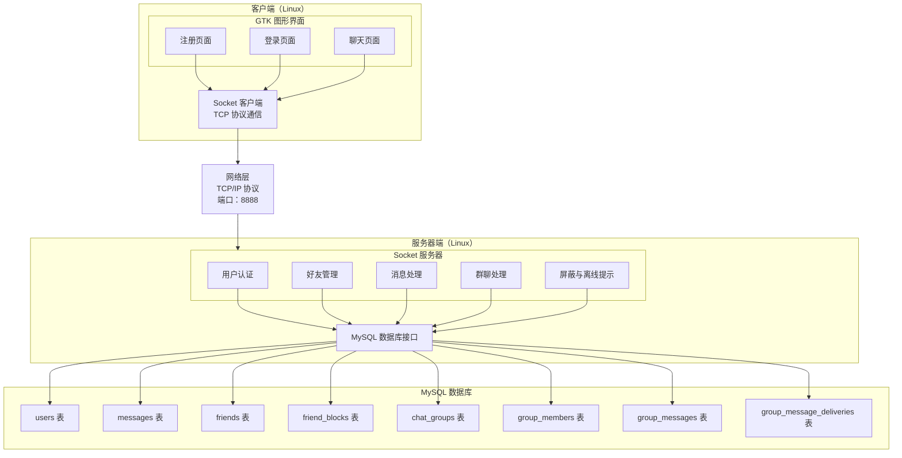
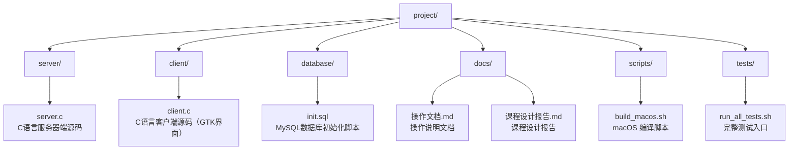

# Linux操作系统与程序设计课程设计报告

---

## 目录

1. [项目目标](#1-项目目标)
2. [项目功能及模块划分](#2-项目功能及模块划分)
3. [人员组成及职责划分](#3-人员组成及职责划分)
4. [设计与实现](#4-设计与实现)
   - [4.1 系统结构](#41-系统结构)
   - [4.2 客户端界面](#42-客户端界面)
   - [4.3 服务器的实现](#43-服务器的实现)
   - [4.4 数据库访问](#44-数据库访问)
   - [4.5 通信模块的实现](#45-通信模块的实现)
5. [测试与调试](#5-测试与调试)
6. [总结](#6-总结)
7. [附录：程序代码](#7-附录程序代码)

---

## 1、项目目标

这次课程设计我们选择做一个 Linux 平台下的即时通信工具。项目规模不算特别大，但它把 Socket 通信、多线程、MySQL 数据库和 GTK 图形界面都串在了一起，作为一次完整的Linux程序设计实践。

我们给这个项目定下的目标主要有以下几项：

1. **完成 Socket 网络通信实现**：用 TCP Socket 打通客户端和服务端之间的连接、消息收发和断开处理。

2. **完成 MySQL 数据持久化设计**：把用户信息、消息记录和好友关系保存到 MySQL 中，并用 MySQL C API 完成查询和写入。

3. **完成 GTK3 图形客户端开发**：用 GTK3 做出登录、注册、好友列表和聊天窗口，并处理按钮点击、好友选择和消息刷新。

4. **完成多线程服务端设计**：服务端为每个客户端连接创建处理线程，并用互斥锁保护在线用户列表和数据库连接。

5. **完成团队协作与任务分工**：把代码实现、文档整理、测试验证和问题修复拆开推进，减少重复工作。

6. **形成问题定位和复测验证流程**：遇到问题后先记录现象，再分析原因、修复代码，并用测试脚本确认问题没有反复出现。

---

## 2、项目功能及模块划分

### 2.1 项目概述

我们实现的是一个基于 Linux 平台的网络即时通信工具。服务端使用 C 语言、Socket 和 MySQL，客户端使用 GTK3 做图形界面。用户启动客户端后，可以完成注册、登录、添加好友、一对一聊天、群聊、拉黑用户和查看离线消息提示等操作。

### 2.2 功能模块划分

从实现上看，我们把功能拆成了下面几个模块：

| 模块名称 | 功能描述 | 所属层次 |
|---------|---------|---------|
| 用户注册模块 | 用户通过用户名和密码进行注册 | 客户端+服务器 |
| 用户登录模块 | 用户通过用户名和密码进行登录，验证身份 | 客户端+服务器 |
| 好友管理模块 | 添加好友、查看好友列表 | 客户端+服务器 |
| 消息发送模块 | 向好友发送文本消息 | 客户端+服务器 |
| 消息接收模块 | 实时接收好友发送的消息 | 客户端+服务器 |
| 消息存储模块 | 将消息记录存储到数据库 | 服务器 |
| 用户状态管理 | 管理用户在线状态 | 服务器 |
| 群聊管理模块 | 创建群聊、查看群列表和群成员、添加群成员 | 客户端+服务器 |
| 群消息模块 | 发送群消息、保存群历史、向在线群成员实时推送 | 客户端+服务器 |
| 拉黑模块 | 拉黑或解除拉黑用户，私聊发送前检查拉黑关系 | 客户端+服务器 |
| 离线消息模块 | 记录私聊和群聊未读状态，登录后提示未读摘要 | 客户端+服务器 |

### 2.3 核心功能描述

**用户注册与登录**

- 用户可以通过客户端注册页面创建新账号，需要填写用户名和密码
- 用户可以通过登录页面验证身份并进入系统
- 用户名具有唯一性约束，避免重复注册
- 登录状态通过用户ID进行管理

**好友管理**

- 用户可以添加其他用户为好友
- 用户可以查看自己的好友列表
- 好友关系建立后，双方可以互相发送消息

**实时消息通信**

- 用户可以选择好友进行一对一聊天
- 消息采用TCP Socket技术实现实时传输
- 消息发送后立即显示在聊天窗口中
- 历史消息可以随时查看

**群聊通信**

- 用户可以创建群聊，创建者会自动成为群成员
- 群成员可以查看自己加入的群聊和群成员列表
- 群成员可以向群聊发送文本消息，在线成员会实时收到
- 服务端会校验发送者是否属于该群，非成员不能发送群消息，也不能查看群历史

**状态通知和拉黑**

- 好友登录和断开连接时，在线好友会收到上线或离线提示
- 用户可以拉黑其他用户，也可以解除拉黑
- 私聊发送前会检查双方是否存在拉黑关系，存在拉黑关系时消息不会写入数据库
- 用户离线期间收到的私聊和群聊消息会留下未读记录，重新登录后可以看到未读摘要

---

## 3、人员组成及职责划分

### 3.1 团队成员

| 姓名 | 学号 | 职责 |
|------|------|------|
| 卞宇宁 | 239054412 | 组长，系统分析、整体设计和模块划分 |
| 杨国龙 | 229024392 | 核心代码初步构建，完成客户端、服务端、数据库和通信链路的主体实现 |
| 孙正辉 | 待补充 | 文档编写与资料整理，负责操作文档、课程报告和测试结果记录 |
| 杨智强 | 239044484 | 测试验证、数据库集成检查和问题修复协助，负责复测验证、数据一致性验证和缺陷整理 |

### 3.2 职责详细说明

**卞宇宁（组长）**

- 负责整个项目的需求分析和架构设计
- 制定开发计划和模块划分方案
- 协调各成员之间的工作
- 审核和整合各模块代码
- 负责项目整体进度控制

**杨国龙（核心代码初步构建）**

- 负责项目代码主体的初步构建
- 完成 C 语言服务端 Socket 通信、多线程连接处理和消息路由的基础实现
- 完成 GTK3 客户端登录、注册、聊天窗口和好友列表的基础实现
- 完成 MySQL 表结构、初始化脚本和数据库访问函数的初步实现
- 打通注册、登录、添加好友、历史消息和实时聊天的主要功能链路

**孙正辉（文档编写）**

- 负责项目操作文档和课程设计报告的编写
- 整理环境配置、数据库初始化、编译运行和使用说明
- 根据代码实现同步更新模块说明、协议说明和测试说明
- 记录测试结果、已修复问题和仍需改进的内容
- 维护文档结构、图表和最终提交材料

**杨智强（测试验证与问题整理）**

- 负责客户端和服务端主要功能的测试验证
- 设计并执行注册、登录、好友管理、消息收发和历史消息查询的测试用例
- 配合完成真实 MySQL 环境下的数据一致性检查
- 整理问题清单和复测结果
- 协助定位缺陷原因，并跟进修复后的测试闭环

---

## 4、设计与实现

### 4.1 系统结构

#### 4.1.1 系统架构

我们采用 C/S 架构。客户端只负责界面交互、协议消息发送和结果展示，服务端集中处理登录校验、好友关系、消息转发和数据库读写。客户端和服务端之间通过 TCP Socket 通信，默认端口为 8888。

**系统架构图：**



#### 4.1.2 技术选型

| 层次 | 技术 | 版本 | 说明 |
|------|------|------|------|
| 编程语言 | C语言 | C99 | 核心开发语言 |
| 服务器 | Socket编程 | POSIX标准 | TCP网络通信 |
| 线程 | POSIX线程 | pthread | 多线程支持 |
| 数据库 | MySQL | 5.7+ | 数据存储 |
| 数据库驱动 | MySQL C API | libmysqlclient | C语言访问MySQL |
| 图形界面 | GTK | 3.0+ | Linux下gnome图形环境 |

#### 4.1.3 项目结构



### 4.2 客户端界面

客户端界面主要包含注册、登录和聊天三个部分。注册页用于创建新账号，界面上包括：

- **用户名输入框**：用于输入用户名，要求唯一
- **密码输入框**：用于输入密码，采用密码框形式隐藏输入
- **注册按钮**：提交注册信息
- **状态提示标签**：显示操作结果

注册流程：

1. 用户填写用户名和密码
2. 点击注册按钮
3. 客户端通过Socket连接服务器，发送注册请求
4. 服务器验证用户名是否已存在
5. 验证通过后，将用户信息存储到数据库
6. 返回注册成功消息，用户可以进行登录

登录页用于校验账号密码，界面上包括：

- **用户名输入框**：用于输入用户名
- **密码输入框**：用于输入密码
- **登录按钮**：提交登录信息
- **状态提示标签**：显示操作结果

登录流程：

1. 用户填写用户名和密码
2. 点击登录按钮
3. 客户端通过Socket连接服务器，发送登录请求
4. 服务器验证用户名和密码是否匹配
5. 验证通过后，返回用户信息
6. 客户端保存用户信息，跳转到聊天页面

聊天页采用左侧列表、右侧聊天窗口的布局。左侧同时放好友列表、群聊列表和群成员列表，右侧复用同一个消息区域显示私聊或群聊内容。这个布局比较直观，测试时也方便观察好友切换、群聊切换和消息刷新是否正常。

**左侧侧边栏：**

- **用户信息区域**：显示当前登录用户信息，提供添加好友、创建群聊、添加群成员、拉黑好友和解除拉黑按钮
- **好友列表**：显示所有好友，点击好友可以切换聊天对象
- **群聊列表**：显示当前用户加入的群聊，点击群聊可以查看群历史
- **群成员列表**：选择群聊后显示该群成员

**右侧聊天区域：**

- **聊天标题栏**：显示当前聊天好友的用户名
- **消息列表**：显示与当前好友的所有聊天消息，支持滚动查看历史消息
- **消息输入区域**：包含输入框和发送按钮，支持回车键发送

界面实现上主要有几个特点：

- 主要使用 GTK 原生控件，整体风格比较接近 Linux 桌面应用
- 使用 Frame 控件划分用户信息、好友列表、群聊列表、群成员列表和聊天区域
- 消息列表使用 TextView 控件，便于滚动查看历史内容
- 窗口尺寸变化时，主要区域可以随布局自动调整

### 4.3 服务器的实现

#### 4.3.1 用户登录

登录请求由服务端线程处理，大致流程如下：

1. **接收请求**：服务器接收客户端发送的登录请求，格式为 `LOGIN:username,password`
2. **解析参数**：从请求中解析用户名和密码
3. **数据库查询**：在users表中查询用户名和密码匹配的记录
4. **验证结果**：
   - 如果匹配成功，返回登录成功消息，包含用户ID和用户名
   - 如果匹配失败，返回登录失败消息

**关键代码逻辑：**

```c
else if (HAS_PREFIX(buffer, "LOGIN:")) {
    char username[50], password[50];
    int user_id;

    if (sscanf(PREFIX_PAYLOAD(buffer, "LOGIN:"), "%49[^,],%49[^\n]", username, password) == 2 &&
        login_user(username, password, &user_id) == 0) {
        client->user_id = user_id;
        strncpy(client->username, username, sizeof(client->username) - 1);
        client->username[sizeof(client->username) - 1] = '\0';
        update_client_session(client->sockfd, user_id, username);
        snprintf(response, sizeof(response), "LOGIN_SUCCESS:%d:%s", user_id, username);
    } else {
        snprintf(response, sizeof(response), "LOGIN_FAILED");
    }
    send(client->sockfd, response, strlen(response), 0);
}
```

#### 4.3.2 转发聊天消息

消息发送也是在服务端线程里处理。这里我们没有直接相信客户端传来的 sender_id，而是使用登录会话里的用户 ID，避免客户端伪造发送者：

1. **接收消息**：服务器接收客户端发送的消息，格式为 `SEND:sender_id,receiver_id,content`
2. **解析参数**：从消息中解析发送者ID、接收者ID和消息内容
3. **消息存储**：服务器将消息存储到messages表中
4. **消息转发**：服务器通过Socket将消息发送到接收者客户端

**关键代码逻辑：**

```c
else if (strncmp(buffer, "SEND:", 5) == 0) {
    int sender_id, requested_sender_id, receiver_id;
    char content[BUFFER_SIZE];
    char timestamp[50] = "";

    if (client->user_id <= 0 ||
        sscanf(buffer + 5, "%d,%d,%1023[^\n]", &requested_sender_id, &receiver_id, content) != 3) {
        snprintf(response, sizeof(response), "SEND_FAILED");
        send(client->sockfd, response, strlen(response), 0);
        continue;
    }

    sender_id = client->user_id;
    if (!are_friends(sender_id, receiver_id) ||
        has_block_between(sender_id, receiver_id) ||
        !can_send_private_message(sender_id, receiver_id) ||
        save_message(sender_id, receiver_id, content, timestamp, sizeof(timestamp)) != 0) {
        snprintf(response, sizeof(response), "SEND_FAILED");
        send(client->sockfd, response, strlen(response), 0);
        continue;
    }

    snprintf(response, sizeof(response),
             "NEW_MESSAGE:%d:%s:%s:%s", sender_id, client->username, timestamp, content);
    send_to_user(receiver_id, response);
    send(client->sockfd, response, strlen(response), 0);
}
```

#### 4.3.3 群聊消息处理

群聊部分仍然由服务端统一校验。客户端发送 `SEND_GROUP:sender_id,group_id,content`，其中 sender_id 只是为了兼容协议格式，真正使用的是当前连接登录后的用户 ID。服务端会先检查发送者是不是群成员，再写入 `group_messages` 表，并为每个群成员写入一条投递记录。在线群成员会立即收到 `NEW_GROUP_MESSAGE` 通知，离线成员重新登录后可以通过未读摘要或群历史看到消息。

创建群聊时，服务端会先写入 `chat_groups`，再把创建者写入 `group_members`。后续成员通过“添加群成员”操作按用户名加入。成员表上有 `group_id + user_id` 唯一约束，所以重复成员不会变成多条记录。查看群成员和群历史时也会校验当前用户是否属于该群。

### 4.4 数据库访问

#### 4.4.1 数据库设计

数据库部分我们使用 MySQL。为了支撑账号、好友、私聊、群聊、屏蔽关系和离线提示，主要设计了下面几类表：

**users表**：存储用户账号信息。

| 字段名 | 类型 | 约束 | 说明 |
|--------|------|------|------|
| id | INT | PRIMARY KEY | 8 位随机数字用户ID |
| username | VARCHAR(50) | UNIQUE NOT NULL | 用户名，唯一约束 |
| password | VARCHAR(100) | NOT NULL | SHA-256 密码哈希 |
| created_at | TIMESTAMP | DEFAULT CURRENT_TIMESTAMP | 创建时间 |

**messages表**：存储聊天消息记录。

| 字段名 | 类型 | 约束 | 说明 |
|--------|------|------|------|
| id | INT | PRIMARY KEY AUTO_INCREMENT | 消息ID，自增主键 |
| sender_id | INT | NOT NULL, FOREIGN KEY | 发送者ID，外键关联users表 |
| receiver_id | INT | NOT NULL, FOREIGN KEY | 接收者ID，外键关联users表 |
| content | TEXT | NOT NULL | 消息内容 |
| delivered | TINYINT(1) | DEFAULT 0 | 接收者是否已经在线收到或查看 |
| timestamp | TIMESTAMP | DEFAULT CURRENT_TIMESTAMP | 发送时间 |

**friends表**：存储用户之间的好友关系。

| 字段名 | 类型 | 约束 | 说明 |
|--------|------|------|------|
| id | INT | PRIMARY KEY AUTO_INCREMENT | 记录ID，自增主键 |
| user_id | INT | NOT NULL, FOREIGN KEY | 用户ID，外键关联users表 |
| friend_id | INT | NOT NULL, FOREIGN KEY | 好友ID，外键关联users表 |
| status | INT | DEFAULT 0 | 状态，0表示待确认，1表示已确认 |
| created_at | TIMESTAMP | DEFAULT CURRENT_TIMESTAMP | 创建时间 |

**friend_blocks表**：存储用户之间的屏蔽关系，`blocker_id` 和 `blocked_id` 组合唯一。

**chat_groups表**：存储群聊名称、创建者和创建时间。

**group_members表**：存储群成员关系，`group_id` 和 `user_id` 组合唯一，用来防止重复成员。

**group_messages表**：存储群聊消息，包含群ID、发送者ID、消息内容和发送时间。

**group_message_deliveries表**：按用户记录每条群消息是否已经收到或查看，用来实现离线未读提示。

#### 4.4.2 数据库操作

**数据库连接函数：**

```c
void init_database() {
    db_conn = mysql_init(NULL);
    if (!mysql_real_connect(db_conn, "localhost", "chat_user", "chat_password", "chat_db", 0, NULL, 0)) {
        fprintf(stderr, "数据库连接失败: %s\n", mysql_error(db_conn));
        exit(1);
    }
    printf("数据库连接成功\n");
}
```

**初始化数据库表函数：**

```c
void create_tables() {
    char *create_users = "CREATE TABLE IF NOT EXISTS users ("
                         "id INT PRIMARY KEY,"
                         "username VARCHAR(50) UNIQUE NOT NULL,"
                         "password VARCHAR(100) NOT NULL,"
                         "created_at TIMESTAMP DEFAULT CURRENT_TIMESTAMP)";
    // 创建其他表...
}
```

**用户注册函数：**

```c
int register_user(const char *username, const char *password) {
    const char *statement =
        "INSERT INTO users (id, username, password) VALUES (?, ?, SHA2(?, 256))";
    MYSQL_STMT *stmt = NULL;
    MYSQL_BIND params[3];
    unsigned long lengths[2];
    int user_id = REGISTER_ERROR_SERVER;

    if (username == NULL ||
        password == NULL ||
        strlen(username) >= 50 ||
        strlen(password) >= 50 ||
        !is_protocol_safe_text(username, 0) ||
        !is_protocol_safe_text(password, 0)) {
        return REGISTER_ERROR_INVALID_INPUT;
    }

    pthread_mutex_lock(&db_mutex);
    user_id = generate_unique_user_id_locked();
    if (user_id <= 0) {
        user_id = REGISTER_ERROR_SERVER;
        goto cleanup;
    }

    memset(params, 0, sizeof(params));
    bind_int_param(&params[0], &user_id);
    bind_string_param(&params[1], username, &lengths[0]);
    bind_string_param(&params[2], password, &lengths[1]);

    stmt = mysql_stmt_init(db_conn);
    if (stmt == NULL ||
        mysql_stmt_prepare(stmt, statement, strlen(statement)) != 0 ||
        mysql_stmt_bind_param(stmt, params) != 0 ||
        mysql_stmt_execute(stmt) != 0) {
        user_id = REGISTER_ERROR_SERVER;
    }

cleanup:
    if (stmt != NULL) {
        mysql_stmt_close(stmt);
    }
    pthread_mutex_unlock(&db_mutex);
    return user_id;
}
```

#### 4.4.3 数据安全

- 使用参数化查询防止SQL注入攻击
- 使用 `SHA2(..., 256)` 存储密码哈希，避免明文密码落库
- 对用户输入进行验证和过滤
- 好友、历史消息、群聊和发送消息操作只信任登录会话中的用户 ID
- 群聊发送和群历史查询会校验成员身份
- 私聊发送会检查屏蔽关系
- 数据库用户权限最小化配置

### 4.5 通信模块的实现

通信方式上我们选择 TCP Socket。聊天消息虽然不像文件传输那样大，但需要保证顺序和可靠送达，所以 TCP 比 UDP 更合适：

| 特性 | UDP | TCP |
|------|-----|-----|
| 可靠性 | 不可靠（可能丢失） | 可靠（保证送达） |
| 顺序 | 无序 | 有序 |
| 连接 | 无连接 | 面向连接 |
| 数据量 | 有限制 | 无限制 |
| 适用场景 | 实时音视频 | 可靠数据传输 |

实现时主要用到下面几个点：

- 使用POSIX Socket API实现TCP通信
- 服务器使用多线程模型，每个客户端一个线程
- 使用pthread_mutex保证多线程安全
- 使用自定义文本协议进行通信

**Socket编程流程：**

**服务器端：**

1. 创建Socket：`socket(AF_INET, SOCK_STREAM, 0)`
2. 设置Socket选项：`setsockopt()`
3. 绑定地址：`bind()`
4. 监听连接：`listen()`
5. 接受连接：`accept()`
6. 创建线程处理客户端：`pthread_create()`
7. 接收消息：`recv()`
8. 发送消息：`send()`

**客户端：**

1. 创建Socket：`socket(AF_INET, SOCK_STREAM, 0)`
2. 设置服务器地址：`struct sockaddr_in`
3. 连接服务器：`connect()`
4. 发送消息：`send()`
5. 接收消息：`recv()`

**通信协议格式：**

客户端发送的每条命令以换行符 `\n` 作为帧边界，服务端维护连接级接收缓冲区并按完整行解析，所以可以处理 TCP 粘包和拆包。命令本体格式如下：

```
COMMAND:param1,param2,param3
```

| 命令 | 参数 | 说明 |
|------|------|------|
| REGISTER | username,password | 用户注册 |
| LOGIN | username,password | 用户登录 |
| ADDFRIEND_USERNAME | username | 添加好友，客户端默认使用用户名 |
| ADDFRIEND | user_id,friend_id | 添加好友，旧 ID 协议兼容 |
| FRIENDS | user_id | 获取好友列表 |
| MESSAGES | user_id,friend_id | 获取消息记录 |
| SEND | sender_id,receiver_id,content | 发送消息 |
| CREATE_GROUP | group_name | 创建群聊，创建者自动成为群成员 |
| GROUPS | user_id | 获取当前用户加入的群聊 |
| GROUP_MEMBERS | group_id | 获取群成员 |
| ADD_GROUP_MEMBER_USERNAME | group_id,username | 添加群成员，客户端默认使用用户名 |
| ADD_GROUP_MEMBER | group_id,user_id | 添加群成员，旧 ID 协议兼容 |
| GROUP_MESSAGES | group_id | 获取群聊历史 |
| SEND_GROUP | sender_id,group_id,content | 发送群消息 |
| BLOCK_USER_USERNAME | username | 拉黑用户，客户端默认使用用户名 |
| BLOCK_USER | user_id,blocked_id | 拉黑用户，旧 ID 协议兼容 |
| UNBLOCK_USER_USERNAME | username | 解除拉黑，客户端默认使用用户名 |
| UNBLOCK_USER | user_id,blocked_id | 解除拉黑，旧 ID 协议兼容 |
| OFFLINE_MESSAGES | user_id | 获取未读消息摘要 |
| QUIT | 无 | 断开连接 |

---

## 5、测试与调试

### 5.1 测试环境

- **操作系统**：Ubuntu 20.04 LTS
- **编译器**：GCC 9.3.0
- **MySQL版本**：5.7.33
- **GTK版本**：3.24.20
- **测试工具**：gcc编译工具、MySQL命令行、终端调试、完整测试脚本和专项测试脚本

### 5.2 功能测试

**用户注册测试**

| 测试用例 | 输入 | 预期结果 | 实际结果 |
|---------|------|---------|---------|
| 正常注册 | 用户名：test1，密码：123456 | 注册成功，返回user_id | 成功 |
| 用户名重复 | 用户名：test1，密码：123456 | 返回 `REGISTER_FAILED_DUPLICATE_USERNAME` | 成功 |
| 缺少参数 | 用户名或密码为空 | 客户端提示"请填写用户名和密码" | 成功 |

**用户登录测试**

| 测试用例 | 输入 | 预期结果 | 实际结果 |
|---------|------|---------|---------|
| 正常登录 | 用户名：test1，密码：123456 | 登录成功，进入聊天界面 | 成功 |
| 密码错误 | 用户名：test1，密码：654321 | 返回"LOGIN_FAILED" | 成功 |
| 用户不存在 | 用户名：nonexist，密码：123456 | 返回"LOGIN_FAILED" | 成功 |

**添加好友测试**

| 测试用例 | 输入 | 预期结果 | 实际结果 |
|---------|------|---------|---------|
| 添加有效好友 | 输入好友用户名 | 添加成功 | 成功 |
| 添加自己 | 输入自己的用户名 | 客户端提示无效 | 成功 |
| 重复添加 | 输入已添加好友的用户名 | 返回"ADDFRIEND_FAILED" | 成功 |

**消息发送测试**

| 测试用例 | 操作 | 预期结果 | 实际结果 |
|---------|------|---------|---------|
| 正常发送消息 | 用户1向用户2发送消息 | 用户2收到消息，消息显示在聊天窗口 | 成功 |
| 发送空消息 | 输入空内容发送 | 消息不发送 | 成功 |
| 未选择好友发送 | 未选择好友直接发送 | 消息不发送 | 成功 |

**群聊功能测试**

| 测试用例 | 操作 | 预期结果 | 实际结果 |
|---------|------|---------|---------|
| 创建群聊 | 用户1输入群名称创建群聊 | 群聊创建成功，创建者写入成员表 | 成功 |
| 重复成员 | 重复添加同一成员用户名 | 成员表只保留一条成员记录 | 成功 |
| 非成员查看群历史 | 未加入群聊的用户请求群历史 | 服务端返回空列表，不泄露群消息 | 成功 |
| 群消息发送 | 群成员发送文本消息 | 群消息落库，在线群成员实时收到 | 成功 |
| 群消息非法内容 | 消息包含冒号、分号或换行 | 服务端拒绝保存 | 成功 |

**拉黑和离线提示测试**

| 测试用例 | 操作 | 预期结果 | 实际结果 |
|---------|------|---------|---------|
| 拉黑用户 | 用户2拉黑用户1后，用户1尝试私聊用户2 | 服务端拒绝发送 | 成功 |
| 解除拉黑 | 用户2解除对用户1的拉黑 | 私聊发送资格恢复 | 成功 |
| 好友上线/离线 | 好友登录或断开连接 | 在线好友收到状态通知 | 成功 |
| 私聊离线消息 | 接收者离线时收到私聊 | 登录后可以看到未读提示，打开历史后清除 | 成功 |
| 群聊离线消息 | 群成员离线时收到群消息 | 登录后可以看到未读提示，打开群历史后清除 | 成功 |

#### 5.2.1 登录后聊天链路专项测试

针对登录成功后无法正常进入聊天流程、实时消息无法正确显示等问题，我们保留了一个登录链路专项测试脚本，用于快速验证相关修复点。

测试内容包括：

| 测试项 | 预期结果 | 实际结果 |
|-------|---------|---------|
| 客户端编译检查 | `client.c` 通过 `-Wall -Wextra -Wpedantic` 编译 | 成功 |
| 服务端编译检查 | `server.c` 通过 `-Wall -Wextra -Wpedantic` 编译 | 成功 |
| 在线会话同步 | 登录后 `clients` 数组同步用户ID和用户名 | 成功 |
| 页面切换检查 | 客户端通过 `GtkStack` 管理登录页和聊天页 | 成功 |
| 接收线程检查 | 接收线程使用 GTK idle 回调，并复制消息缓冲区 | 成功 |
| 用户名来源检查 | 实时消息使用登录会话用户名，不再空密码调用登录函数 | 成功 |

#### 5.2.2 聊天稳定性专项测试

针对历史消息解析、响应缓冲区、socket 判断和数据库并发访问等问题，我们保留了聊天稳定性专项测试脚本。

该脚本会先复测登录后聊天链路，再检查稳定性相关修复。测试内容包括：

| 测试项 | 预期结果 | 实际结果 |
|-------|---------|---------|
| 登录链路复测 | 登录后聊天链路相关检查继续通过 | 成功 |
| 数据库互斥检查 | 服务端全局 MySQL 连接通过 `db_mutex` 串行访问 | 成功 |
| 时间戳格式检查 | 历史消息时间戳不包含 `:`，避免客户端解析错位 | 成功 |
| 协议记录拼接检查 | 好友和历史消息记录拼接使用容量保护，结果过长时返回失败 | 成功 |
| 历史响应缓冲区检查 | `MESSAGES_LIST` 不再把大缓冲区写入 1KB `response` | 成功 |
| socket失败判断检查 | `socket()` 失败判断使用 `< 0` | 成功 |
| 无界写入检查 | 服务端不再使用 `sprintf`、`strcat`、`strcpy` 构造响应 | 成功 |

#### 5.2.3 完整测试套件

为避免测试只围绕单次问题修复编写，项目新增 `tests/run_all_tests.sh` 作为主要测试入口：

```bash
./tests/run_all_tests.sh
```

默认测试不依赖正在运行的 MySQL 服务，覆盖内容包括：

| 测试项 | 预期结果 | 实际结果 |
|-------|---------|---------|
| 编译检查 | 客户端和服务端通过 `-Wall -Wextra -Wpedantic` 编译 | 成功 |
| 服务端会话状态 | 登录状态能同步到在线用户数组，错误 socket 不会误更新 | 成功 |
| 定向发送 | `send_to_user()` 只向匹配用户发送消息 | 成功 |
| 协议边界 | 协议记录拼接在缓冲区不足时返回失败并保持字符串结束符 | 成功 |
| 协议帧边界 | 换行分隔协议能处理 TCP 粘包、拆包和超长帧 | 成功 |
| 客户端检查 | GTK idle 回调复制缓冲区，解析格式包含长度限制 | 成功 |
| 服务端检查 | 数据库互斥、事务、唯一约束、级联外键、预处理语句和有界响应构造存在 | 成功 |
| 群聊扩展检查 | 群聊协议、群成员唯一约束、群消息表和离线投递表存在 | 成功 |
| 安全加固检查 | 协议分隔符拒绝、会话授权、成员校验、密码哈希和客户端 `snprintf` 构造存在 | 成功 |
| 初始化脚本检查 | `init.sql` 包含唯一约束、级联外键、密码哈希、群聊表和 `INSERT IGNORE` | 成功 |

#### 5.2.4 数据库集成测试

完整测试套件支持真实 MySQL 集成测试。运行前需要提供一个专门用于测试的数据库，数据库名必须包含 `test`，因为测试会删除并重建其中的 `users`、`messages`、`friends`、`friend_blocks`、`chat_groups`、`group_members`、`group_messages` 和 `group_message_deliveries` 等表。

```bash
LINUXCHAT_RUN_DB_TESTS=1 \
LINUXCHAT_TEST_DB_HOST=localhost \
LINUXCHAT_TEST_DB_USER=chat_test_user \
LINUXCHAT_TEST_DB_PASSWORD=chat_test_password \
LINUXCHAT_TEST_DB_NAME=linuxchat_test \
./tests/run_all_tests.sh --with-db
```

数据库集成测试覆盖内容包括：

| 测试项 | 预期结果 | 实际结果 |
|-------|---------|---------|
| 重复用户 | 重复用户名插入失败，数据库只保留一条记录 | 需真实数据库环境 |
| 密码哈希 | 用户密码以 64 位 SHA-256 哈希保存，不保存明文 | 需真实数据库环境 |
| 注入防护 | 注入型登录输入不能绕过认证，带单引号字段可安全注册和登录 | 需真实数据库环境 |
| 无效外键 | 不存在的好友或消息用户 ID 不会写入数据库 | 需真实数据库环境 |
| 双向好友 | 添加好友时同时写入两条互为好友记录 | 需真实数据库环境 |
| 事务回滚 | 半边好友关系存在时，失败重试不会写入另一半脏数据 | 需真实数据库环境 |
| 屏蔽关系 | 屏蔽后私聊发送资格被拒绝，解除后恢复 | 需真实数据库环境 |
| 群聊创建 | 创建群聊后写入创建者成员关系 | 需真实数据库环境 |
| 重复群成员 | 重复添加成员不会产生多条成员记录 | 需真实数据库环境 |
| 非成员越权 | 非成员不能查看群成员、群历史或发送群消息 | 需真实数据库环境 |
| 群消息持久化 | 群消息写入数据库，并产生按成员记录的投递状态 | 需真实数据库环境 |
| 离线提示 | 私聊和群聊未读摘要在查看历史后清除 | 需真实数据库环境 |
| 历史消息 | 消息按时间排序，时间戳不破坏协议分隔 | 需真实数据库环境 |
| 协议分隔符 | 含 `:`、`;` 或换行的消息内容不会持久化 | 需真实数据库环境 |
| 级联删除 | 删除用户后相关好友、私聊、群聊、群消息和投递记录自动清理 | 需真实数据库环境 |

### 5.3 调试过程

**问题1：编译错误找不到 mysql.h**

**现象**：编译服务器时提示找不到mysql.h头文件

**原因**：MySQL开发库未安装

**解决方案**：
```bash
sudo apt install libmysqlclient-dev
```

**问题2：编译错误找不到 gtk/gtk.h**

**现象**：编译客户端时提示找不到gtk/gtk.h头文件

**原因**：GTK开发库未安装

**解决方案**：
```bash
sudo apt install libgtk-3-dev
```

**问题3：数据库连接失败**

**现象**：服务器启动时无法连接MySQL数据库

**原因**：数据库用户名、密码或数据库名配置错误

**解决方案**：检查server.c中的数据库连接参数是否正确

**问题4：客户端无法连接服务器**

**现象**：客户端启动后无法连接到服务器

**原因**：服务器未启动或防火墙阻止连接

**解决方案**：
- 确保服务器已启动
- 配置防火墙允许端口8888

**问题5：多线程同步问题**

**现象**：多个客户端同时操作时出现数据不一致

**原因**：多个线程同时访问共享数据结构

**解决方案**：使用pthread_mutex互斥锁保护共享数据

**问题6：GTK线程安全问题**

**现象**：在接收线程中更新界面导致程序崩溃

**原因**：GTK不是线程安全的，不能在非主线程中更新界面

**解决方案**：使用`gdk_threads_add_idle()`函数在主线程中更新界面

---

## 6、总结

### 6.1 项目完成情况

到目前为止，项目已经能够跑通主要聊天流程。客户端和服务端可以正常启动，用户可以注册、登录、添加好友，进行一对一消息收发，也可以创建群聊、查看群成员、发送群消息、拉黑用户和查看离线消息提示。我们实际完成的内容包括：

1. **服务器端实现**：基于 Socket 的 TCP 服务端，支持多个客户端连接
2. **客户端实现**：基于 GTK3 的图形界面，支持登录、注册和聊天操作
3. **数据库操作**：使用 MySQL C API 保存用户、好友关系和消息记录
4. **用户管理功能**：实现了用户注册、登录和身份验证
5. **好友管理功能**：实现了添加好友和查看好友列表
6. **消息通信功能**：实现了私聊和群聊的实时消息发送、接收和历史查询
7. **扩展通信功能**：实现了群聊管理、屏蔽关系、好友上线/离线通知和离线消息摘要
8. **文档编写**：整理了操作文档、课程设计报告和测试说明

### 6.2 实现中比较关键的部分

1. **Socket网络编程**：客户端和服务端通过 TCP Socket 交换文本协议消息
2. **多线程设计**：服务端使用 pthread 处理多个客户端连接，并对共享数据加锁
3. **MySQL数据库访问**：服务端通过 MySQL C API 读写用户、好友和消息数据
4. **GTK图形界面**：客户端使用 GTK3 完成窗口、列表、输入框和按钮事件
5. **自定义协议**：使用简单文本协议连接 UI 操作和服务端业务逻辑

### 6.3 目前还不完善的地方

1. **功能范围仍以文本为主**：目前已经支持私聊和群聊文本消息，但没有图片、文件、语音和视频等富媒体内容
2. **界面比较朴素**：GTK 原生控件能满足使用，但界面美观度还有提升空间
3. **安全机制还可以继续加强**：当前已经补了密码哈希、预处理语句和会话授权，但消息传输还没有加密
4. **协议处理还比较基础**：现在通过限制分隔符规避解析错位，后续更适合改成长度前缀或转义协议

### 6.4 后续改进方向

1. **增加功能**：后续可以继续补充图片、文件传输、表情发送等功能
2. **界面优化**：调整 GTK 布局和样式，让聊天窗口更接近日常软件的使用习惯
3. **安全增强**：增加消息传输加密，并把密码哈希升级为带盐慢哈希方案
4. **性能优化**：后续可以考虑线程池，减少大量客户端连接时的线程创建开销

### 6.5 实践收获

做这个项目时，我们不是一次就把所有功能写完的。前期先把客户端、服务端和数据库主链路跑通，后面又陆续补充了登录后聊天、历史消息、并发访问、数据库一致性、安全加固、群聊、屏蔽和离线提示等内容。这个过程里比较有收获的地方包括：

1. **Socket网络编程**：真正走了一遍连接建立、消息收发、断开连接和实时转发流程
2. **多线程编程**：理解了在线用户数组、数据库连接这类共享状态为什么需要互斥保护
3. **MySQL数据库访问**：从普通查询写入，逐步补到事务、外键、唯一约束和预处理语句
4. **GTK图形界面开发**：体会到 UI 线程和后台接收线程之间不能随意互相操作，需要通过 GTK 的 idle 回调更新界面
5. **测试复查**：后期补充测试脚本之后，修复问题时更容易确认有没有破坏已有功能
6. **团队协作**：代码、文档、测试和问题整理分开推进后，项目整体节奏更清楚

---

## 7、附录：程序代码

本文档不再内嵌完整源码副本，避免课程报告中的代码片段与仓库真实实现产生偏差。当前实现以仓库源码为准：

- `server/server.c`：服务端 Socket、多线程、数据库访问、协议帧解析、好友/群聊/拉黑/离线消息处理。
- `client/client.c`：GTK3 客户端界面、登录注册、好友和群聊交互、消息收发线程。
- `database/init.sql`：MySQL 表结构、外键约束、唯一约束和演示数据。
- `tests/`：编译检查、协议边界、会话授权、安全约束和数据库集成测试。

如需查看完整程序代码，请直接打开上述文件；这样可以保证阅读到的内容与当前可编译、可测试版本一致。
